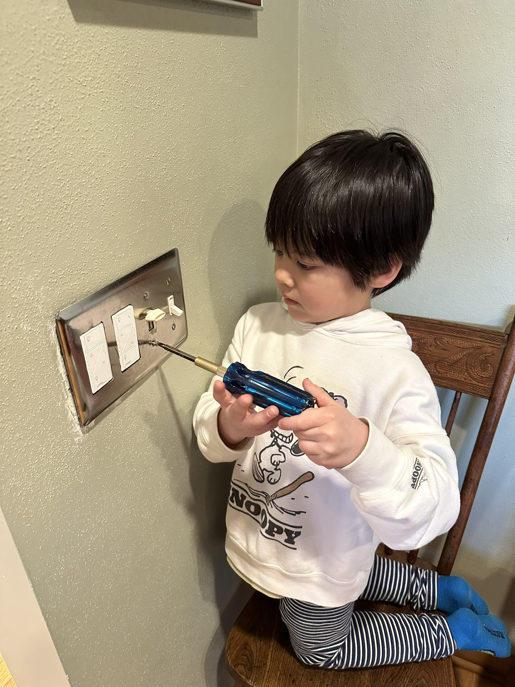
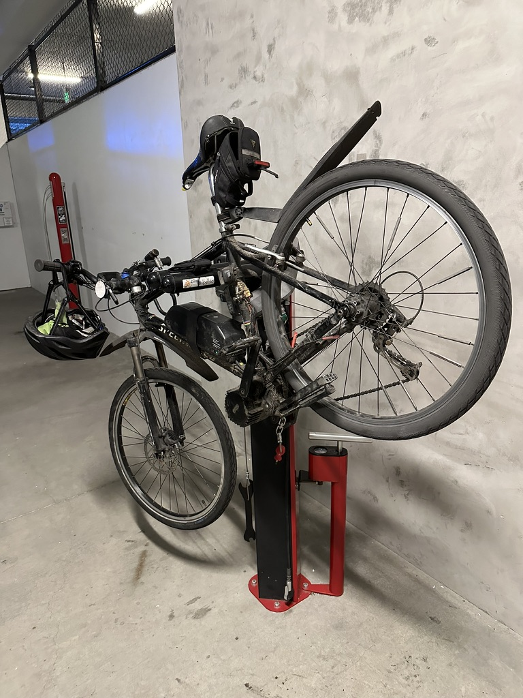
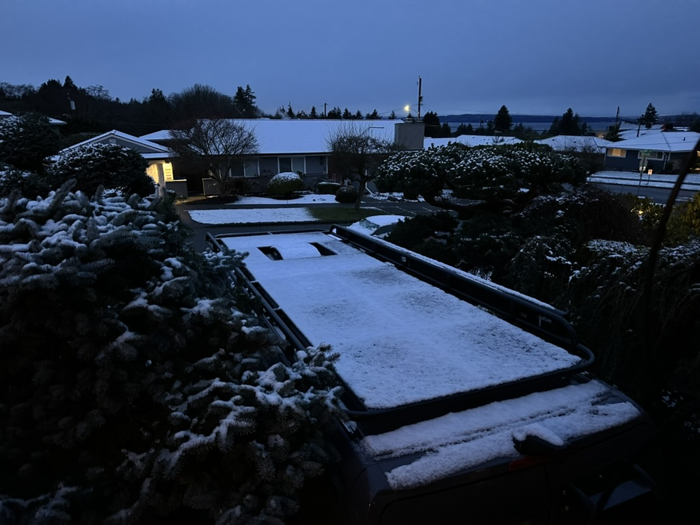

Good Morning! Sunday, Feb 18, 2024

I hope things are going well for you and your back is feeling better.   

Things are going well around here.    The days are starting to get longer, so I am seeing the sun come up before I leave for work, and I am riding my bike home, and the sun is still up, which is nice.

This was a long week on the bike front. I had three flat tires in two days.   I finally found a shard of glass just embedded enough that when the tire was full of air, and I was rolling down the road, it would work its way into the tube. But when I felt the inside of the tire while repairing it, I couldn't feel it.    And...  when I did the repairs, it would hold air overnight, but by the time I got halfway to work, the tire would be flat. So the first time it happened, Catherine picked me up from work. I was only halfway to work the second time it happened, so I walked the bike back home. The third time it happened, I replaced the tube at work and only made it halfway home, so Catherine had to come to fetch me again.  

It was an excellent reminder to not take it for granted that things just work sometimes and the impact of not having reliable equipment.

Alex is still enjoying his job. He and Katarina went to Mount Baker this weekend to ski. Hopefully, the conditions there are better than what we have seen at Snoqualmie Pass. Catherine and I drove up there Friday night, spent the night, and did one run on Saturday. The conditions could have been more fun. Our friend Yves was up there doing Nordic skiing, so he swung by afterward and hung out with us.   We left, and he stayed up there and spent the night at the condo, as he is also going skiing today.

Catherine and I are getting excited about our trip to Texas that is coming up in March. As it sits right now, the plan is to leave either Friday the 22nd or Saturday the 23rd, head east towards Spokane, and do a quick visit with Aunt Do and Aunt Gloria, if she is up for it, and then head down to Boise ID.   Beyond that, we have some ideas but have yet to make solid commitments. The goal will be to stay off the interstates and identify the challenges we might face when traveling for a year in the van.   So, we will identify and address problems as we go on this trip.

Today, there will be more work in the yard, and then this afternoon, we will go and do an escape room with Curt and Amy and then grab some dinner afterward.

Love ya
Dan W

Look has been helping do house maintenance chores on Monday nights when he comes over for soup night.  

Replacing my tube at work.   This repair got me as far as the locks, before the tire was flat again...

We had snow when we woke up on Thursday morning - it didn't last.