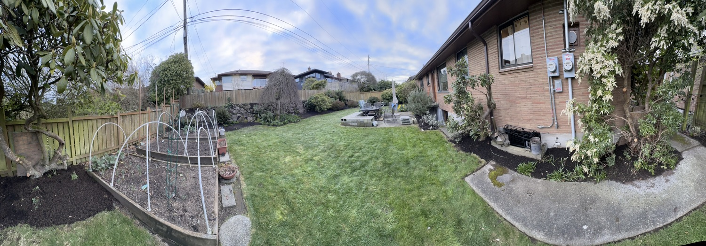

Happy Sunday! I hope things are going well and you are feeling happy and healthy.   

Things are going well around here this past week.   The shock of the layoffs is starting to wear off. We are still working through the impacts of the different programs and if there will be things that leadership expects us to deliver anyway.    I've been counseling folks to determine what they _have_ to provide and then clarify what we won't be able to deliver.   The sooner people hear the news, the sooner they can get over it and move on.

Catherine and I will head out on our adventures towards Texas and back in two weeks.   We are planning a short stop in Spokane for a quick visit with Aunt Do and Uncle Tom on Sat, the 23rd of March. We hope to see Aunt Gloria as well.   From there, we will go to Boise, Idaho, to see some friends, then down to Sandy, UT, to drop in on Uncle Dan and Cousin Dan and whomever we can rustle up.  

At the moment, it looks like we will be getting Sandy UT on the afternoon of Tuesday, March 26th.  

From Sandy, we will head towards Flagstaff to meet Sue and her clan, arriving there on Friday the 29th .   (We will probably stop for a day at Zion National Park on the way)  Mom, if you don't make it to Flag, we will swing by your place after we leave Flag.  

From there, it will hit places like the Petrified Forest, Carlsbad Caverns, Guadalupe Mountains National Park, and Big Bend National Park before arriving at the Hill Country Arts Foundation on Saturday, April 6th, so that we are in place for the eclipse on the 8th.

We have yet to do any planning for the route home other than we want to be back in the area by April 20th, as I have a car race that weekend.

This journey will be about figuring out how to do a trip like this. Noting things on the van and the road are problems we must address before we adventure out for a year.   The other thing we want to figure out is how to manage what to do while on the road since that is a skill in and of itself.  

I have a buddy who flew to Europe with his new wife. The extent of their planning was to land and buy motorcycles and go. That was it. They were there for a year and had just a stunning time!

Ok - gonna wrap this up and send this off!

Love ya!
Dan W

PS - for a detailed look at what our route currently looks like check out [2024-03-01-Seattle-Hill-country-art-council-13-day-itinerary](../trip-reports/2024-eclipse-texas-roadtrip/2024-03-01-Seattle-Hill-country-art-council-13-day-itinerary.md)

Not a big week for pictures.

Here is a panorama of our backyard.   We have been getting on the yard maintenance.  Everything is pruned and weeded, and the mulch is laid down.  The garden is ready to be planted, and then later, we will plant our planter boxes for the summer.

## Letters to Mom
These are the letters that I send to my mom, Aunts, and others on a regular basis to share what's up in my life.
- [2024-06-02-sun-may-is-a-wrap---on-to-junuary](./2024-06-02-sun-may-is-a-wrap---on-to-junuary.md)
- [2024-05-26-sun-a-week-of-events-and-a-rainy-spring](./2024-05-26-sun-a-week-of-events-and-a-rainy-spring.md)
- [2024-05-19-sun-news-at-expedia](./2024-05-19-sun-news-at-expedia.md)
- [2024-05-12-sun-happy-mothers-day!](./2024-05-12-sun-happy-mothers-day!.md)
- [2024-05-05-sun-sunday-visit---spring-is-in-the-air](./2024-05-05-sun-sunday-visit---spring-is-in-the-air.md)
- [2024-04-28-sun-back-from-work-and-racing-at-the-ridge](./2024-04-28-sun-back-from-work-and-racing-at-the-ridge.md)
- [2024-04-21-sun-eclipse-week-for-sees-us-return-home](./2024-04-21-sun-eclipse-week-for-sees-us-return-home.md)
- [2024-04-14-sun-eclipse-trip-week-three---from-texas-to-central-california](./2024-04-14-sun-eclipse-trip-week-three---from-texas-to-central-california.md)
- [2024-04-07-sun-eclipse-week-2---from-moms-to-hill-country-art-foundation](./2024-04-07-sun-eclipse-week-2---from-moms-to-hill-country-art-foundation.md)
- [2024-04-01-mon-eclipse---week-one---getting-to-mom's](./2024-04-01-mon-eclipse---week-one---getting-to-mom's.md)
- [2024-03-24-sun-visit---starting-on-the-road-trip](./2024-03-24-sun-visit---starting-on-the-road-trip.md)
- [2024-03-17-sun-sunday-visit---6-days-to-the-trip---skiing-in-whitepass](./2024-03-17-sun-sunday-visit---6-days-to-the-trip---skiing-in-whitepass.md)
- [2024-03-10-sun-getting-excited-for-our-trip-to-texas-for-the-eclipse](2024-03-10-sun-getting-excited-for-our-trip-to-texas-for-the-eclipse.md)
- [2024-03-03-sun-sunday-visit---expedia-layoffs---i-am-ok](./2024-03-03-sun-sunday-visit---expedia-layoffs---i-am-ok.md)
- [2024-02-25-sun-sunday-visit](./2024-02-25-sun-sunday-visit.md)
- [2024-02-18-sun-sunday-visit](./2024-02-18-sun-sunday-visit.md)
- [2024-02-12-mon-snowbirds-and-superbowls](./2024-02-12-mon-snowbirds-and-superbowls.md)
- [2024-02-05-mon-visited-with-krista-todd-joe-and-jada](./2024-02-05-mon-visited-with-krista-todd-joe-and-jada.md)
- [2024-01-29-Battery-refresh-in-the-van-done-jazz-alley](./2024-01-29-Battery-refresh-in-the-van-done-jazz-alley.md)
- [2024-01-25-not-much-to-report-been-sick-but-feeling-better-Alex-started-new-job](./2024-01-25-not-much-to-report-been-sick-but-feeling-better-Alex-started-new-job.md)
- [2024-01-15-sking-over-martin-Luther-king-holiday-weekend](./2024-01-15-sking-over-martin-Luther-king-holiday-weekend.md)
- [2024-01-15-my-first-letter-to-mom](./2024-01-15-my-first-letter-to-mom.md)

