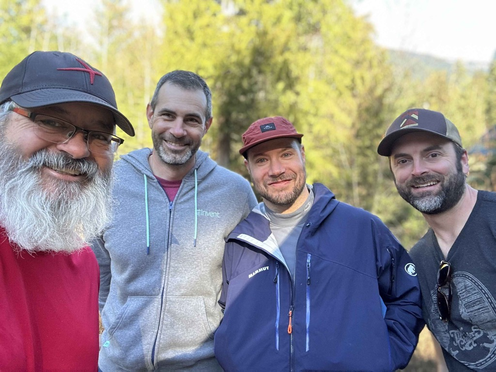

Good Day!  I hope that you are doing well and enjoying the coming spring.   Catherine and I are just a week away from starting our big road trip down to Texas to see the eclipse on the 8th of April.

This week has been about getting ready for the trip.  The weather at the beginning of the week was pretty rainy and miserable, but by Wednesday, the weather had started improving, and this weekend was stunning.  

On Wednesday, I met up with my buddy Brian Oneil for lunch near campus.  We get together every six weeks or so, and have been doing that for years.  After work, I met up with John Helde and showed him the Apple Vision Pro.  John is in the final phases of finishing up his latest movie.   I loaned him my laptop last year for him to edit the movie, and that has worked out well for him.  I should be getting the laptop back on Wednesday, which will allow me to prepare it for the road trip.   And then the OMCC spring social was on Wednesday night, so I just hung out the same place I met John.  :)

Thursday was happy hour day, and we had a pretty good turn out.  Bob and Kristie were there, as were Scott and Kirk.  Jenn showed up later, and her Daughter, and her Daughters Fiance also showed up.  The last time I saw Hannah she was just a kid, and now she is getting married.   I had a wonderful visit with both of them.

Friday afternoon, I took off early from work and headed out for white pass to meet up with some buddies for a birthday celebration.  You can read more about that trip [here](../trip-reports/2024-03-16-sat-d-7-starlink-and-whitepass.md) if you are interested.  

I decided not to do any more skiing this weekend so that I could give my feet a break and have a chance to get home a bit earlier than I otherwise would have.  So currently, I am sitting in [Taidnapam Park](https://www.mytpu.org/community-environment/parks-recreation/taidnapam-park/) on my way home.   It is a pleasant little park, and the weather is just absolutely stunning.

Catherine is heading to a Seattle Reign game this afternoon.   Katarina is house-sitting, and Alex has been in Pullman for cougar crew days.

I will stop at Cabela's on the way home from here, and pick up a few supplies for the trip.

The current  [plan](https://weaties.github.io/blog/trip-reports/Seattle-Hill-country-art-council-13-day-itinerary.html) , for the trip, has us going east from flagstaff, but we may head south first to catch a Mariners Spring training game in Peoria on Saturday March 30th.  Nothing is set in stone just yet, but our friends Bob and Lynette live in Peoria and got wind of the trip, and are trying to entice us to go down there.   

Love ya
Dan W

Brian and I after lunch.

The OMCC community club social hour at Stoup Brewing.

Our Starlink kit arrived, so we can have reliable internet on the road.

Me, Eric, Brandon, and Jaron as we went our ways this morning.   Brandon and Jaron went back to get in another day of skiing, and Eric and I headed home.

pulled out the drone, and got this picture on the side of the road.