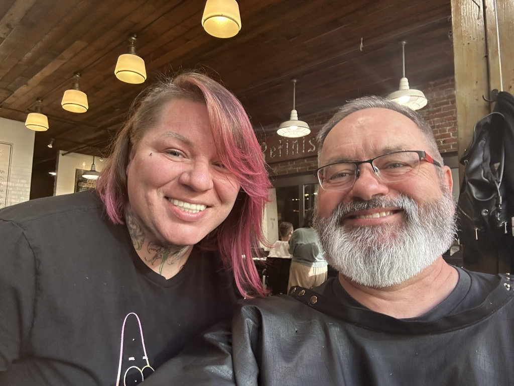
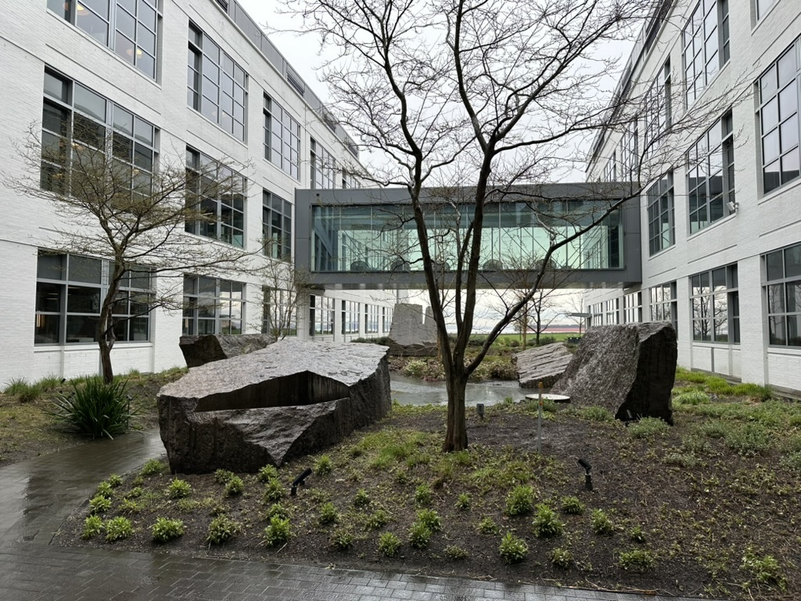
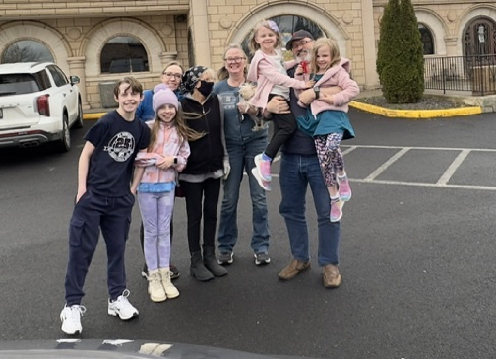

Hey Mom!  

I hope that you are well!  Catherine and I have started our trip! After months (years?) of planning, we are on the way to Texas to see the eclipse!  This week for me was all about wrapping things up at work so that everything is covered while I am gone and then making sure that I didn't discover anything that would make me fret while I was gone since I'm not going to cancel my trip, and there will be nothing I can do about it.   But the big rocks are covered.  There may be some drama in certain corners of what I am involved in, but my being there would not impact any of that.

This past week was Expedia Week, which is when everyone is encouraged to come to campus.  (it is also the week of the board of directors meeting). On Tuesday, there was the WELL (women's education learning and leadership) panel. Four board of directors members (all women) were there to speak.   I was impressed with them all, especially Chelsea Clinton and her story.    It is also notable that after Arianne takes over as CEO in May, Expedia's CEO, CTO, and CFO will all be women. 

On Thursday, Kai flew into town, so instead of the traditional happy hour, we all went to his house and had dinner. We kept him up until 8:30 so that he could work on recovering from his jetlag.   Scott, Martha, Sarah, Jenn, Elizabeth, and Katarina joined us.

After dinner, John Helde stopped by the house to return the laptop I loaned him last year to edit his Film Marcies.  Having my own laptop is nice, and I did _NOT_ bring my work laptop with me on this trip.  :)

[Friday night](../trip-reports/2024-03-22-fri-day0-the-night-before-we-leave.md), we had Kai over for dinner and went to Shoreline Community College to see the Woodland Park Players' production of My Fair Lady.   When we got home from that, I finished loading up the van and putting things away so that in the morning, we could bounce up and ROLL!

[Yesterday](../trip-reports/2024-03-23-day1-sat-seattle-to-spokane---visit-aunt-glo-and-do-and-uncle-tom.md), we kicked things off with the first leg of the trip to see Aunt Gloria, Aunt Do, and Uncle Tom, and we had wonderful visits with them.  

Today, we are heading towards Boise, Idaho, where we will hang out with our friend Patrick Atkinson, who moved there a couple of years ago.

On this trip, I will be writing a daily [trip report](../trip-reports/index.md).  I recognize that that could be a bit overwhelming for folks, so I will keep writing a weekly mail that links to those different trip reports as I mention them in these missives and keep sending it to this group.   Let me know if anyone is interested in getting mail with the daily trip reports, and I will include you in those mailings.

Love ya All!

Dan W

I got a hair cut and my beard trimmed for the trip!

The women of the Expedia Board talking at the [WELL](https://careers.expediagroup.com/blog/introducing-well-women-at-expedia-group-learning-and-leading/) (Women at Expedia Group Learning and Leading) Seminar on campus.

On Tuesday night we had the OMCC general meeting at the Gilbert and Sullivan rehersal space. 

One of my coworkers had some extra raspberry canes, and was kind enough to give me some.   I have such fond memories of picking Raspberries at Granma P's house.  I am hoping that these are just as wonderful in a couple of years :) 

This is the "Rock Garden" between "E" street on the left, and "D" street on the right.   I got this as a "before" picture to compare to when we get done with this trip.

We are having the treatment around the stairs rebuilt and refinished to be complete.  So they started this.  The same guys also repaired our front porch last year, and just installed new gates into the backyard.

Curtain call at my Fair lady

Aunt Glo's clan outside of azteca

That's Mick and Julie.

Nestled in at the Horn school rest area.