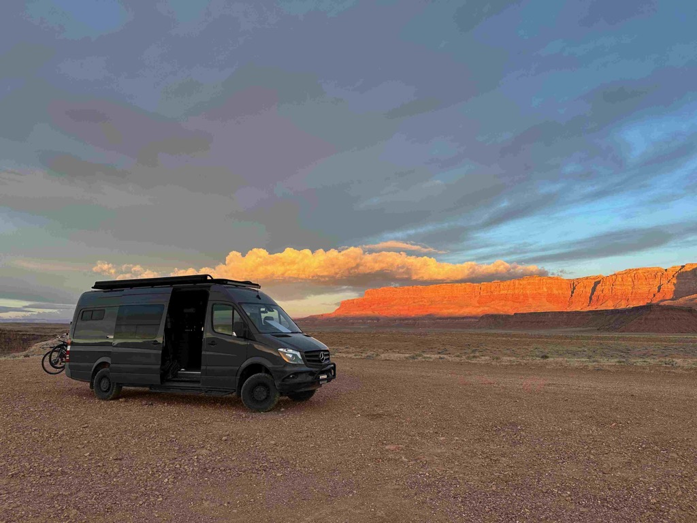
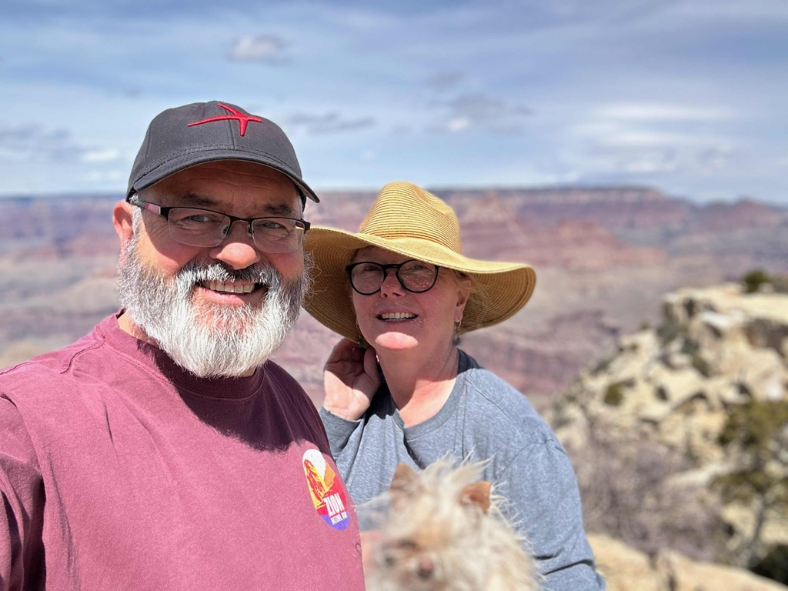
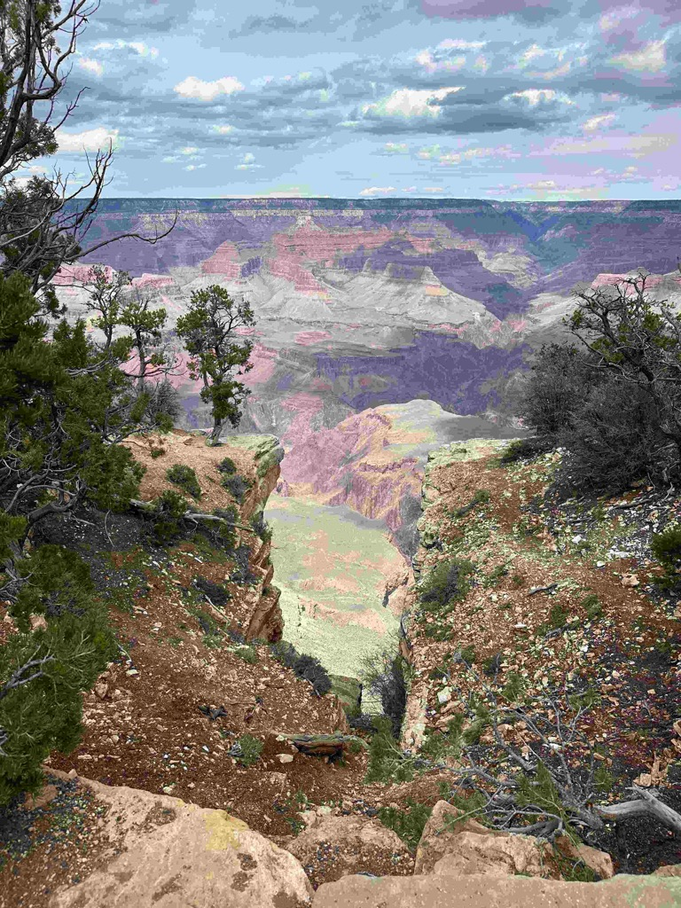
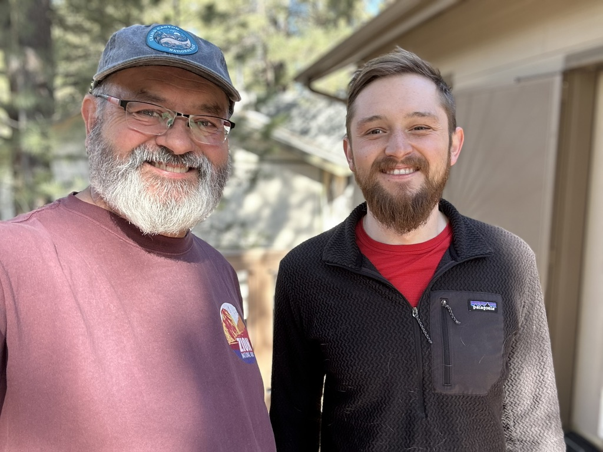

Week one is in the books, and so far (knock on wood) so good.  The rig has run reliably; we have managed to sleep very well and cozily every night.  We have had the opportunity to visit with friends and family, and we have seen some of the sights along the way.

The [first day](../trip-reports/2024-eclipse-texas-roadtrip/2024-03-23-day1-sat-seattle-to-spokane---visit-aunt-glo-and-do-and-uncle-tom.md) of the trip had us heading over to Spokane to Visit Aunt Do, Uncle Tom and Aunt Gl (with a bonus visit with my cousin Kim and her kids).  On [Day 2](../trip-reports/2024-eclipse-texas-roadtrip/2024-03-24-day2-sun-to-boise-to-visit-patrick.md)  we drove over to Boise Idaho where we had a wonderful evening and meal with our friend Patrick, whom I used to work with at Expedia.  In the morning, Catherine worked for a while, and Patrick gave me a walking tour of Boise (I want to go back for the [treefort music festival](https://treefortmusicfest.com/) next year). [Day 3](../trip-reports/2024-eclipse-texas-roadtrip/2024-03-25-day3-mon-boise-to-city-of-rocks-national-preserve.md) saw us driving down to [City of Rocks](https://www.nps.gov/ciro/index.htm) for the evening, where we had just a wonderful evening, and woke up to fresh snow on the ground.  On [Day 4](../trip-reports/2024-eclipse-texas-roadtrip/2024-03-26-day4-tue-city-of-rocks-to-vernon-resevoir---visit-with-uncle-dan-aunt-linda-and-cousin-spencer.md), we stopped in for a quick visit with my Uncle Dan Weatbrook and Aunt Linda.  And then swung by to see my cousin Spencer.    I had hoped to see my cousin Dan Weatbrook and his wife Spencer, but they were under the weather so we missed them.  That evening we stayed at the Vernon Reservoir and covered the rig and bikes with Mud!  [Day 5](../trip-reports/2024-eclipse-texas-roadtrip/2024-03-27-day5-wed-vernon-resevoir-to-kolob-canyon-.md) saw us heading towards Zion National Park where we spent the late afternoon at Kolob canyon.   and then having a bit longer of a hunt to find a place to camp for the night then we expected.   We first bumped past 30 full camp sites on some [BLM land](https://www.blm.gov) with no luck, before finding a spot up a side road next to a river.  [Day 6](../trip-reports/2024-eclipse-texas-roadtrip/2024-03-28-day6-thur-zion-canyon-to-marble-canyon.md) had us visiting Zion Canyon and having a nice visit there.  We stayed under the vermillion cliffs that evening and had a wonderful, if windy, evening under the spectacular stars.  On [Day 7](../trip-reports/2024-eclipse-texas-roadtrip/2024-03-29-day7-fri-vermillion-hills-grand-canyon-jack-and-jay.md), we stopped at Lee's Ferry on the way to the Grand Canyon before picking up some dinner for Jack and Jay and spending the evening with them and all of their Dogs.  [Day 8](../trip-reports/2024-eclipse-texas-roadtrip/2024-03-30-day8-Sat--jack-and-jays-to-moms-via-sedona-and-jerome.md)  we headed to Mom's house via Sedona and Jerome, where we had the chance to hang out and catch up with Mom, my sister Sue, our Nephew Peter, and our Niece Sophie.

Me and Patrick in Boise

A quick bike ride in the city of rocks

This is as far up the Zion Canyon trail as I was equipped to walk.  

Catherine and Athena overlooking the Colorado River

Sunrise in the dessert.

Me and Catherine at the Grand Canyon

Looking over the canyon

A toy holds their undivided attention.

Me and Jack

The Clan at Mom's house

Our Trip so far.  
2,122 miles
157.6 Gallons of fuel
$594 for fuel
15.13 mpg
$0.25 per mile