Two weeks into our eclipse road trip, we are settling into the [Hill Country Arts Foundation](http://www.hcaf.com/) property in a wonderful campsite.   Tomorrow is the eclipse, and we are hoping for clear weather, but that is looking sketchy at the moment.  

This past week has been a wonderful week, traveling from Mom's house on [Monday and going to the Guadalupe Mountains National Park](../trip-reports/2024-eclipse-texas-roadtrip/2024-04-01-day10---moms-house-to-guadalupe-mountains-national-park.md). It was our biggest day of driving on the trip at almost 600 miles.  We spent the night at a rest stop, and on Tuesday morning, we spent the [day in the park](../trip-reports/2024-eclipse-texas-roadtrip/2024-04-02-day11-guadelupe-mountains-national-park.md), hiking and enjoying the day.  In the morning, we headed to [Carlsbad Caverns](../trip-reports/2024-eclipse-texas-roadtrip/2024-04-03-day12-carlsbad-caverns-to-big-bend.md) and explored the caves.   They are quite something.   From there, we drove over to [Big Bend](../trip-reports/2024-eclipse-texas-roadtrip/2024-04-03-day12-carlsbad-caverns-to-big-bend.md) National Park, again arriving after dark, leading to a little bit of adventure, finding a place to spend the night.   We spent [Thursday exploring the park](../trip-reports/2024-eclipse-texas-roadtrip/2024-04-04-day13---big-bend-national-park.md) before heading to a wonderful campground in the Black Gap Wild Life Management Area before [driving out here](../trip-reports/2024-eclipse-texas-roadtrip/2024-04-05-day14-black-gap-wma-to-hill-country-arts-foundation.md) to our final destination for the eclipse, where we met up with Kai.   Yesterday, we had a [wonderful day with my coworker Joyce](../trip-reports/2024-eclipse-texas-roadtrip/2024-04-06-day15-day-trip-to-joyce's-place.md) at her place with her family and friends.

So far, this trip has exceeded my expectations.  Catherine and I work very well as a team, driving, navigating, preparing food and beverages, and cleaning.  The van is a wonderful platform for all of this, and what we have seen has been spectacular.   Our friends Scott and Martha will be showing up later today, and tomorrow is the actual [2024 eclipse](https://www.timeanddate.com/eclipse/map/2024-april-8) and we are in place.   

At some point we are going to have to put some effort into thinking about the route we want to take to get home, and what we want to see on the way there.

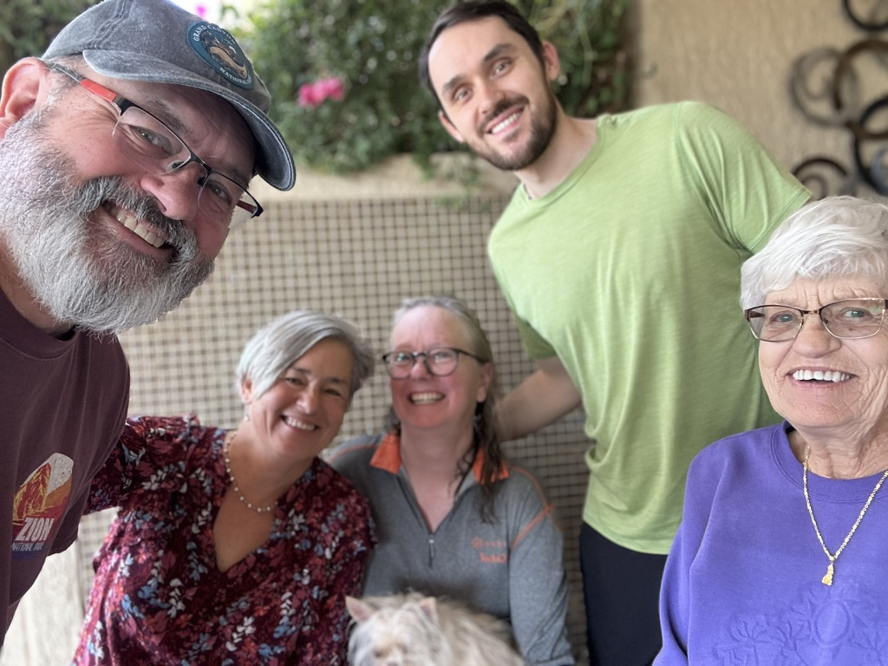
Me, Sue, Catherine, Peter and Mom saying good by on Monday.

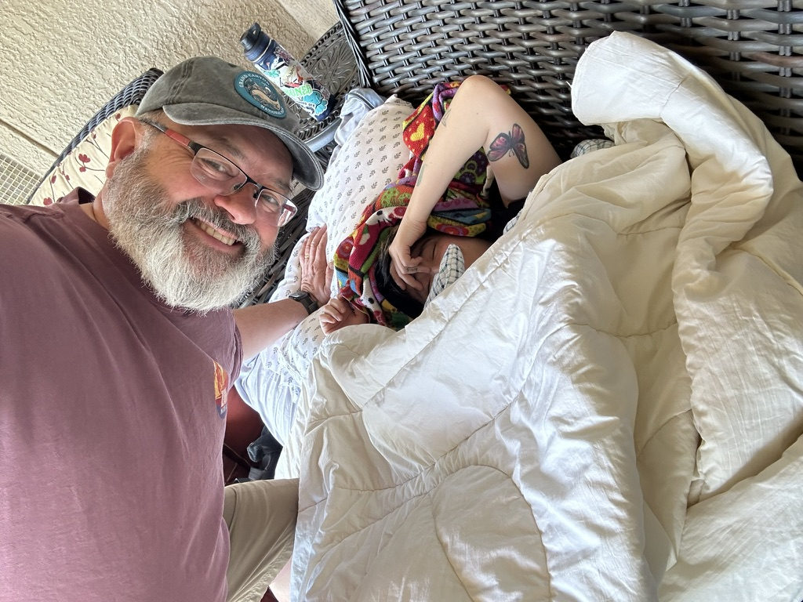
Sophie likes her sleep.

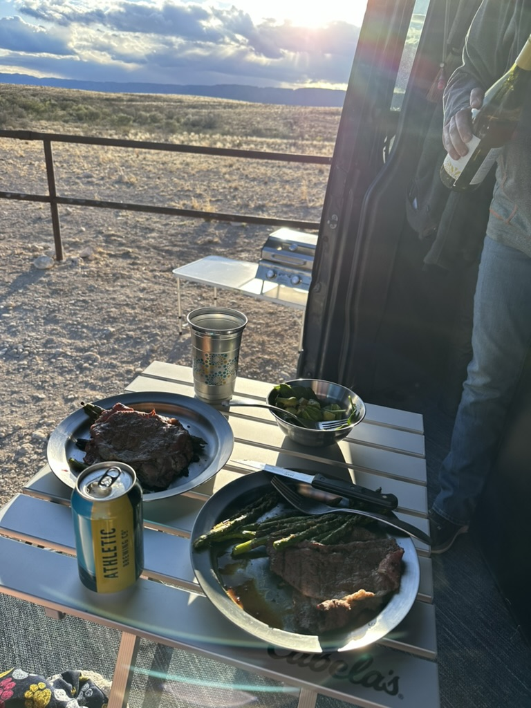
Dinner in our BLM campsite.

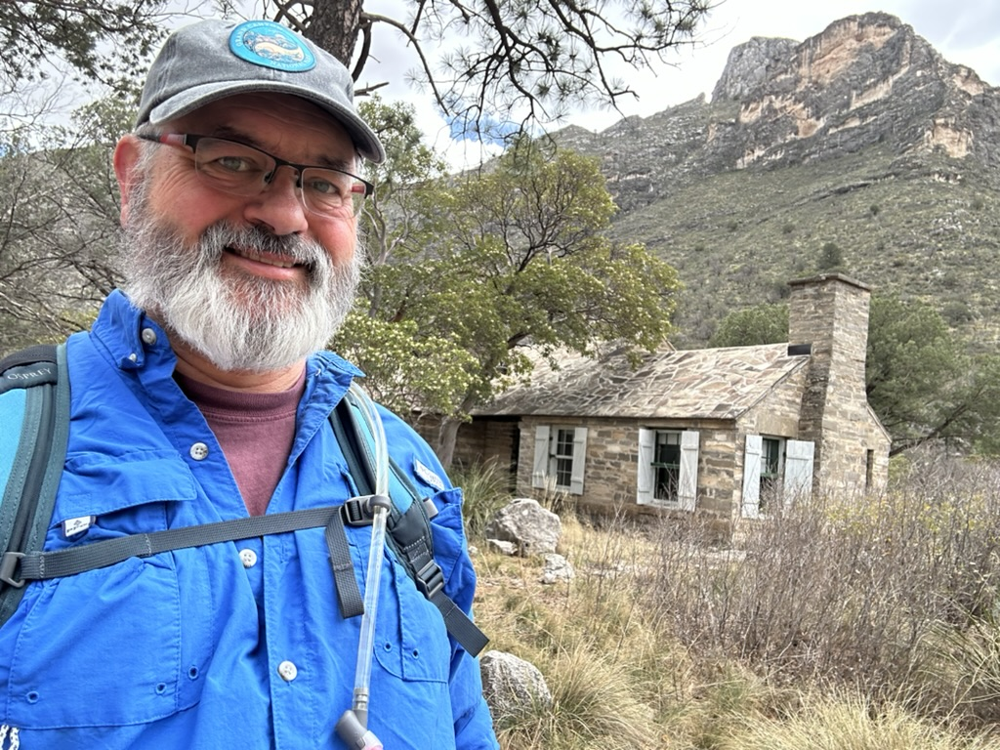
Me hiking up McKittrick Canyon in Guadalupe Mountains National Park

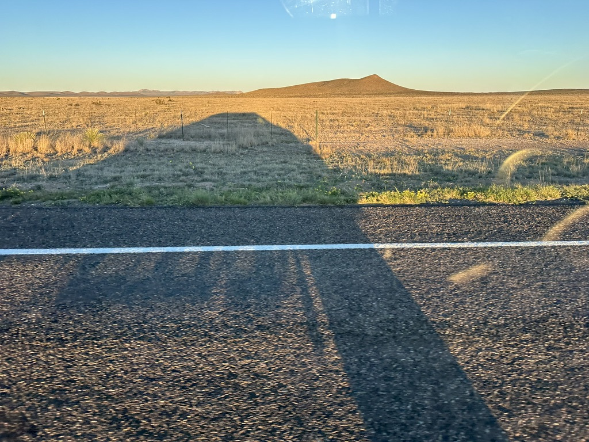
Long shadows from the van

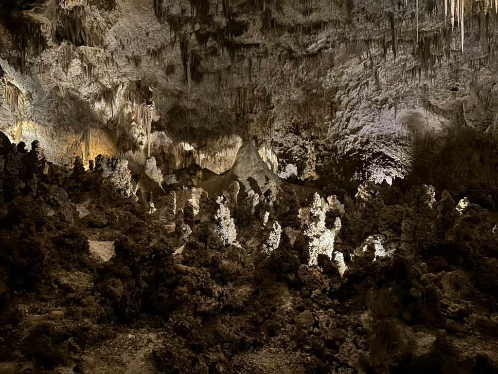
Inside of Carlsbad Caverns

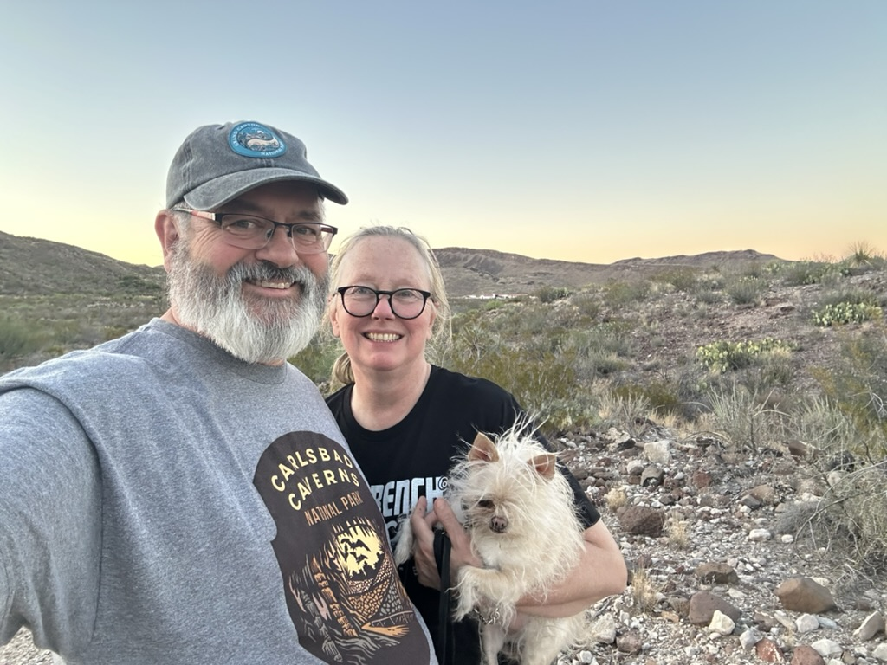
Me and Catherine at Sunset.

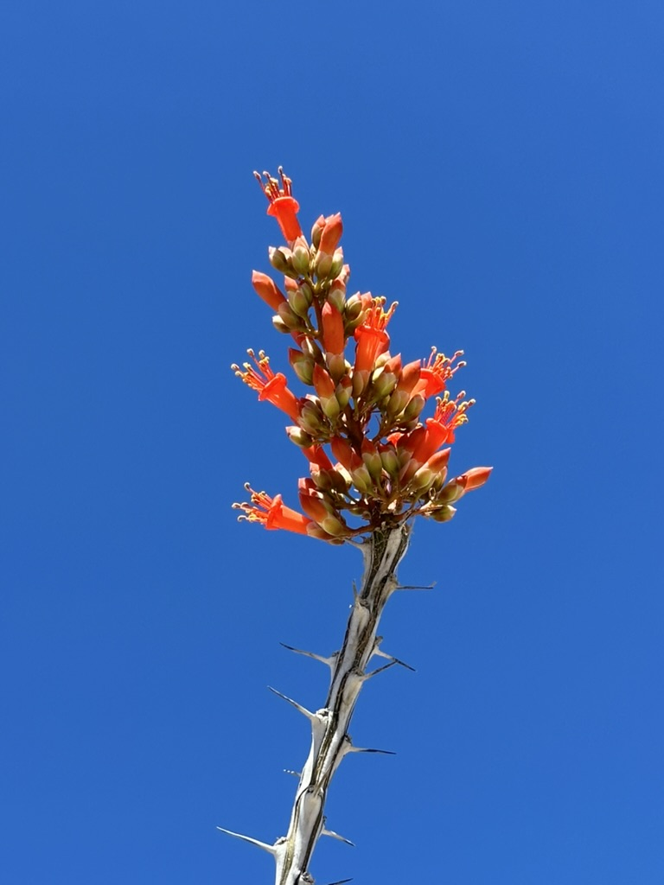
Flowers in Big Bend national Park.

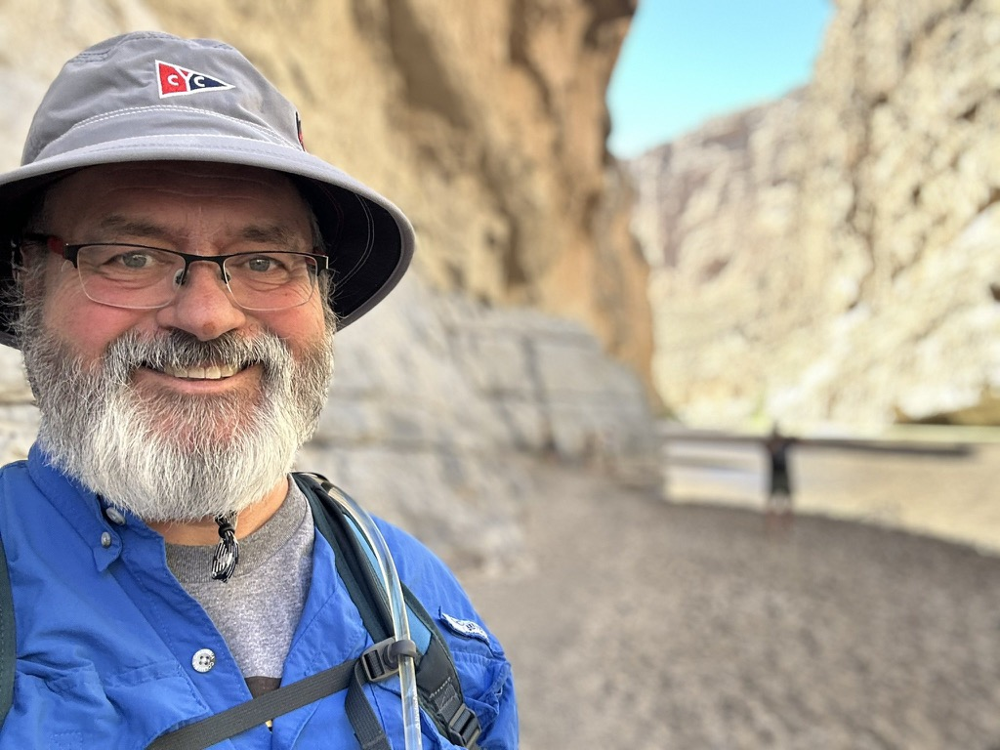
I crossed the Rio Grande into Mexico.

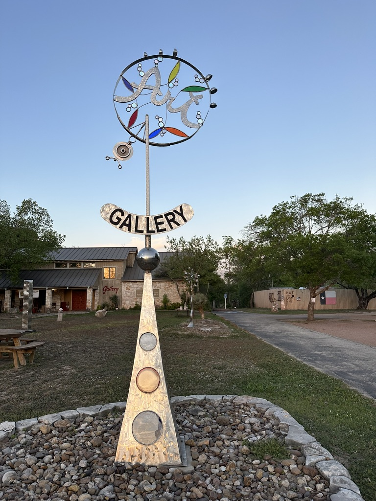
At the Arts Center.

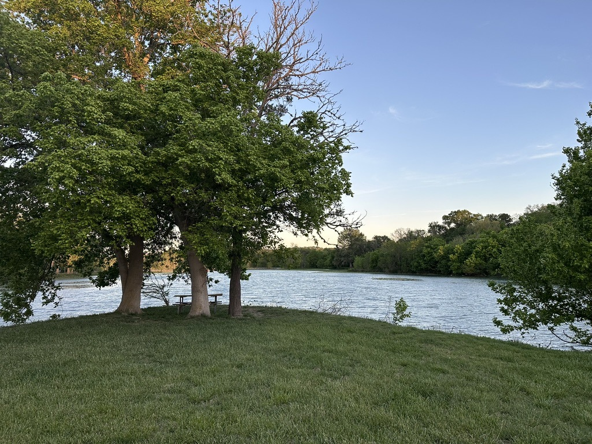
The view from the van at our campsite. 

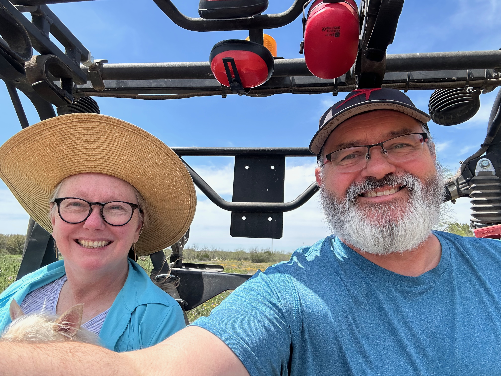
Catherine and Me driving around my coworker Joyce's property

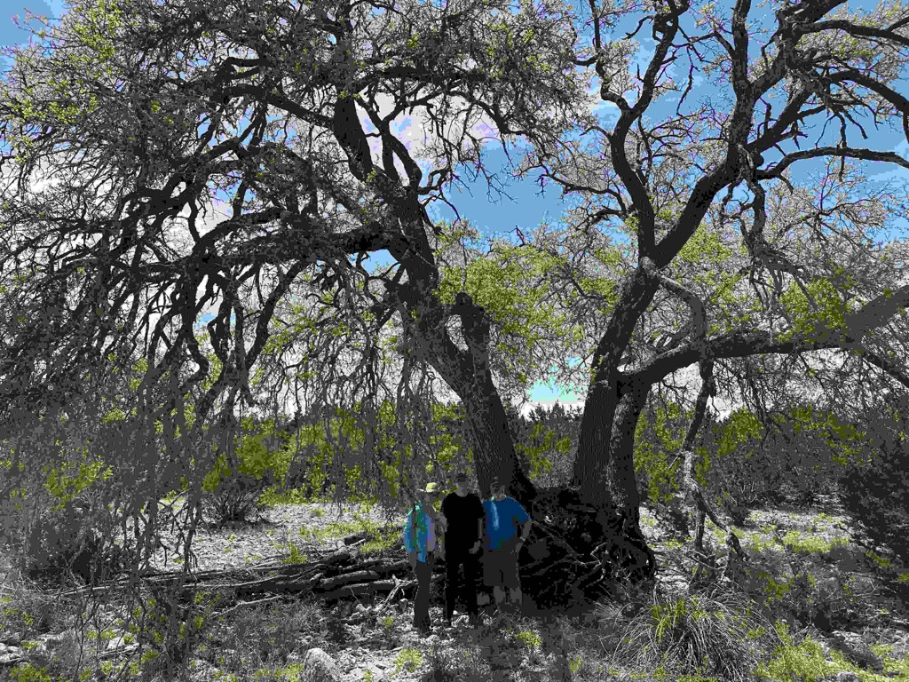Catherine, Kai and me at the oak tree in the Creek.

Week 2 stats
- miles driven - 1381
- Fuel Consumed - 109 Gallons
- Money spent on Fuel - $393
- Cheapest Fuel - $3.36 / gallon
- Most Expensive Fuel - $3.66 / Gallon
- Most miles driven on a single tank - 345