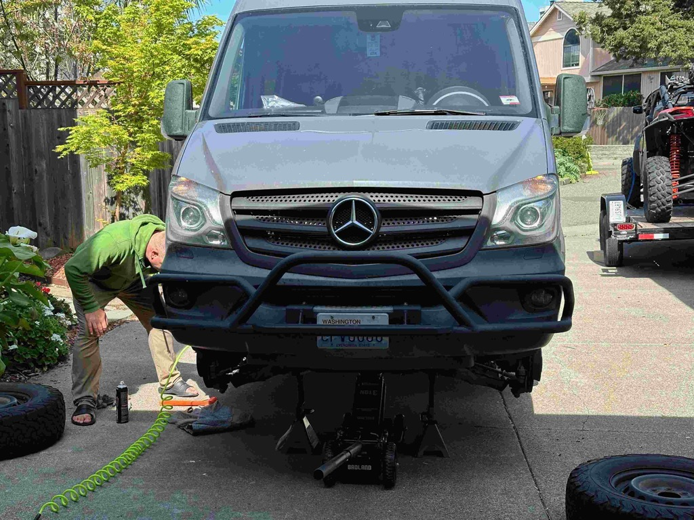

Well,  That's a wrap!  Catherine and I have returned home from our big adventures, and we both agree that the goals of this adventure have been met.

1. See the eclipse - check - even though there were clouds
2. See friends and Family - check
3. Visit cool places, and see new things - check
4. Trial run the van and see if it is something that we can do for an extended period of time - check

This past week we started by heading up to [Petaluma on Day 23 and 24](../trip-reports/2024-04-15-day23-and-24---petaluma-with-eric-and-dillon-beach.md) to hang out with my cousin Eric, his Wife Maggie, and their wonderful daughter Sahalee.   It was good to catch up with Eric and the Fam.  While we were there Eric and I geeked out about our vans, and he helped me check the brakes on our Van to discover that the passenger side rear brake pads were shot - they managed to get us home, but I have new ones to put on today.  

From there we had a short drive over to [Lawsons Landing on day 25](../trip-reports/2024-04-16-day25-lawsons-landing-with-george-and-the-boys.md) where we met up with our good friend George and his kids Felix and Stefan.  There we enjoyed catching up, hanging out at the campfire roasting marshmallows in the evening, flying kites, and eating oysters. 

From there, the horse started smelling the barn (so to speak), so we didn't make as many stops along the California or Oregon coasts as they warrant - but we did have a wonderful visit to Mancino, and a wonderful night of food and music in [Eureka on day 26](../trip-reports/2024-04-17-day26---dillon-beach-to-clam-beach-with-a-stop-in-mancino-and-eureka.md) of the trip.

From there we headed up to a wonderful national forest service campground on the [Oregon coast on day 27](../trip-reports/2024-04-18-day27-clam-beach-to-oregon-coast.md) Along the way we stopped in and checked out Redwood National Park, as well as the trees of Mystery.

And finally, [Friday day28](../trip-reports/2024-04-19-day28-oregon-to-home.md) saw us make the final push home to arrive just at 4:00 PM. Where we unloaded, and cleaned the rig.   We caught up with Katarina before she headed out for her Mom's birthday, and we started slipping back into normal life.

Here are some stats from the trip.

| Title                               | Value                                                                                                                                                                                |
| How long was the trip               | 28 days                                                                                                                                                                              |
| How many days of driving            | 23 days of significant travel                                                                                                                                                        |
| How many times were the bikes ridden | four or five days                                                                                                                                                                    |
| Miles Driven                        | 6,604                                                                                                                                                                                |
| Fuel Stops                          | 28                                                                                                                                                                                   |
| Fuel Consumed                       | 432 Gallons                                                                                                                                                                          |
| Fuel Cost                           | $1,724                                                                                                                                                                               |
| MPG                                 | 15.27 mpg                                                                                                                                                                            |
| Cost Per Gallon                     | $3.98                                                                                                                                                                                |
| Cost Per Mile                       | $0.2611                                                                                                                                                                              |
| Most expensive Fuel                 | $5.60 / Gallon - Peteluma CA [Day 23 & 24 in Peteluma](../trip-reports/2024-04-15-day23-and-24---petaluma-with-eric-and-dillon-beach.md)                                                 |
| Least expensive Fuel                | $3.30 / El Passo TX - [Day 10 - Mom's house to Guadalupe](../trip-reports/2024-04-01-day10---moms-house-to-guadalupe-mountains-national-park.md)                                         |
| Oil                                 | I checked the oil pretty regular - and never needed to add any                                                                                                                       |
| Most miles on a single tank         | 345 miles [Day 10 - Mom's house to Guadalupe](../trip-reports/2024-04-01-day10---moms-house-to-guadalupe-mountains-national-park.md)                                                     |
| Most miles in a single day          | 608 miles [Day 20 - to Joshua Tree](../trip-reports/2024-04-11-day20-white-sands-area-to-joshua-tree.md)                                                                                 |
| Highest elevation                   | 8,154 feet [Day 20 - to Joshua Tree](../trip-reports/2024-04-11-day20-white-sands-area-to-joshua-tree.md)                                                                                |
| Maintenance issues                  | No significant issues.   I did check the brakes at my cousin Eric's place, and we discovered that the passenger side rear pads were shot - we made it home and have new ones coming. |

and an overview of our route.

Catherine and I have identified several little things we can improve about the van, for example, more storage nets in the van, lights under the bed, area rugs that can have the dirt beat out of them instead of fitted carpets that need to be vacuumed.   Better charging infrastructure for the laptops, convert the Starlink to run directly off the battery instead of the inverter.   A swing arm for the bike rack, a cover for the bikes.  A solution for storing shoes is a built-in Kennel for Athena with a catch-all box above it, and Adapters that go in the dashboard can holders that will hold out coffee cups on the road.  But man, there is _nothing_ big on that list.   

Things that we changed on the trip are 1) we bought new chairs from Cabelas that were more comfortable while camping, 2) we bought a small camp table from Cabelas that was much easier to deploy and way more sturdy and stable than the one we started with.   

I hope everyone has enjoyed getting these updates from me as the trip went on.   I will stop the daily trip reports until our next trip, but will keep up these weekly letters with pictures from the week.  

I put together a four-ish minute slide show video of the best pictures from the trip - you can watch it on [youtube here](https://www.youtube.com/watch?v=L3x6HtO3I_U)

Love ya all
Dan W

Athena likes to sleep in in the mornings.

Eric helping me check the brakes on the van.

Me, Catherine and Sahalee

Me and my cousin Eric.

Georges Van and our Van.  George was instrumental in the purchase of our van.  When we found it, he was able to extend a business trip and spend a number of hours at the Dealership inspecting it and giving us the report we needed to feel comfortable that this was the van for us.  

Me, Stefan, George, Felix, Catherine and Athena

We had a wonderful campfire where we roasted marshmallows.

The Oregon coast could take a month itself of exploring and hiking.

Grabbing fish and chips at Noyo's in Fort Bragg

Catherine and I did a great job of sharing the driving responsibilities.   

Dem are some big trees!

More Big trees!

Athena spies, with her only eye, momma up in the trees!

There's momma walking way up in the trees.

And here she is enjoying the sunset on the beach.

Sunsets are big on the oceah shore.

So so so many rocks just off of the shore.

Look!  It's home!

Would you look at that, after four weeks together we are still enjoying ourselves.

That's how many miles we have on the van now.