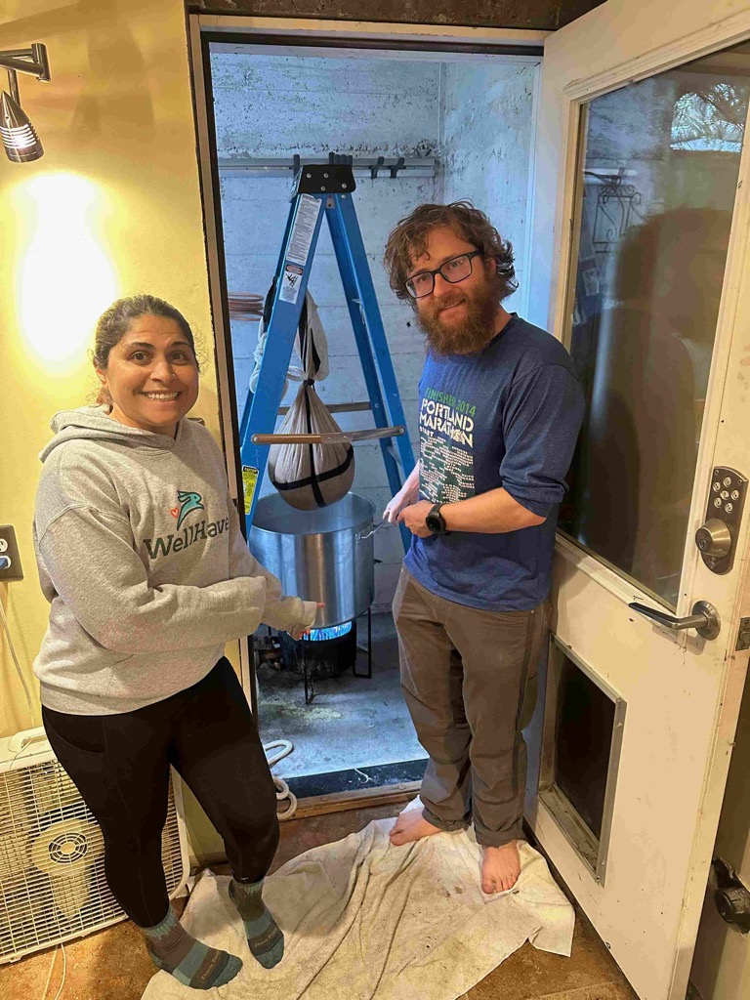

Good Morning!  and welcome to the Month of May - This is the month where I usually feel like I have really made it through the winter, as all of the trees are busting out in green, the flowers are up, there is daylight _before_ I get out of bed.   I _just_ love this time of year!

This past week was a pretty good week.  Peter Kern, the CEO of Expedia for the last four years, had a Coffee with Peter session on Tuesday as he gets ready to hand the reigns of the place over to Arriane.  There wasn't a speach or a statement, but more of a receiving line where folks could come up and shake his hand and say a few words.  So I did that.  I will say that I don't think Expedia would have survived the Pandemic without Peter at the helm.  We were not only able to survive the pandemic, but we competely re-invented the company, and I believe for the bett

