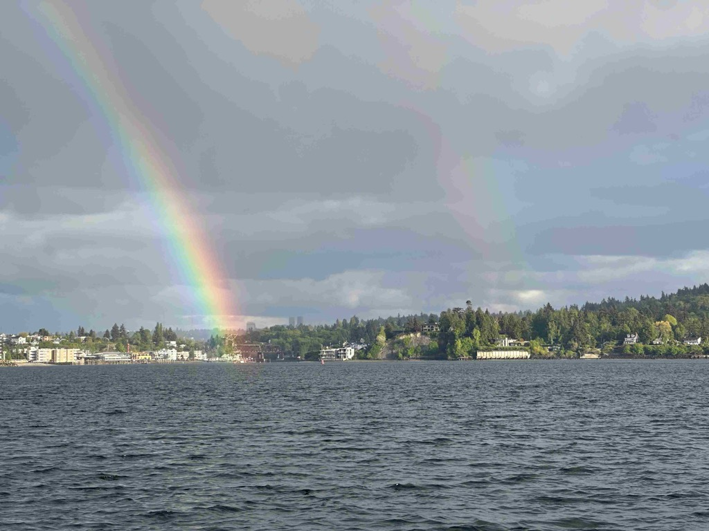
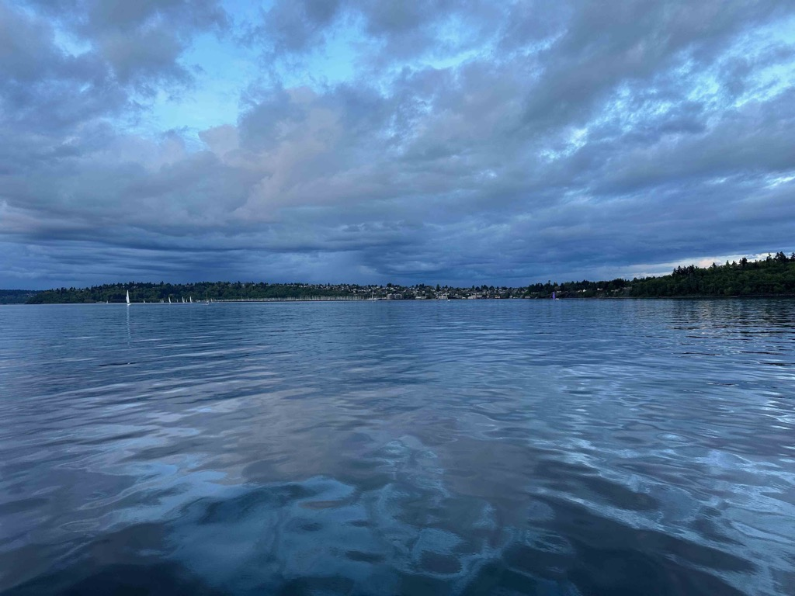

Good Morning! Welcome to the Month of May! - This is the month when I usually feel like I have made it through the winter, as all of the trees are busting out in green, the flowers are up, and there is daylight _before_ I get out of bed.   I love this time of year!

This past week was pretty good.  Peter Kern, the CEO of Expedia for the last four years, had a Coffee with Peter session on Tuesday as he got ready to hand the reins of the place over to Arriane.  There wasn't a speech or a statement but more of a receiving line where folks could come up and shake his hand and say a few words.  So I did that.  I will say that Expedia would not have survived the pandemic without Peter at the helm.  We were able to survive the pandemic and completely re-invented the company, and I believe for the better.

Later in the week, I introduced myself to Jeff, the campus gardener.  He is a super exciting guy.  He worked thirty years at Seattle Pacific University as their main landscape guy.  And he has been working for Barry on campus for a couple of years.   Jeff knows his stuff, and Barry Diller _really_ likes his plants and flowers (and is somewhat specific about the colors used as well).  And Jeff is on a first-name, friendly basis with Barry, Peter, and Arriane.  We met on Friday, and he gave me a tour of the boardroom.  Barry Diller had a huge influence on everything that went on here.  The stories are legendary about his attention to detail in this space and his Ire when things don't meet his expectations.

This past week, the VP for the org that I am in had his leadership team in-house and held a Happy hour on Wednesday.   It was good to have a chance to chat with a lot of those folks and get a sense of where they think things are going with the company.   This will be an interesting summer as we go through this CEO transition and see where she wants to take the company.  We have already seen two of the L2 leaders leave the company (the CEO is L1, those that report to the CEO are referred to as L2, leaders, the leaders that report to the L2's are L3's, etc)

Moving onto non-work-related items.   We have moved soup night to Tuesday nights, freeing me up to sail with Tom on Monday nights.  This past Monday, I joined the Corvo crew out on the sound, and we had a pretty good race.  There were too many boats and not enough space at the leeward mark, so that was exciting. we had a protest against us that we will have to go to the protest room for, but that's part of racing.

Thursday, we all went to Kirk's house for a nice evening BBQ, which was quite pleasant and relaxed.

On Saturday, I spent 15 hours brewing four batches of beer for Alex Kubinec's and Greta's wedding (Alex is Katarina's brother) This is going to be our wedding gift to them.  So I got up at 6am, and started that process.  Alex and Greta came over in the afternoon and helped with the last two batches and the cleanup.   It was a rather pleasent way to spend the day.

Today Alex and Katarina are on a big bike ride, and Catherine and I are going to go and see our friends Alex D and his wife Sarah down in Ballard.

Love Ya

Dan W

Rainbows on Monday out on the water

We could see both ends of the Rainbow.

And it was actually a double Rainbow!

The Monday night Crew on Corvo

Ghosting along in the sunset.

Some Angry looking clouds.   At this point We didn't think we had any chance of making it to the finish line in time, but we managed to cross the line with three minutes to spare.

Peter Kern and Myself.  

My Coworker Mary organized a charcuterie event, so I brought some salt blade in ;) 

Gathering in Kirk's back yard on Thursday

This is the hidden mural.  The same artists did three other murals that are each three stories tall, on campus.

The gatherine area outside of the board room

The plant wall you see when you get off of the elevators.

Greta and Alex brewing beer.

The brew day isn't done, until the towels used to Mop the floor are in the washing machine ;) 