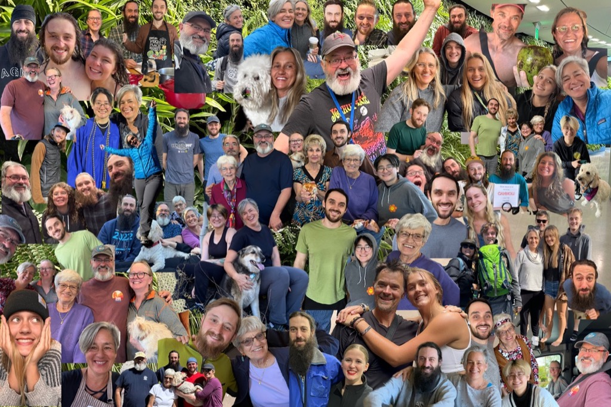

Happy Mothers Day Mom!

I'm sorry about the mothers day gift goof up.  Sue, Judy and I did _NOT_ mean to send you a 1,000 piece puzzle that was white on both sides.  It was suppose to have this picture on it!  Apparently I forgot to actually, you know, add the picture to the puzzle :).  I've ordered a replacement that I am pretty sure looks like it is suppose to.  It should be there by Wedensday.

We didn't go racing this past Monday as it looked like it was going to be cold, too windy, and rainy.   so no sailing pictures to share this week.  

The week at work went pretty well.  There is a lot of excitement in the air, as this coming week is [Expedias Explore conference](https://www.exploreexpediagroup.com/event/e57d7e74-fd5c-422e-8a59-48118fd7c2f8/websitePage:c8607554-a1e7-4f77-8618-8d6c3aba0dfe) . This will be the official handover from Peter Kern, our CEO for the last four+ years, and Arriane Gorin, our new incoming CEO.    We will also have a some announcements to make that has everyone pretty excited.   And I am excited to see what those announcements actually are.

Tuesday we had our regular Soup Night, Scott made a wonderful roasted Garlic soup, and the bread was quite good this week as well.   Luke had fun building the crunch lab squirt gun.   It's got a prank mode, where you can turn a valve, and it shoots the person holding the squirter, instead of where they are pointing it.  I managed to get Luke to pull the trigger in prank mode, but only once.  Every other time, he was on to my tricks. 

Thursday night Catherine and I joined Martha and Scott over at Chris and Emi's for a wonderful short rib dinner. 

Friday night we had a nice light show with the northern lights, so we watched that for a while.  Yesterday was a beautiful day, and we got a lot of work done in the yard, then we did some projects up at Crown hill, and then in the evening we rode our bikes down to Ballard to see some live music at the Tractor Tavern.

Today looks like it is going to be a slow paced day., which is just fine.  :). 

This is a 3d model of a something that I want to build and install in the van.  The idea is that the bottom part will be a kennle for Athena, the top part will be an "inbox" where we can put things that don't have a better place to go while we are going in and out of the Van.  the Laptops will also sit in there, and have access to charging.  On the front side if it will be a leaf that can come up and work as a desk, and then flip all the way over, and be another horizontal surface for the galley, as well as lock to secure everything that is in box.

This lillac is from a cutting that Catherine and I got from Aunt Do before the pandemic.

This is what the back yard is looking like this week.   

Brian and me at lunch at Redmill on Wednesday - we worked together back in 1996, and have been friends every since.

Emi and Chris cooking short ribs at their house.

Sister Sue gavE ME 

