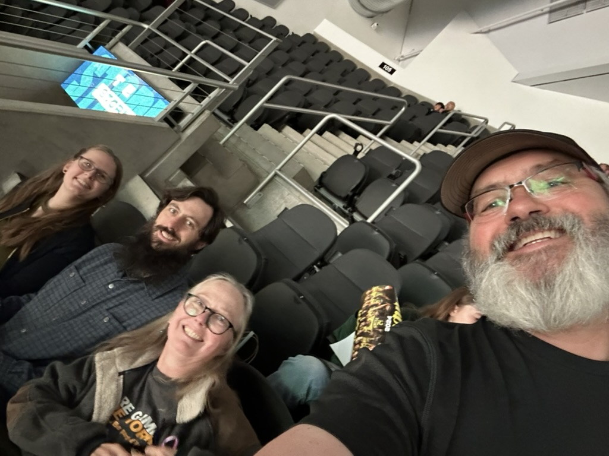
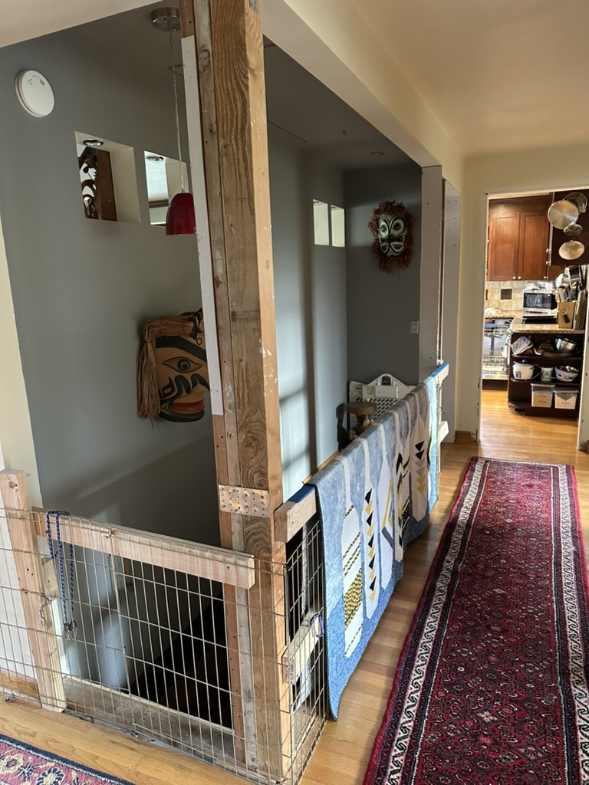
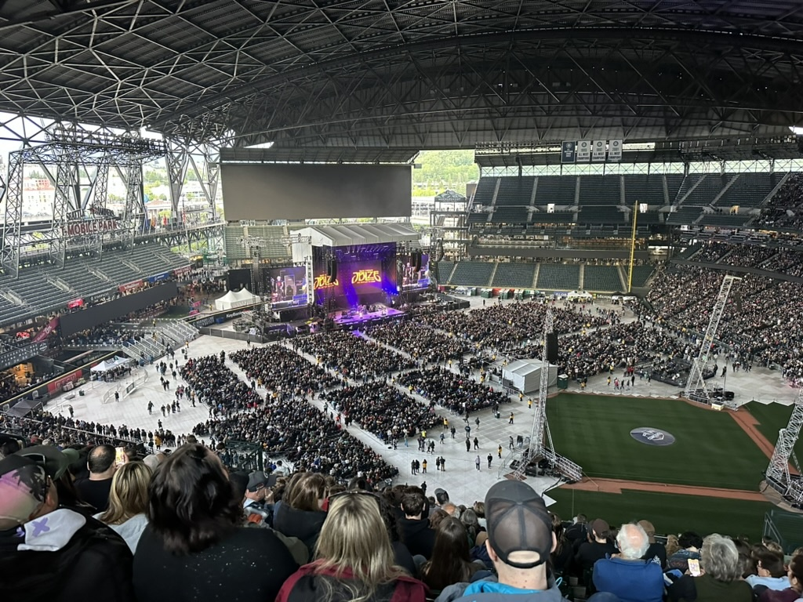
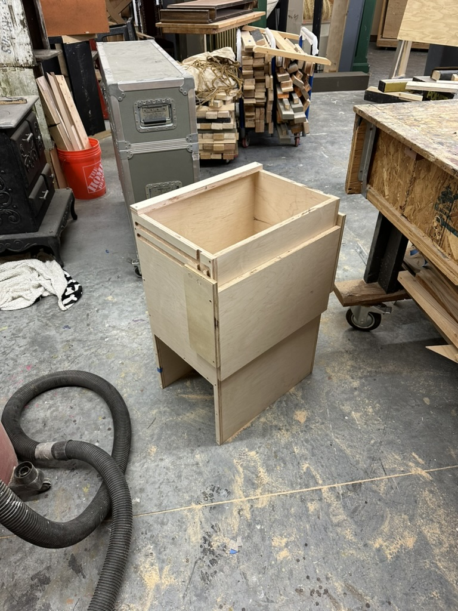
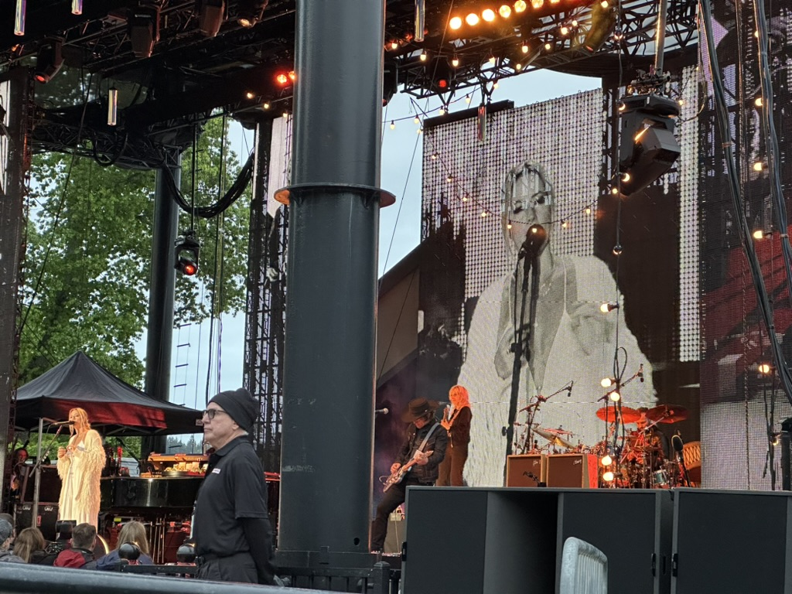
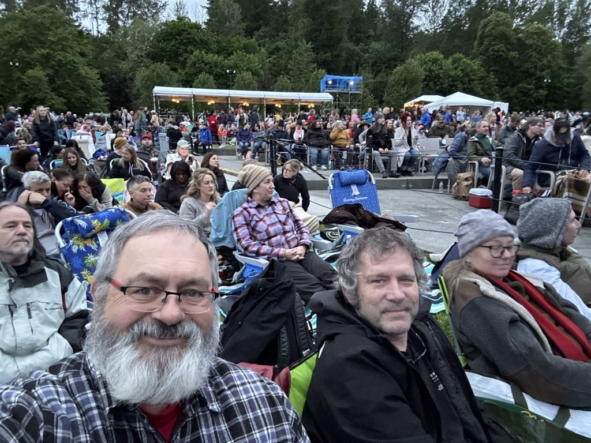

Good Morning!  

I hope that this week has been kind to you, and that everyone is healthy and happy.  Things are well around here.   I didn't get a chance to go sailing on Monday, as we had rescheduled the OMCC monthly board meeting for Monday night.   The season's hot topic is the repair of a planter at one of the entrances to the Manor - we have three architects involved in the board, and they all agree that it should be rebuilt to be consistent with how it was before it was damaged.  And we have one member of the community who is dead set to exploit this opportunity to have it rebuilt as _he_ wants it rebuilt.   He's rather vocal and insistent and attended the meeting on Monday as well, so that was a long drawn-out meeting.   In the end, we decided to repair it "in kind", and the guy that wants it different will put together a design proposal to present to the general meeting in the fall.   This is just more evidence for me that I am not cut out to be a politician.  :)

Work is going ok as well.  We had a workshop this week for our flights servicing stuff.   I've been in this industry since 2005, and I am constantly finding out that things are way more complicated then one might think.   Especially when it comes to flights, and all of the policies around who can do what, with what bookings.  It's kind of crazy.

Things have been incredibly calm about our CTO \ CPO and her right-hand man getting the ax.  The new CEO is carrying herself with great confidence and competence.  The senior leaders who are now all reporting to her are all talking and acting calmly and gracefully and moving things forward, so I am optimistic that things won't come crashing down immediately.   It will be interesting to see how things evolve over the next six months as we start to settle on the new leadership roles, and what we have been doing continues to evolve. 

Tuesday, on the way home from work in the rain, the axle on my pedal broke on my bike.  Fortunately, I could "motorcycle" home and had plenty of battery power to do that.   My buddy Matthew works at a bike shop, and grabbed me a replacement set of peddles, but they had the wrong size threads, so I wasn't able to get new peddles until Friday - in the meantime, I borrowed Alex's bike.

On Wednesday night, Catherine, Alex, Katarina, and I went to the Seattle Storm game.  We all met at Will's place and had dinner with him before the game, and then walked from his place to the arena, which worked out wonderfully.

This was the first game that Caitlyn Clark played in Seattle, and it really drew a crowd (The most people to ever attend a WNBA game in Seattle as a matter of fact)

It was quite the thriller of an ending!  The last 14 seconds of the game clock took over 15 minutes of wall time to complete.

This is a before shot of the railing around the stair case.   We have a new metal railing that has been created, and the guys are in this week preparing to install it.  At the moment they are drywalling around all of the posts.  I keep hearing dad say that "the best time to sand your mud is while it is still wet". These guys do beautiful metal work, but I don't know that they have the same level of skill with Drywall.  We will see how it looks when they are done with the sanding :) 

On Friday night, Catherine and I caught the train to head down to T-Mobile park to see Billy Joel perform.  The opening act was the Jason Bonheim Led Zeppelin evening - JBLZE.  (Jason Bonheim is the drummer, and is the son of John Bonheim, the original drummer for Led Zeppelin). I have to say that they did an excellent job playing the Led Zeppelin canon.

Billy Joel put on one heck of a concert!   He quipped, "The piano points this way, and the piano points that way - and that is it for special effects". :).   He performed for over two and half hours (including the encore)  and did all of his hits, as well as covering two Jimmy Hendricks songs, as well Start me up, by the rolling stones.   He also brought JBLZE on stage for two Led Zeppelin songs.  All and all a great show!

Saturday morning, and early afternoon, was spent working on this Kennel Cabinet for the van.  I designed this all in onshape, and use VR, to check it's fit in the van, and then I was able to create the construction drawings for it.  and Damn if it didn't all work as expected.   I've got a couple of tweaks to do, and then it will be time to finish it.   

Here it is in the van.  Athena will use the opening in the bottom as a kenel to hide out.  The shelf is also a cover that we will be able to lock on the top to secure things.

The idea is that we use this cabinet as just a quick and handy place to drop things as we go in and out of the van, and a place to secure and charge the laptops.

And when we turn the drivers seat around it can be a desk to work from.   And the height of the desk can be adjusted.   

Saturday night we drove out to Chateau Ste Michelle for the [Sarah McLachlan](https://en.m.wikipedia.org/wiki/Sarah_McLachlan) concert with Kyle and Diane.  Getting into and out of the venue is a sub par experience, as we were standing in line for well over an hour.  Sarah, however, is a very good singer ;) 

Me, Kyle, Catherine and Diane sitting up front. 

Love ya all

Dan W  