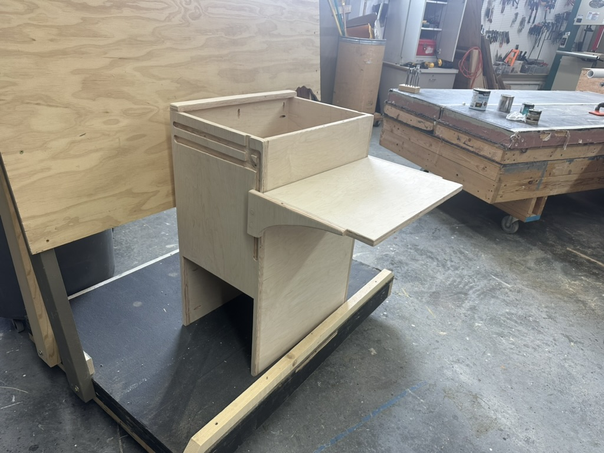
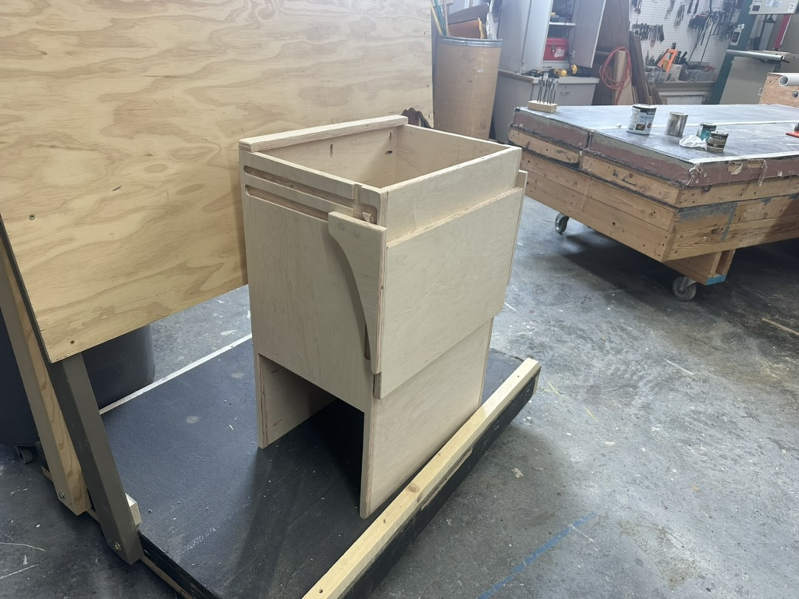
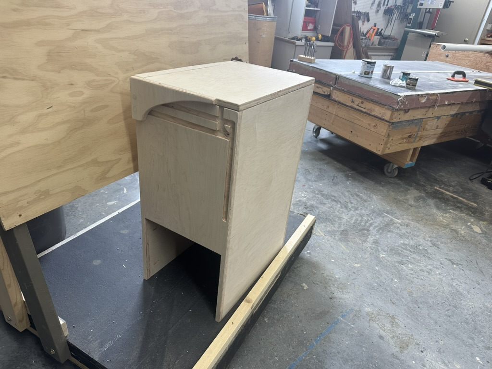
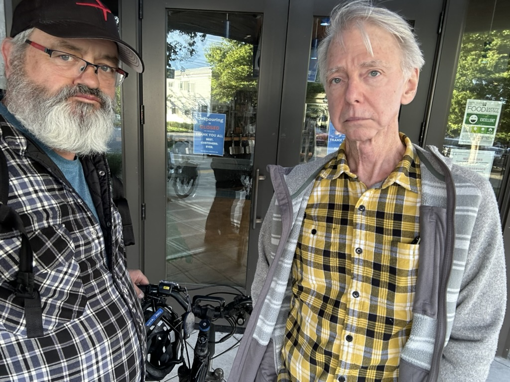
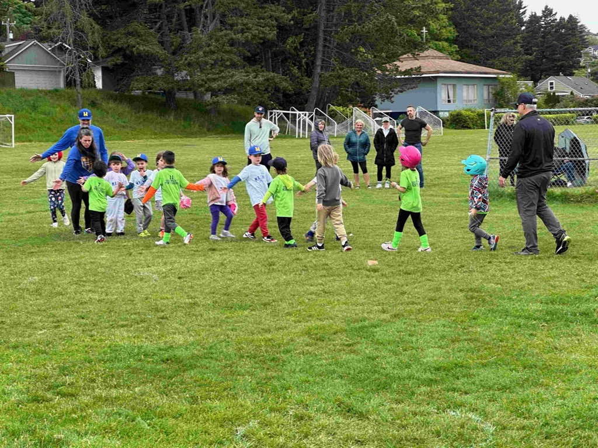
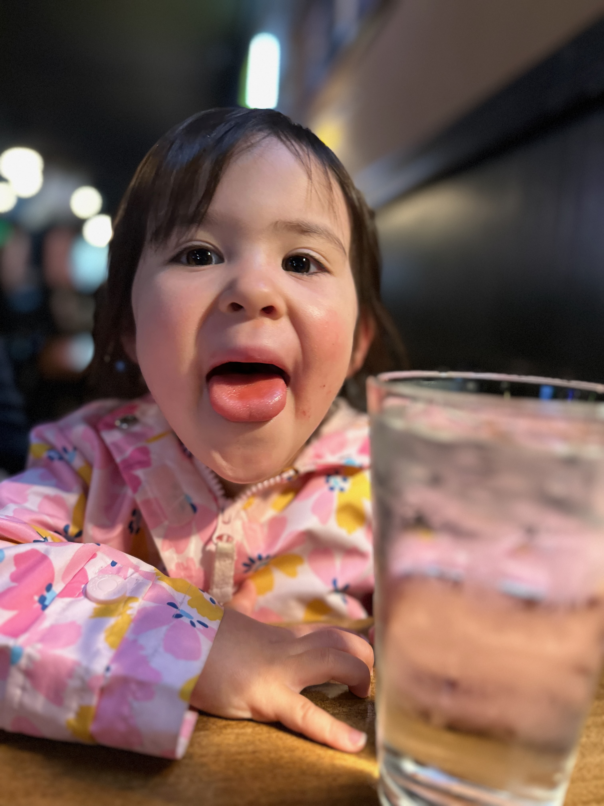
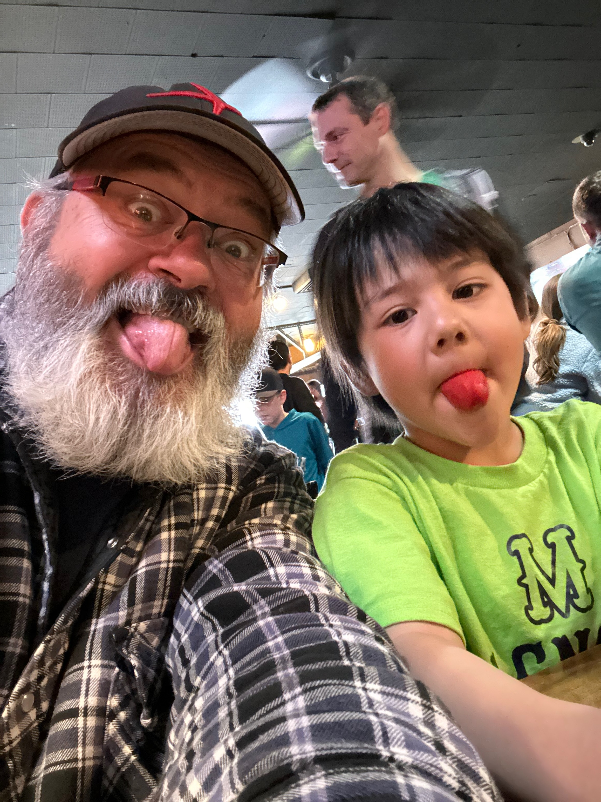
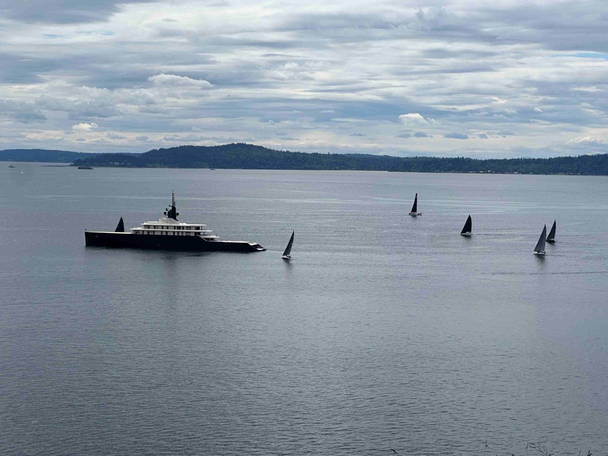
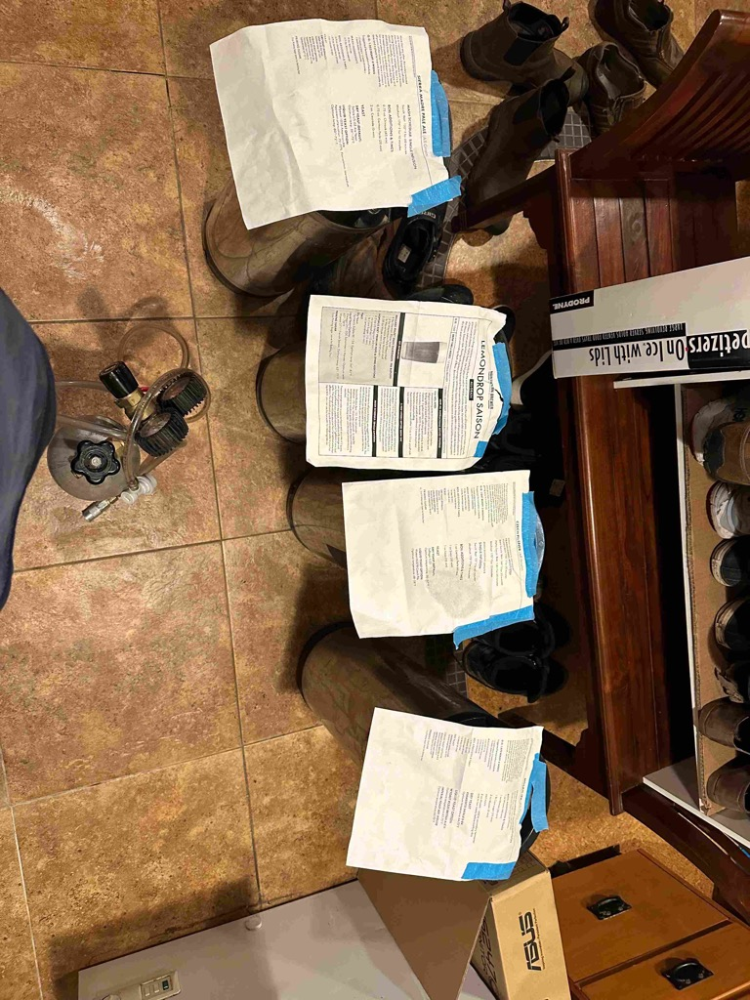

Hey all!  

I hope that this has been a good week for you!  For me, it was a nice short week.   

On Memorial Day I realized that I could have done a better job of assembling the Kennel/Cabinet that I had built earlier in the weekend, so I went back up to the shop and made a couple of new parts, and then reassembled the whole thing using pocket screws.   It looks a lot better as a result.  It's one of those things.  It would have been fine, but I was going to be looking at it for a long time, so i am glad I took the time to redo it.   

In the afternoon, Catherine threw some pork ribs on the Grill to smoke, and we headed out to meet up with Kat and Mark and had a wonderful afternoon of sampling a couple of beers at some breweries on the Magnolia side of the ship canal, and then came back to the house and had a wonderful dinner of Ribs and grilled Veggies.  

Tuesday was another nice soup night.   Chris and Emi made a wonderful Tom Ka soup.   

Wednesday, I had a chance to meet up with my friend John, and we talked about the movie-making process.   He has just finished up his most recent movie, and the next step is to get it into a film festival.  

Thursday, Scott and I met up after work for our Happy hour.  We were going to grab a beer at Outpouring, one of our favorite local bottle shops, only to discover that they have closed, like forever (as they said on their sign).  :(.  so we walked to another neighborhood bar called Bakes for a drink. 

Friday, I was going to work from home, but my work laptop started acting up, so I went to campus (it was a beautiful day for a bike ride anyway) to see if there was anyone there from IT to support me, but nope, there was not.  So I had to file a ticket, and hopefully, they can get the screen fixed on Monday.

Friday night Alex, Katarina, Catherine, and I played some games after dinner.  It had been a while since we had done that, and it was quite pleasant.  

Yesterday was a nice relaxing day - I headed over to Magnolia to watch Luke play in the last teaball game of the season, and then Chris, Luke, Freya, and I headed over to the Magnolia pub for lunch.   After that, I went for a nice lazy bike ride around Magnolia and ended up at Shots a Sprockets, where Matt works. I dropped in and said hi to him.  Next to them is a store called Seven Hills Running that sells good running gear, so I picked up a pair of running shoes.  This is the first pair of running shoes I have had in decades.   Sue and I will be doing the beat the Blerch run in September, so I am have started running a bit (slowly).  

Today, Catherine is heading up to Leavenworth to drop off a fridge at Icicle Creak and then they will have dinner with Phil and McKenzie and visit with their dog Hercules.   I'll be heading to Fremont to meet up with Sean and Josie.  We were going to go sailing today, but we are supposed to get as much rain today and tomorrow as we would typically get in all of June!

This past week we also had some workers in the house doing some drywall work around the stairs in preparation for installing the railings for the basement.  They are done with the drywall work, and now we need to get it all painted, and they will install the railings.   We are very excited for that, as that will bring to closure a big part of the outstanding projects on the house.  

Love ya
Dan W

The kennel cabinet with the desk deployed.

The desk stowed, with access to the top for dropping stuff in and out of as we get in and out of the van.

and this is with the top closed - we will figure out a way to secure that so it is a bit of extra secure storage.   The bottom part is open, and is where Athena will have a place to chill out while we are traveling.

Sunday's Ribs.

Scott and I are sad at the news of Outpouring being closed.

Lukes Teaball team learning sportsmanship and shaking the hands of the opposing team at the conclusion of the game.

Freya and Me goofing off.

Me and Luke making funny faces.

First time I have seen that super yacht in the area.  The sailboats were closing in on the finish line of the Blake Island race (part of the tri-island series).  

Four batches of beer kegged for Katarina'a brother Alex, and Greta's wedding.