Hey All,

Well, it has been a week.  I tested negative for COVID-19 on Monday, which led me to go to the dentist for my semi-annual cleaning.   So that was good.  However, my left knee was acting up and made getting around a bit of a problem, and as the week progressed, the knee got worse and worse.  Fortunately, I had a doctor's appointment on Tuesday (by which time the knee was super sore), and she believes that it is gout, so I have been wrestling with that.  To the extent that I was barely able to focus and only managed to get about an hour of work (if you could call it that) in on Wed, Thursday, or Friday.  Saturday, I managed to get out to Chris's birthday party.  That was fun, but the knee prevented me from really enjoying it.

Today, the knee is starting to feel a little better, and I have a bit more mobility in it, but it is still a long way from letting me easily go up and down stairs or for a bike ride.   However, I think it will be good enough for me to join Alex and Scott's boat for a Father's Day sail this afternoon. 

In the grand scheme of things, things could be worse.  This spat will pass, and one day, I will wake up and realize that my knee doesn't hurt, which is something that many people who suffer from chronic pain don't have to look forward to.

So, while I was laying low, that didn't prevent progress in other areas of the house.  The railing around the stairs project made significant progress.    On Monday, my knee was still working well enough to let me get the stairwell painted to install our new railing, which Catherine has been coordinating the project for us.   Joe and his crew came in on Wednesday and installed the new railing, which looks great!   This has been a project that has been a long time in the works.   There is one step left, which is the gate at the top of the stairs, and then another coat of paint in the upper parts of the stairwell.  

The next thing that is going on for us is to head over to Liberty Lake next weekend for Perrin's graduation (we are looking forward to that). And then Katarina's brother's wedding on the weekend of the 29th (I brewed four batches of beer for that, and Catherine is helping with the food)

Hope you are well, and that next week I can report on having been a bit more active.

Love ya!
Dan W

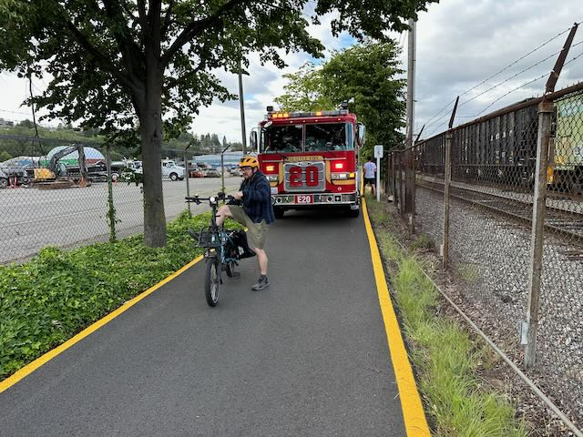

On Tuesday, I managed to ride my bike to work (there was someone that I wanted to talk to in person). I made it to work somehow.  On the way home, I came across a guy on the trail that was in a great deal of distress, so I stopped and called 911 and stayed with him until the fire department showed up.   here, you can see that they brought their fire truck all the way down the trail.   Catherine ended up coming down and picking me up in the van after that, and I really appreciated that since I didn't know how I was going to be able to actually ride all the way home.

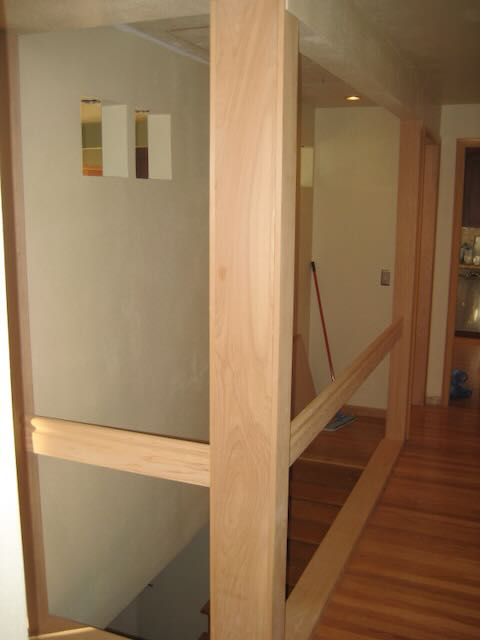

here is what our stair well looked like in 2008

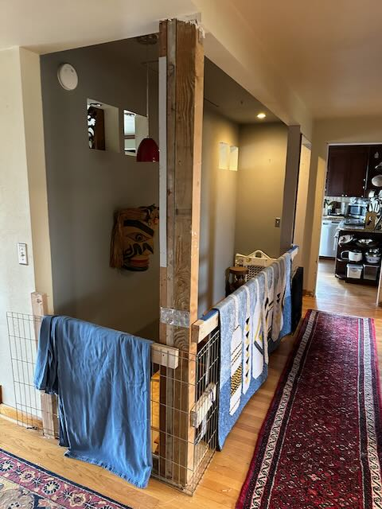

Here we are in 2024 - after removing the wraper boards, in preparation for drywalling.

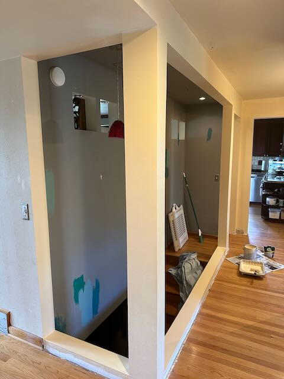
Here, the beams have been drywalled, and we are ready to paint.

<iframe width="560" height="315" src="https://www.youtube.com/embed/2PPkBWcJwao?si=2lZowHh4tQ69WWd6" title="YouTube video player" frameborder="0" allow="accelerometer; autoplay; clipboard-write; encrypted-media; gyroscope; picture-in-picture; web-share" referrerpolicy="strict-origin-when-cross-origin" allowfullscreen></iframe>

here is a timelapse of me painting the stairwell on monday.

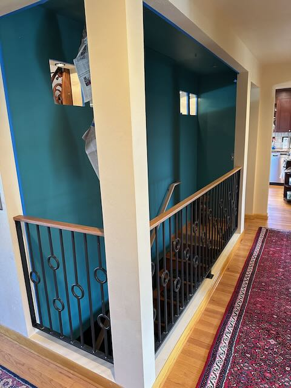

And the Railings are installed.

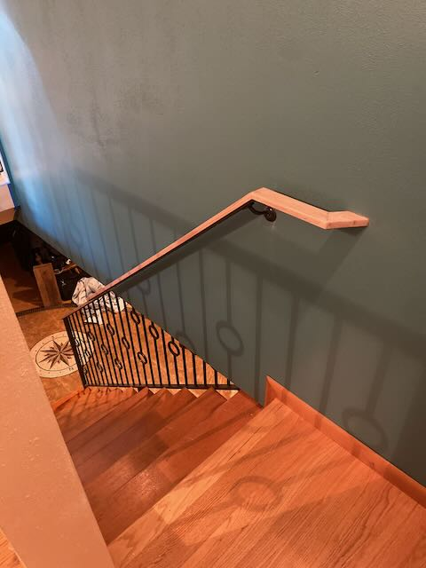
Looks good going downstairs as well.

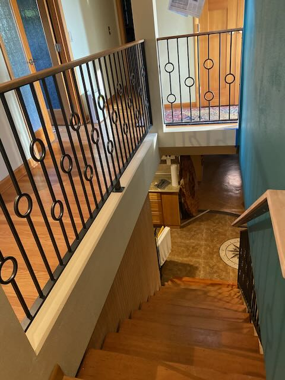
Another view of the new railing.

Installation crew :) 

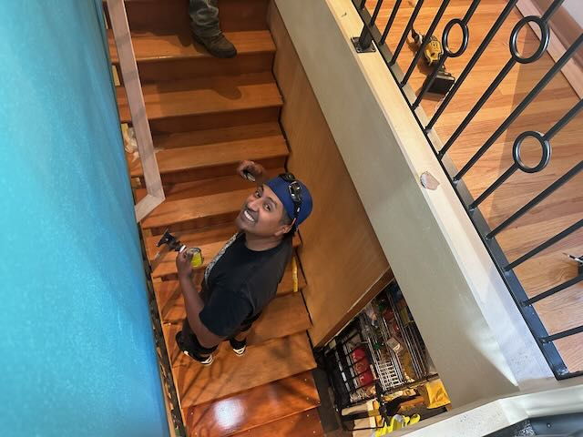

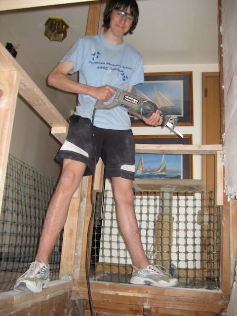
This picture is from 2008 when we started this part of the project with alex doing some demo and prep work.

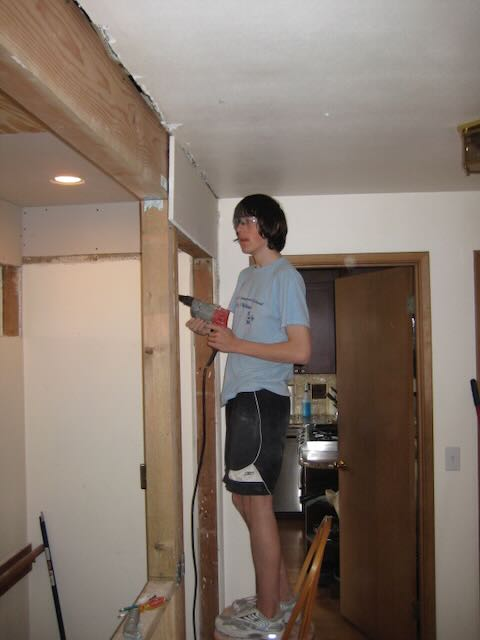

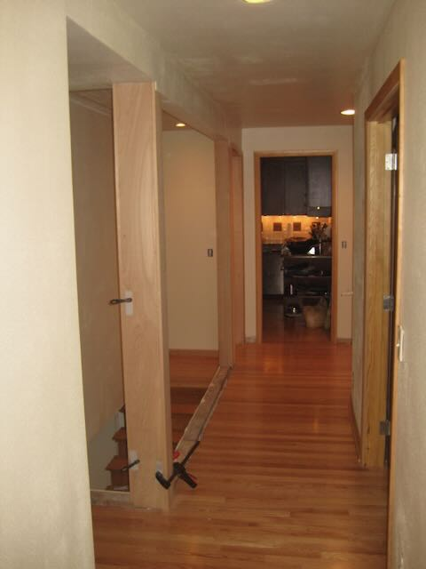
another shot from 2008 with the posts incased in some wood.
