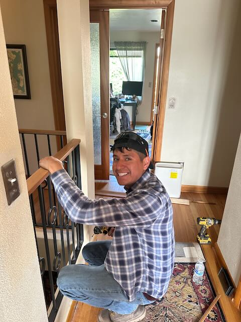

Hey All,

Well, it has been a week.  I tested negative for Covid on Monday, which let me get to the dentist for my semi annual cleaning.   So that was good.  However, my left knee was acting up, and made getting around a bit of a problem, and as the week progressed the knee got worse and worse.  Fortunately I had a dr. appt on Tuesday (by which time the knee was super sore) and she believes that it is gout, so I have been wrestling with that.  To the extent that I was barely able to focus, and only managed to get about an hour of work (if you could call it that) in on wed, thursday, or friday.  Saturday I managed to get out to Chris's bday party, but that 

