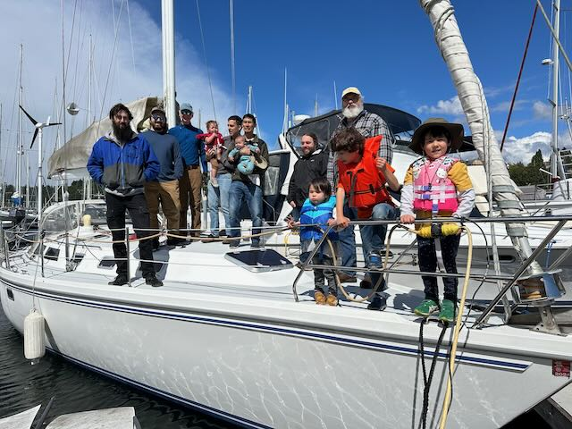
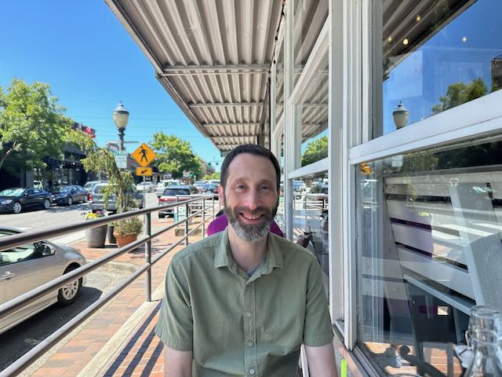
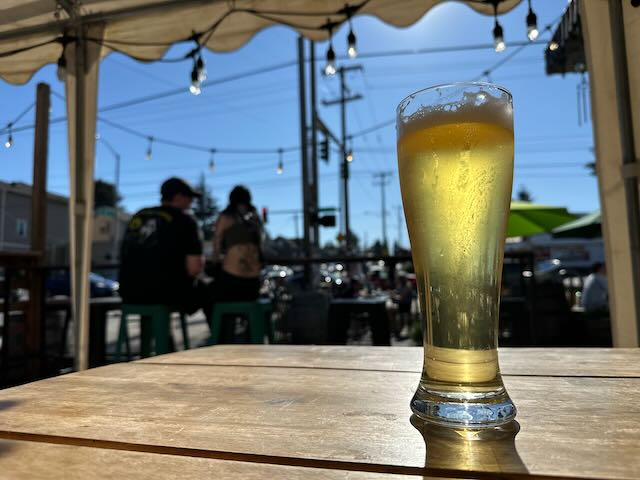
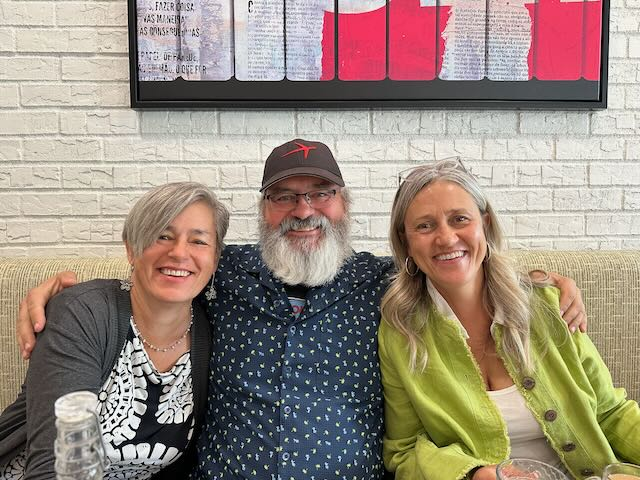
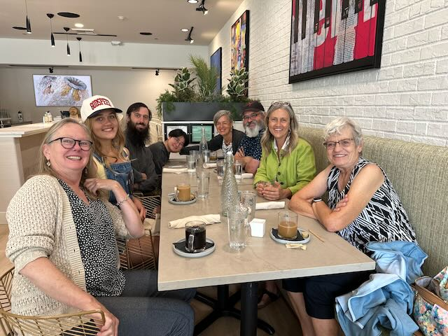
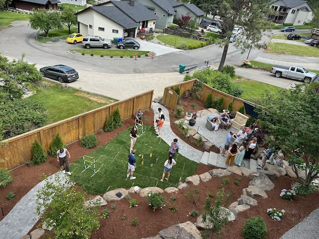

Good Morning! Happy week to everyone!   I am feeling Much better this week.  I'm still slow to go up and down stairs, but other than that, I have all of the mobility back in my knee.

It's been a good week.  It started with a Father's Day sail on Scott's Boat.   With Scott and Carson, Me and Alex, Chirs and Freya and Luke, Nathan, and Derick, and their kids Devon, Alayna, and Rayne (I think). It was a wonderful day for a sail and everyone. I had a wonderful time on the boat.  Luke, Freya, and Devon were super good on the boat and probably did 20 laps from the front to the back of the boat. 

Wednesday, we had off from work for Juneteenth, and I took the opportunity to head over to Bellevue and have lunch with Brian.  after lunch, we went for a five-mile walk all over downtown.  From old main street to Maydenbauer park to Bellevue square.  We rode the new train to the next stop to the east and then walked back to Brian's place, where my car was parked.  It was just a wonderful walk, and my knee, while not feeling great, was feeling pretty dang good.

Thursday was a beautiful day, and after work, Catherine, Scott, Curt, and I all gathered at Chuck's for a nice little catch-up and chat.   

On Friday, Catherine and I worked in the morning before packing up and heading toward Judy and Balin's place on Liberty Lake for Perrins's Graduation party.  The drive was super easy.  When we got there, we had a wonderful evening just hanging out with Sue and Judy and Balin, Mom, and Sophie, Perrin and Alex.   Balin's brother Charlie was here with his wife and kids as well.  This was the first time that I met Charlie and his wife, and they were just as wonderful as you might imagine.  

On Saturday morning, the Weatbrook side of the house got up and headed into Spokane for breakfast at the House of Brunch, which was a lovely time with great food.   After breakfast, we all walked through Riverside Park, which is celebrating the 50th anniversary of the 1974 World Fair.    That was a super pleasant walk.    Before heading back to Judy and Balin's place, we walked through the Saturday market and the Lego store.   

The graduation party itself was super fun.  There was great food and a lot of people.  My cousin Eric showed up with his wife, Maggie, and their daughter Sahalie.   Eric and I Geeked about vans for a bit.  Later My cousin Krista showed up with her son Joe, and then Todd showed up with Jada.    it was good to have the whole family together.

We would head over to Aunt Do's house today, but...   At the end of the day, we had one of the guests at the party test positive for Covid, so we are calling that off.  Sorry, Aunt Do! We will have to come back over later this summer.

Love ya all
Dan W

Everybody hanging out on the bow of Scott's boat after a wonderful day of sailing.

Lunch with Brian at old downtown Bellevue

That's Stefan's sailboat down on Maydenbauer bay.

Waiting for Scott and Curt to show up at Chucks

Me and My sisters (Sue and Judy)

The Weatbrook gang at Breakfast

Perrin and Sophie picked up some Model Lego cars.   Sophie is turning into an F1 fan, and is heading to the Las Vegas race!  :) 

Some of the folks gathered in Judy and Balins lower garden

Eric and I spent a good amount of time down at the lake throwing sticks into the water for his dog while all of the kids were swiming.