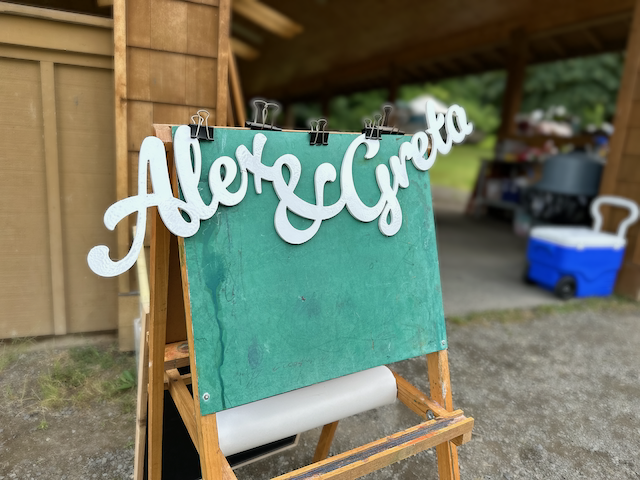
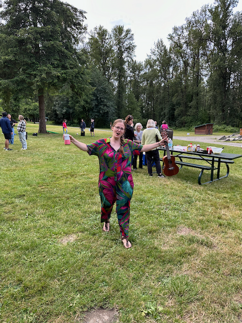
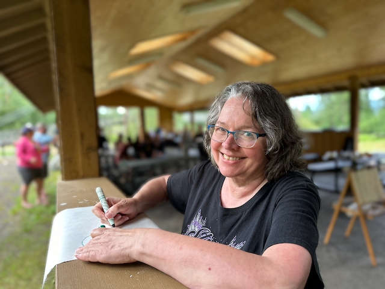
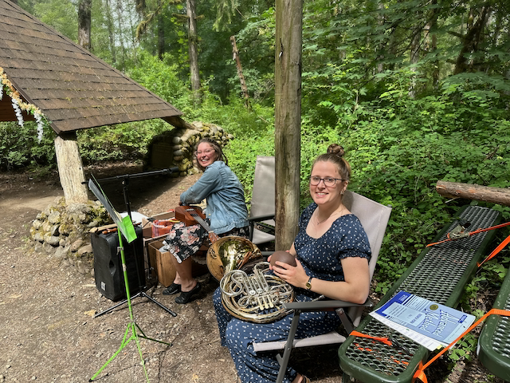
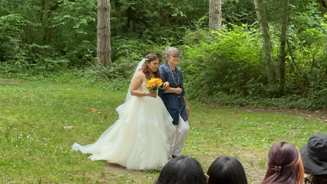
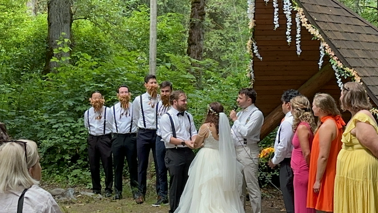
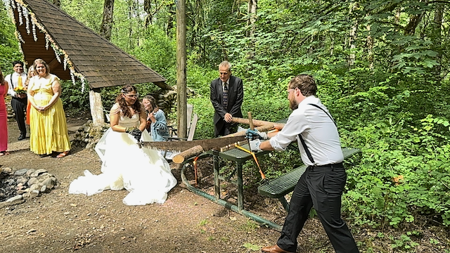
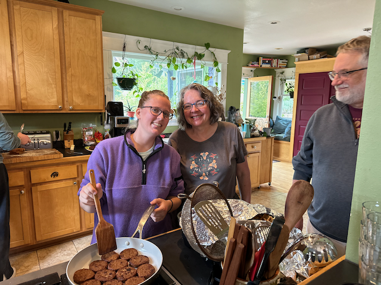

Hi everyone!  I hope you are all well.  This past week was pretty low-key, but it culminated with Katarina's brothers, Alex and Greta's wedding.   The wedding was out in Carnation at The Tolt MacDonald Park and Campground.  Catherine and I drove out there Friday after work with a bunch of supplies, and the beer I had brewed for the event.   The whole weekend was just wonderful.   I met a bunch of Katarina's family from as far away as Poland, as well as a family close by.  All of them were just wonderful.

Friday was a super casual hang while things were put together. The ceremony was Saturday at 3, and then on Sunday, we went over to Katarina's uncle Bob and Aunt Ginger's house for brunch.

This evening my cousin Eric, and Maggie and Sahale are stopping buy for the evening on their big roadtrip.  We have smoked up some beef rip and a pork butt to share with them.

Love ya All
Dan W

Guess who's getting married!

Katarina enjoying the evening.

Katarina's mom, Sabine, is getting ready for the breaking of the dishes.  Which is a tradition in Germany that is meant to scare away the poltergeists (I think I remembered that right)

Onya and Katarina provided the music (Onya is Katarina and Alex's sister)

Greta marching in with her mom.

The ceremony. All of the groomsmen had fake beards for part of it. 

Another German tradition that I was introduced to was that the bride and groom saw a log to show their dedication to working through the challenges of being married.

Katarina and Sabine helping with Brunch at Bob and Gingers house