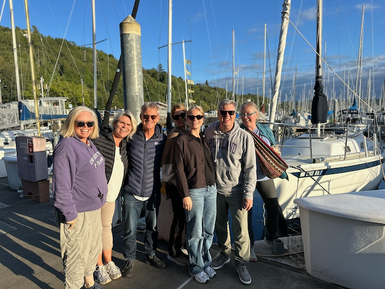
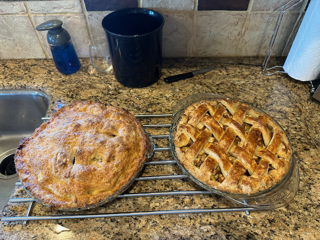
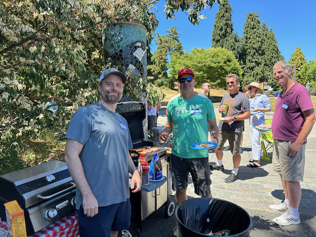
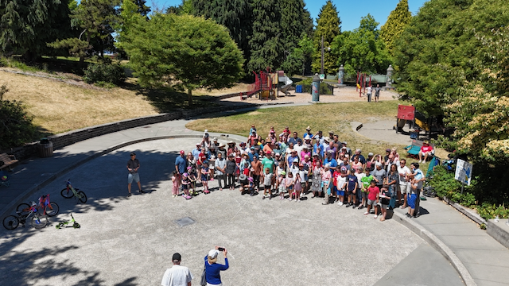
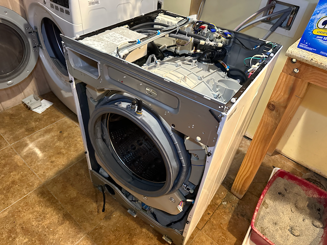
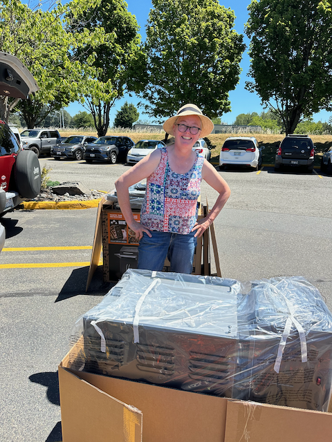
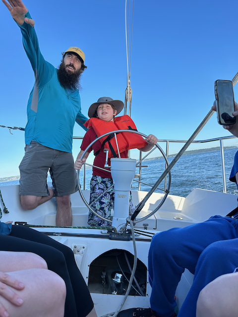
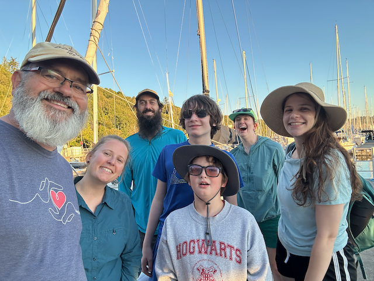

Good Morning!  And Happy Fourth of July week!

This has been a good week. I think that it helped that it was a short week!  :).  The week started out with my cousin Eric, his wife Maggie, and their daughter Sahale stopping by to spend the night on their Big road trip. They drove up from Petaluma for Perrin's graduation and then headed into Canada. They stopped at our place as they slowly made their way south back toward home. We had a wonderful visit and Dinner with them.

On Tuesday, I headed into work, and then after work, Catherine and I took Bob and Amy Maher out sailing in the evening with the family of Amy's childhood exchange student. It was a wonderful evening. We very much enjoyed hanging out with Bob and Amy.

Wednesday, I got up at 5 a.m. and started brewing four batches of beer for the pig roast next month. It was a slow day for work, so I was able to pay attention to that a bit while brewing beer. Each batch of beer takes ~ four hours, and I finally finished up and put the mop away at 8:15 p.m. That's when Alex noticed that the washing machine was full of water and wasn't draining.

So, I decided to ignore that since there was not much we could do late in the evening, and we had pie to bake for the Fourth of July picnic that we were coordinating the next day.   So Catherine and I stayed up late on wednesday.  Catherine made her pie completely, and I just made my pie crust dough and got it into the fridge.  On Thursday morning, the fourth of July, I got up early to bake my apple pie for the Apple Pie contest we were entering at the picnic.

At about 10 a.m., we loaded up all of the stuff for the picnic and took it up to Soundview Playground. We spent a wonderful afternoon grilling and playing games. Twice, during the picnic, I counted how many folks were there, and I got to 100 each time, which means there wasn't less than that since it was hard to count them all.   

After we cleaned up the picnic and headed home, I started tackling the washing machine.   I ran the diagnostic mode, and confirmed that it was the drain pump that was not working.  So I took the whole thing apart, pulled out the pump, and yup, you could tell, just by spinning it, that the pump was bad, so I ordered a new pump on Amazon.   Fortunately our neighbors are out of town for the weekend, and they said that we could use their washer and dryer, so that helped us stay on top of things.

On Friday, Catherine worked, and I took the day off and did some work around the yard before a friend of mine from work came over to look at my car. His dream car is my car, and he is looking to buy one. So he checked it out, and we went for a drive and had a nice catch-up.

Friday night, Catherine and I drove over to the train station, took the light rail to Capital Hill, and then walked over to the Sorento Hotel, where we met up with Curt and Amy as a celebration of our 35th wedding anniversary (which is Monday the 8th). We had a fantastic meal out on the patio, and afterward, we went into the fireside lounge where we played a game of Clue (Amy gave that to us as a wedding gift). Before, Amy and Curt gave us a ride back to the train station.

Yesterday, Catherine and I headed to Kent to check out a cabinet shop.   Catherine had confirmed the date and time with them a _number_ of times before we went down there.  But of course, they didn't really understand that it was the Fourth of July weekend, so they weren't there.   The trip wasn't a complete waste, as we headed over to Costco to get fuel. While there, we decided to gift each other a Traeger Grill they had on sale there.  :)     When we got home from that Trip, we wrestled the new grill into the backyard, and I put it together.  While I was putting it together, the part for the washing machine came, and I was able to get the washing machine put back together before heading down to the boat to go sailing with Alex and Katarina, and a couple of Katarina's friends, and the Nephews of one of her Friends.   

When I got home from that, Catherine had some Salmon on the smoker, and Scott came over to join us. We had a wonderful dinner and hung out on a lovely evening.

Today - Catherine is going to go to the Storm game, and I am going to walk down to Ballard Market with Scott.   The weather around here is just fantastic this time of year.

Love you all
Dan W

Catherine and Sahale

Amy and Bob, and Amy's childhood exchange students family.

Four batches of beer brewed and getting ready for the pig roast.

My pie is on the left, and Catherine's is on the right.

The grill masters at the picnic

Let the judging begin!  (FWIW - I took second place :) )

The three legged race was a fun event at the picnic.

Here is a shot of the folks that were still around for the final picture.

Before the bicycle parade :) 

The most important people at any party, are the ones that are there to help put away the mops ;) 

Turns out that it is not too hard to take apart the washing machine.

And yup. that pump was shot.

Curt and Amy at the Sorento.

Some lovely food for dinner.

we had to unpack the Traeger in order to get it into the car.

All assembled and ready to go.  Today's task it to cleanup the packing materials ;) 

Alex coaching one of the nephews while sailing.

Katarina is getting pretty good at this.

Back at the dock with Everyone.

Our first food off of the Traeger.