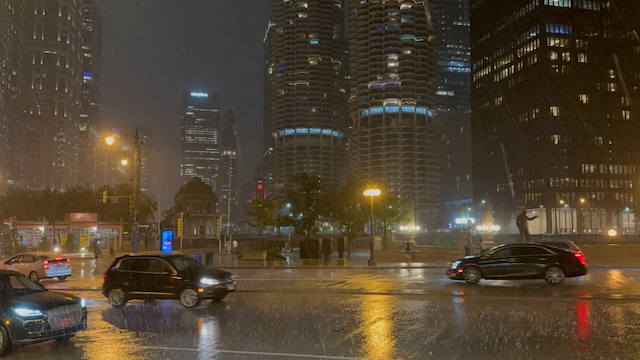

Howdy!

This past week was pretty good.  I spent it working from the Chicago office, and I had the chance to spend some time out and about in Chicago. I really like Chicago.   I traveled out there with my coworker Mary. The purpose of the trip was to intersect with a couple of folks from the Austin office who were in town at the same time and are the leaders of the development team that is implementing and integrating with another system for a new pattern of allowing travelers to change and cancel their bookings.    While we were there, it became official that I would be leaning into a new project around our Vrbo stack stability.   And man, was it convenient that I was in Chicago since that allowed me to get face time with two of the senior leaders sponsoring this effort.   The short story here is that last year, we lost a lot of money as a company because of outages in our systems.  A full half of this was because of incidents with a single set of systems.  There has been a lot of work on getting this set of systems more stable, and It is just my turn to do a round on it.  One of the challenges is that there has been a lot of attrition of Subject Matter Experts (SMEs) who know how this system works and how the infrastructure it runs on has worked over the last four years.   There are a few folks who do, and I have already started reaching out to them and creating relationships there.

The flight to Chicago was easy peasy - and we had a great view of mount Rainier as we flew past it.

Me and Mary landing safe in Chicago.

Walking around Downtown Chicago Sunday night was just stunning.  The weather was nice, if a touch warm.

This is the Mart building.  Every night they have a huge light show on the side of the building at 9pm, and I just happened to be wandering by on the riverwalk when it happened.  So I stopped and enjoyed the experience.

Another shot of the "[Art on the Mart](https://artonthemart.com/)"

After I got back to my hotel, I was watching the Netflix show, Remembering Gene Wilder  When the severe weather alert went off, warning of Tornadoes in Cook County.   So that was quite the experience as the storm front rolled through.    The rain and the lightning were something, along with the wind.  And then it happened the next night as well.  This time, there were reports of Tornadoes actually touching down.   I went down and watched the weather come in, and when it showed up, it was like a switch was thrown.  The temps dropped 20 degrees in 30 seconds, and then the rain and wind started blowing, and by the time that I got in side the umbrella's over the patio tables were starting to fly away.    I think I can see the appeal of storm chasing ;) 

This shows just how fast that weather was coming in.

Monday night Mary and I went out for Dinner at [The Girl and the Goat](https://www.girlandthegoat.com/), and it was something else. 

Tuesday night, after a nice dinner with the team, some of us went out [NADC Burger](https://www.nadcburger.com/) (which stands for Not a Damn Chance, as in we don't make any changes to it). Dom (the guy on the right) knows the owners of the chain from Austin, and he got us taken care of.  I didn't get a chance to have a burger here since I had already eaten dinner.

Wednesday night i wandered over to [Billy Goat Tavern](http://www.billygoattavern.com), which is located Under the street.  I was underwhelemed with the burger that I got here.

And then on Wednesday night, I went for the [river boat architecture tour of Chicago](https://www.wendellaboats.com), and that was really impressive.   

Another shot of Chicago from the Boat Tour.

Thursday, I took a five mile walk to work.  This is the [Chicago Water Tower.](https://en.wikipedia.org/wiki/Chicago_Water_Tower)

And a shot of the skyline from just south of the locks (which I was informed during the river boat tour, are the second busiest locks in north america, after the ballard locks :) 

This is the building that the Chicago Expedia offices are in.

Thursday evening we wen to [Cindy's bar in Chicago](http://www.cindysrooftop.com/) This is Dustin and Dom.

A view of the [Cloud Gate](https://millenniumparkfoundation.org/art-architecture/cloud-gate/) with the [Jay Pritzker Pavilion](https://www.cityofchicago.org/city/en/depts/dca/supp_info/millennium_park.html) in the back ground in [Millennium Park](https://www.chicago.gov/city/en/depts/dca/supp_info/millennium_park.html)

here is the Gang getting ready to head down to dinner.

Dinner was in the [Cherry Circle Room](https://www.chicagoathletichotel.com/restaurants/cherry-circle) and was absolutely wonderful.

We then wandered off to [Buddy Guys Legends blues club](https://buddyguy.com/) and watched [Big Al the Heavyweights](https://www.bigal.net) who were absolutely fantastic.

Closing down the joint.

Friday, I left work early and headed to the Chicago Museum of History. It was a three-mile walk up north.  And afterwards I walked through Lincoln park  

Another shot of downtown from Lincoln Park

And another shot of downtown from up north in Lincoln park.  

My walk back south took me through [Old town in Chicago](https://en.wikipedia.org/wiki/Old_Town,_Chicago) which was wonderful little neighborhood.  and I landed up here at [the skydeck](https://theskydeck.com/) deck on [WIllis tower](https://www.willistower.com) (which the tour guide on Wed night said was spelled "S-E-A-R-S").  This thing is a money-making machine!    I figure they are probably pulling in over $200k a day in just ticket sales, not including the pictures they are pushing on you.  

A shot of the sunset from the skydeck.

Saturday morning I walked down to the field museum past [Buckingham Fountain](https://en.wikipedia.org/wiki/Buckingham_Fountain)  

This was me playing around with a photo of the sun behind the fountain.

A Panorama of the city skyline with Buckingham Palace

A picture of [St. Regis Chicago - Wikipedia](https://en.wikipedia.org/wiki/St._Regis_Chicago) , which is the [tallest structure in the world designed by a woman](https://en.wikipedia.org/wiki/List_of_tallest_buildings_designed_by_women).

This is Grand hall in the [Field Museum](https://www.fieldmuseum.org) I spent over six hours in this museum, I skipped the three extra cost installations, and another three installations that were part of the entry fee, and then I gave short attention to another three installations.  This place is HUGE!

I did not go into the section on plants, but these are recreation of plants.  One of the things that museums were about when all of this was created was exposing people to things they could not otherwise experience.   There was no internet, movies, or Television when this museum style was created.  so these collections and dioramas was the primary way that most of the world experienced much of the world that was more then 100 miles from home.  

Of course I went and saw the VERY impressive collection of Fossils

This is Sue, (not my sister :) ). which is the most complete [T-Rex fossil](https://en.wikipedia.org/wiki/Sue_(dinosaur)) every discovered.

Well,  That is a LOT of photos, but it is just a small part of the collection of photos that I took on this trip.    I'm looking forward to the next chance I get to go back to chicago and do some more exploring.

Love ya!
