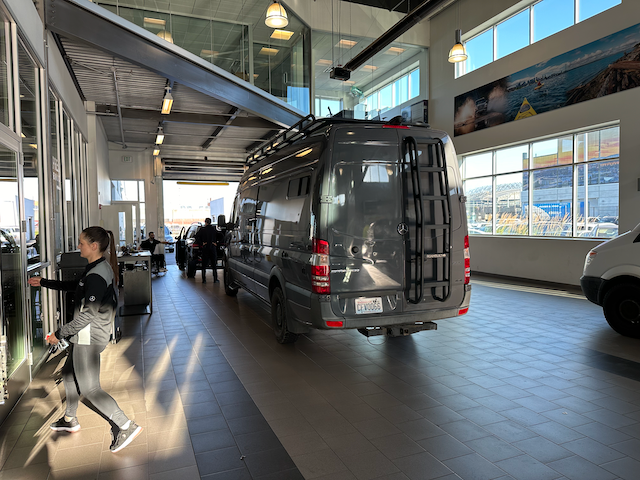
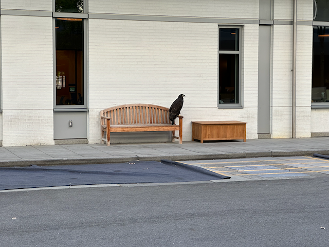
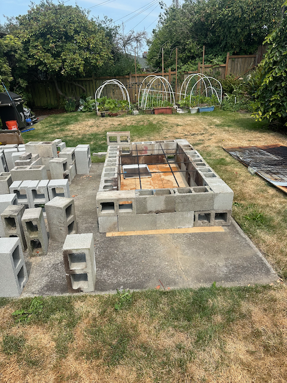
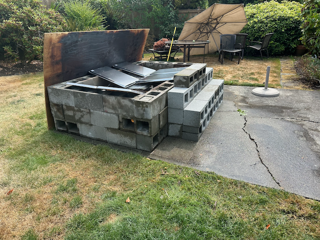

Happy Sunday!

I hope that everything is going well for everyone this past week; it was something of an uneventful week for me.   Monday was cold and gray, but it was good to get out on the water Monday night to sail with Tom.  We managed to get a second out of 14 J105s that were racing, so that felt good.  That was the first time in quite several weeks that I have been able to join Tom and the Gang on the water.  

I took the van to the dealership for its regular service this week. It feels good to know that it is all checked out and passing muster. In other vehicle news, a friend from work was sniffing around thinking about buying my M5 from me. We couldn't agree on a price, and I was actually relieved. Catherine made the good point that I don't need to sell it. It is a car that I really enjoy, and I can work on it.

Tuesday night was soup night, and we had a nice crowd. Chris was there, but Emi and the kids are still in Japan (they will be there this week). Justine made a wonderful corn soup. Elizabeth's Dad, Gene, and sister-in-law, Dawn, could join us, and they were delightful.

I'm working on a new effort called Vrbo stack stabilization.   40% of the revenue losses we had last year from incidents were caused by problems in the Vrbo stack.  So, I will be working with the leaders of the architecture team and some developers from two contract firms out of India to try and figure out how the system works and what causes its problems.   These folks have been working on this for several months, and there has been some progress, but we haven't figured out precisely what, if anything, we should do to address the problem.  The effort is intense, and I have jumped into the deep end.  Fortunately, I like dealing with these kinds of problems.

This weekend, we have been preparing for the upcoming pig roast.   I built the pit yesterday, and Alex did a test fire of some modifications he is doing for the fireboxes.  I made two of the BBQ sauces yesterday.  The beer is all kegged up and ready to go.  And then we spent a good portion of today working in the yard and getting a lot of pruning done so that we are ready for this next weekend.
I'm looking forward to seeing my sister Sue, who is coming in on Wednesday, and Jack and Jay are also coming in.  

Love ya
Dan W

Dropping the Van off at the Mercedes Benz dealership for service/

Brian and I having lunch at the Boxcar Alehouse

There was a juvenile bald eagle hanging out on campus on Thursday.

Getting together with some former expedia co-workers.

Putting the pig pit together.

Pig pit is ready to go.

Cooking up the BBQ sauces

The finished product.

Alex had a test fire going when we got back from Megan's Birthday party.

Alex checking the fire.

