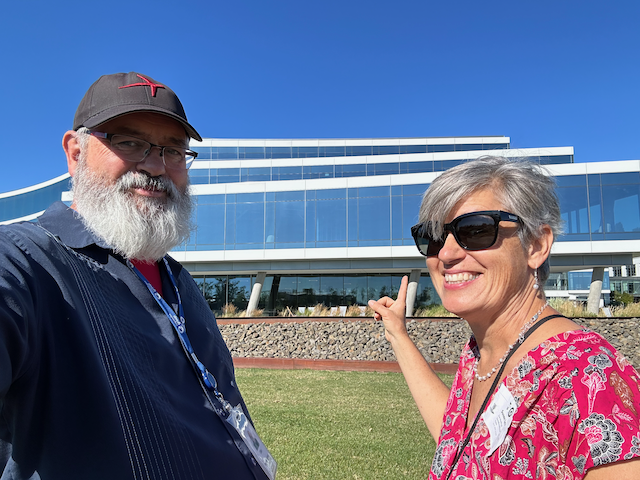
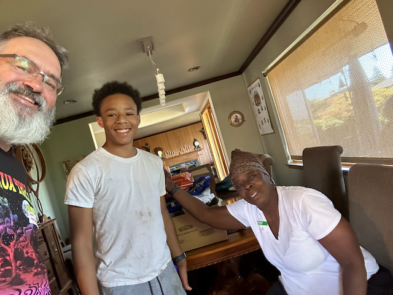
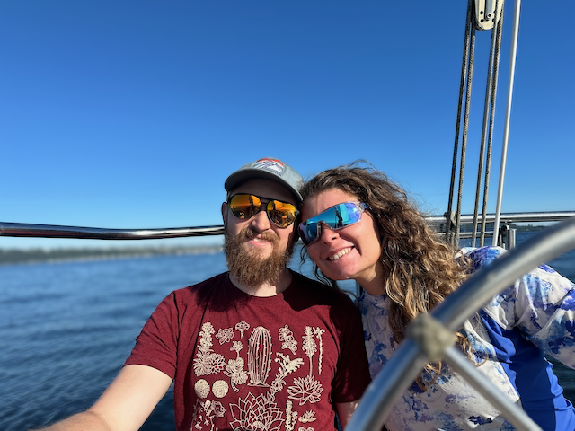
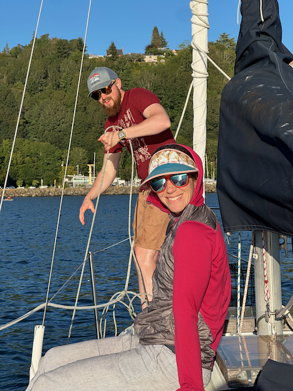
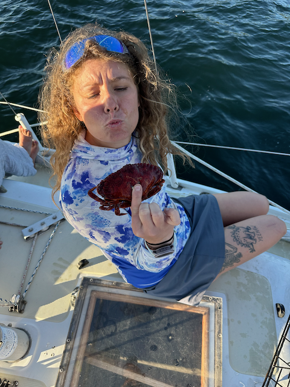
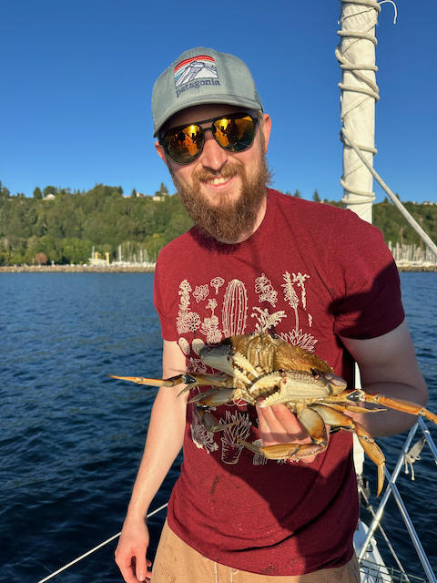

Good Morning!

I hope everyone is doing well! This past weekend, we hosted our fourth summer pig roast, which went off very well. We had RSVPs for about 180 folks, and based on the number of nametags we had left, we had close to 150 show up. This was the largest turnout and smoothest-running event we have ever hosted. The credit for the smoothest goes to Catherine!  She hired some help on Friday, Saturday, and Sunday to help with keeping things running smoothly.

This year, guests were encouraged to add an activity to their name tags as an icebreaker, which worked really well to get people talking to folks they might not know. 

By the time the first guests started rolling in at 3:00, everything was ready, and everyone was showered. The Pig came out at 5:00 p.m., and then it was just chilling and talking. Later in the evening, we pulled out the fire pit, roasted marshmallows, and ate smores, with the last guests helping us clean up the backyard as they rolled out.  And the house was empty just before midnight.

Sunday was cleanup day.  I was up by 7:00 breaking things down, and getting things inside.   Twanda and Donello showed up at 9:30, and by noon we were pretty well cleaned up, other then some shuffling of things in the back yard, and running dishes through the diswasher.   

In the late afternoon I took Jay, Jack and Natalie out sailing on the boat.  It was a beautiful evening of sailing.   (No keepers in the crab pot though ;). )

This week it's back to getting up top speed on my new project, which so far has been going pretty well.

Sue flew in on Wednesday and I gave her a tour of the Expedia campus.

I gave Jack and Alex BBQ aprons as the pit masters this year.

Jack and Jay helped clean and prepare the pig for the pig roast.  (Thank you Bob and Andy for procuring the pig, and providing the facilities to prepare it)

Jay and Jack putting the final touches on the pig.

Loading the pig into the pit on Friday afternoon

Alex shows Remy how things are working with the pit

Me and Alex chilling as the pig does it's thing.

Jack and Alex pulling the pig out of the pit.

Jack, Me and Alex with a successfully roasted pig

A panarama of the backyard showing all of the people.

Me, Teresa, Jessie and Prasana

Trey, Dirk and Jason

Logan and Bruce Henry.  (Bruce hired me into expedia in 2005)

Phil and Asher from Expedia.

Jessie and her husband 

Natalie, Remy and Ben

James and his Family

Finn and Michael

Isaac, Sara and Prasana

Chandler, Jack and Jay. (fun fact, Chandler and Peter attended Yale NSU together)

Catherine, Bob, Kristie, Sara and Kirk

Freya and Luke around the fire shutting down the party.

Brian, Greta and Yves.

Donello and Tawanda helped us cleanup on Sunday, and prepare on Friday and Saturday

Jack and Jay sailing.

Jack and Natalie pulling up the crab trap

Jay giving the little rock crab a good bye wish

Next year We will try to catch this guy again, and maybe he will be big enough then ;) 