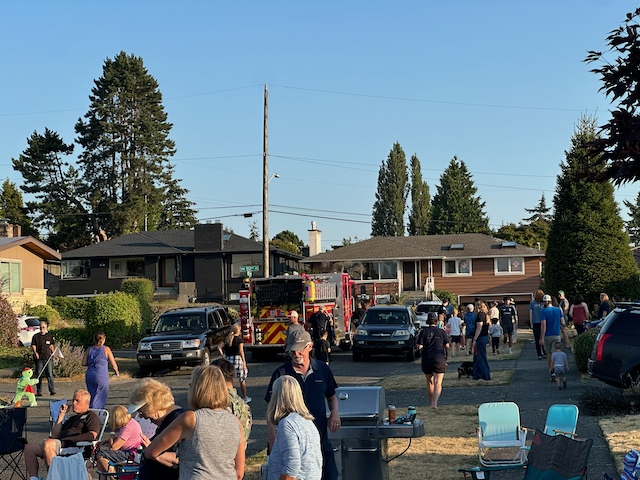
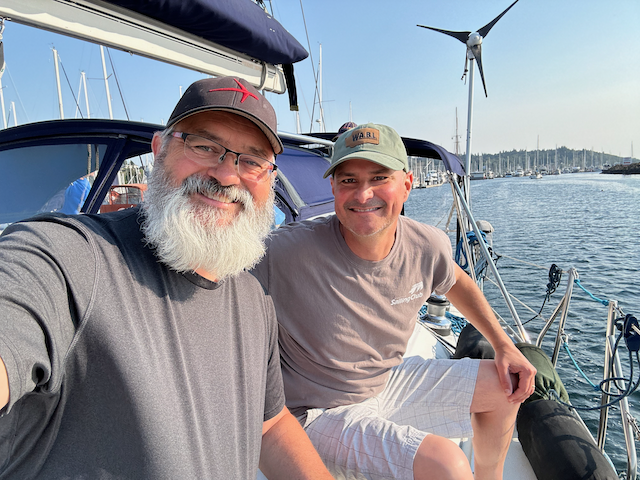
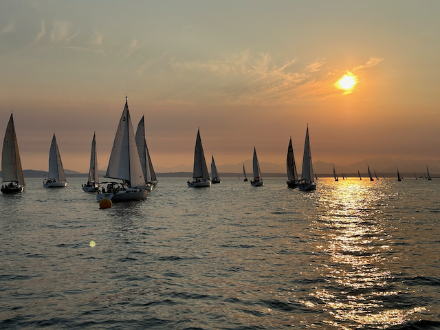
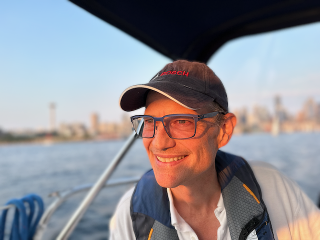
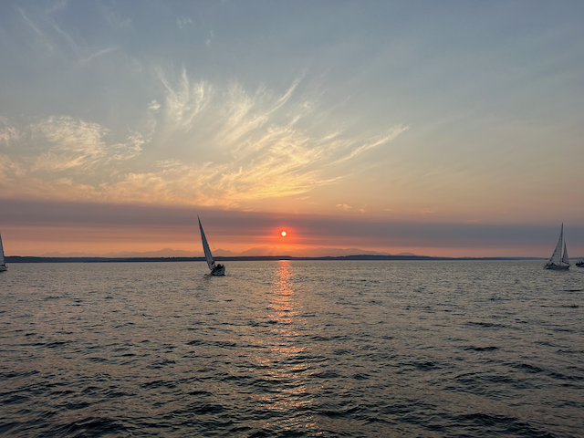
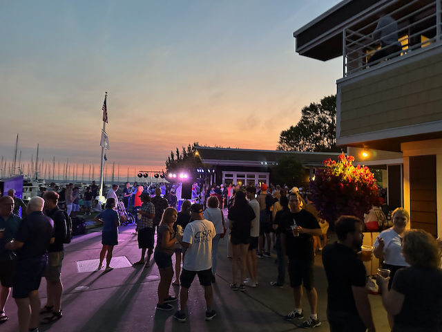
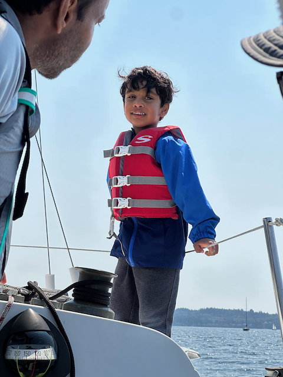
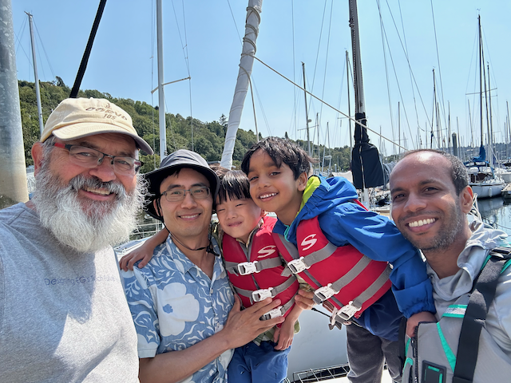
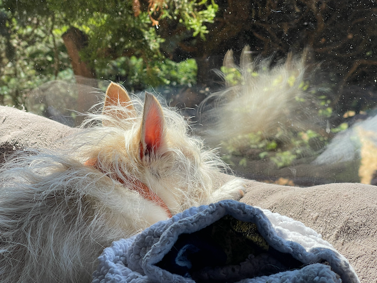

Good Morning, and Happy Sunday!

I hope everyone reading this is well and had a wonderful week.  This was a good week around our place as we recovered from all of the work that went into preparing for the pig roast.  Things are all back in shape.  

Jack and Jay were here all week, doing hikes and sightseeing in Seattle, and they had just a wonderful time. The van served as a guest room for them, and that worked out really well for them. On Friday, they packed up and headed over to the Olympic Peninsula for some camping with Alex and Katarina. They had just a wonderful time, and they are now heading towards home with some sightseeing along the way.

I had the chance to go sailing a few times this week, which was nice.  Monday, we did the sloop tavern Ballard Cup.   We had a terrible start and were over early, so we started dead last by a long shot, but we were able to reel in and pass four boats before the race was over, which was fantastic.  

On Thursday, I went out with my friend Dave on his boat for the Elliot Bay downtown summer sailing season.  What a beautiful evening it was to be on the water. Sailing in front of downtown Seattle is just incredible.   Bob and Kristie were both there, and it was so good to sail with them again.   After the race we pulled into the marina for hotdogs, beer, and live music.  There were a lot of people there, and the band was really good and got many people dancing.  

Yesterday, I took my work friends Rodney and Guru out on the boat with their five-year-old sons, Grayson and Arav. (These kids have been each other's best friends for years.) It was a nice, not too windy day, so we could sail over to Bainbridge and back quickly, and the kids had a lovely time.

Today I am also sailing with some friends for a couple of hours.  

Tuesday, we skipped the Soup night as we had a neighborhood night out against crime, and we had a ton of folks go up to one of the culdesacs for a potluck dinner.   There were a ton of people and kids there, and the fire department showed up with their Fire engine, and the kids just _loved_ that (as did I :) )

Work is heating up. The project I am on is about stabilizing the Vrbo stack. We had three incidents this past week, so we have even more pressure this week to solve the problems, but there isn't an easy solution.   But this is the kind of stuff that I really like to do, so that's OK ;) 

our neighborhood night on on Tuesday with the fire engine. 

Me and Bob on Daves boat heading to Elliot Bay

Sailing at Sunset on Elliot Bay

Dave at the Helm

There are some fires which results in pretty sunsets. 

The after party on Thursday

Arav on the boat.

Me, Rodney, Grayson, Arav and Guru after sailing.

This is how Athena spends the days when Catherine is working from home ;) 