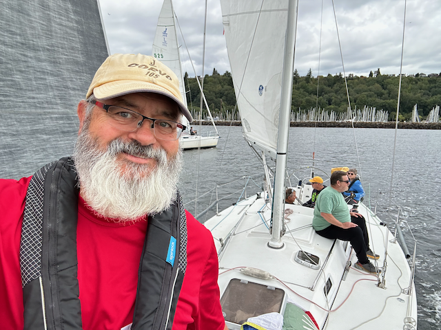
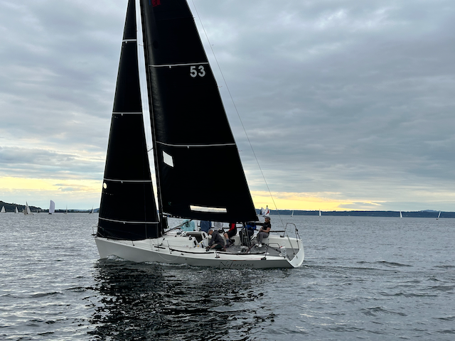
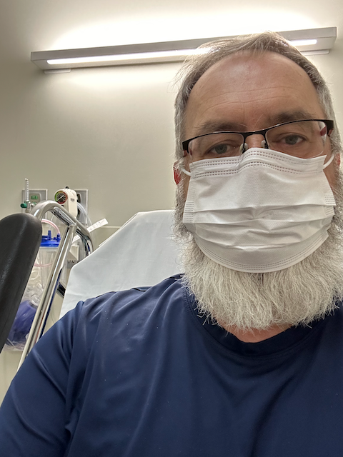

Happy Sunday!

I hope that today finds you happy and healthy - things are good around here. Not much happened this week.  I sailed on Monday (racing) and Wednesday (taking Alan and Sarah out on the boat with Catherine). Tuesday was soup night, and we had a nice set of folks over for that. Elizabeth made some delicious soup.   Thursday, I had the chance to hang out with Scott and Serhad after work at the newly opened [Single Hill brewery tap room](https://singlehillbrewing.com/taproom/), which took over the space formerly occupied by the Outpouring, which recently closed.   

Wednesday, my coworker Arun came up for the day from San Fransisco, and we worked together to frame up the new project he and I are working on.  This will start getting visibility at the highest level, as we are supposed to stabilize the Vrbo stack. However, three incidents resulted in revenue loss the week before.  So, there are a _lot_ of senior leadership eyes on this one.  Arun will be up again three days this week, and then on the 26th, we will have a reboot meeting with one of the key executive sponsors for this.  So it should be a hopping good time. :).  
Friday, Catherine took me down to the surgery center for a minor procedure, and all went very well, but I spent the rest of the day on Friday in a fog and just slowly rolled through Saturday.  We managed to leave the house in the afternoon to hang out with Kai, who had just flown in from Germany with his daughter Jule for two weeks.  He likes it when we go over and keep him up the day he lands so he can try to get over the jet lag.

Love ya all
Dan W

Last night we had thunder storms roll though seattle - here is a timelapse video that I took of that -> https://youtu.be/F77f-T6rgI0

Sailing around before the start on Monday night

Just another pretty sailing picture from Monday night.

Alan, Catherine and Sarah enjoying the sunset on Wednesday

Some art on the breakwater wall

More art on the breakwater wall.

Alan in the sunset after we finished sailing.

The moon was out.

Pre-op - no post-op picture - I didn't have access to my camera when I came to.

The thunderclouds at sunset.

Catherine fixed up a table for Tom and Helen this week as well.

