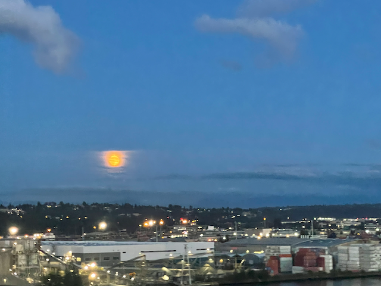
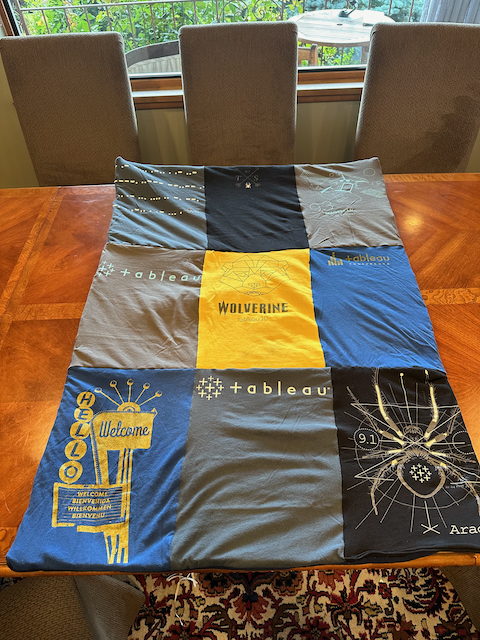
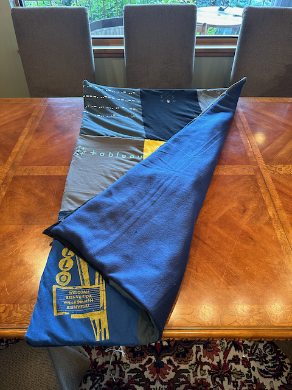

Good morning, and Happy Sunday!

I hope that everyone is well and getting along well. Things are good here. However, Scott said it best: "I didn't think I drank that much last night, but I woke up this morning in October." These past few days, the weather has been very gray, cool, and fall-like. Yesterday, it was just slow, drizzly rain for most of the day.  

Last Sunday, Catherine and I went to West Seattle to loan our air compressor to TJ, pick up some brewing supplies he was getting rid of, and hang out. It's been a while since we've hung out with TJ, and it was good to catch up. Monday, I passed on the sailing, as I am still recovering from my minor surgery, and I didn't want to mess anything up moving around on the boat.  

This week, the architecture team gathered in Seattle. While I am not on that team, my partner on this new project, Arun, is, so they invited me to tag along for a couple of events. It was nice to feel included.  

Arun showed up on Tuesday evening, joined us for soup night, and had a wonderful time.

Arun and I holed ourselves up for a couple of days, working on planning our project. We made some pretty good progress; now, it is a matter of packaging up our thinking in presentations and documentation and planning tickets to share with folks.  (for me, that is always the most challenging part). We have a big meeting on Wednesday to review it with a bigwig. We hope to be able to convince them that the problem is not so much the technology but that we don't have a supporting community of folks that maintain that tech stack and that an element of getting this stack stable is to create a team to support it and build the credibility in the community of people that have been working on it.    Another challenge with this effort is the focus on it from a couple of different programs, and so there is a constant demand for status reports on things.  

I also spent much of the week tuned into the Democratic National Convention and watched how it evolved. I am encouraged by the future-looking nature of what the Democrats are saying. There are still many substantial policy gaps on both sides, but we do know what the architects of Project 2025 want to do. Tim Walz said it best: if you put that much effort into a playbook, you have every intention of using it.

I am signed up to run the 10k Beat the Blerch in two weeks.   We will see how I do, as I haven't run, even a mile, since I came down with COVID-19, so it may take me a very long time to complete that run.

Alex and Katarina attended a wedding in Poulsbo on Friday, so they took the boat over in the rain. The motor died when they were almost there, and they couldn't start it again.  So I walked them through draining the water out of the fuel filter and what to look at on the carb over FaceTime.  They eventually got the motor running again, but not before they had to sail into the slip at the marina, which went smoothly.   They had a wonderful time at the wedding.    After that, Catherine and I realized that we had the same experience at the beginning of our trip to Barkley Sound, when Alex was just three.   

OK time to get on with my Sunday! - love ya all - 

Dan W

Me, TJ and Catherine after dinner in west Seattle

That was some moon on the way home from TJ's place.

On Wed night we went for an electric boat ride on lake union.

On Thursday I joined the larger architecture team for a scavenger hunt.  One of the clues required that we solve this puzzle.  that was harder then one might think!

On Thursday we drove to Bellevue for dinner.  This place was absolutely fantastic!

Saturday I got up and made a baby blanket our of old Tableau T-shirts.  It is for Brandon and Kendle, who are moving back to St Paul Minnesota to be closer to family.  They leave at the end of this week, and I had to get the job done!

Here I am sewing it all together.

And here it is all put together.

And what the back looks like.

Brandon liked it!

Bunch of former co-workers from Tableau got together for some beer at Fremont brewing.  We were all part of the same poker group back before the pandemic.   

