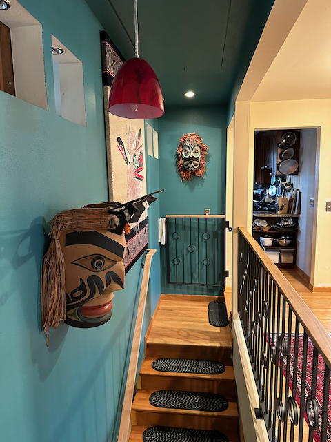

Happy Labor Day!   I hope that everyone has had a chance to enjoy themselves this weekend and spend time with family and friends.

Things are good here.  It was a decently paced week.   Last Sunday, Catherine and I had the chance to hang out with some friends on the rooftop of our friends Boyd and Randi, looking over Greenlake, which was super relaxed and chill.

Monday was Corvo's last weeknight sailing of the season.   Jule, Kai's daughter, had the chance to join us, and the majority of the race was a light air bore, but in the last 15 minutes, the wind picked up, and it was pretty thrilling with boats losing control, some crashing into each other, and some just barely missing each other.   We had to beat Liftoff to take second in the series. Alas, no one could finish the race within the time limit (we missed it by about three minutes), so we were third in the series, which is a good showing.    Either way, Jule had a wonderful time on the boat and was well cared for!

Tuesday was soup night, and Kai and Jule joined us for that.  Jule flew home to Berlin on Wednesday, so it was good to see her off.  She _LOVES_ all of the dogs that are in our friend group and really appreciates any chance she gets to see them all :) 

On Thursday, we had a BBQ at Kirk's place, and that was just so pleasant. I love these late August evenings as the summer starts to bid us farewell, and we can just enjoy each other's company.

We joined Kai at Palisades for a lovely dinner and conversation on Friday.   Saturday, we hung out with my cousin Eric and his buddy Darren for a while in the afternoon.  He and Darren were in town for the Metallica tour.   I decided what the heck and picked up a ticket to go and see the show on Sunday with him.  So I rode my bike down to the Expedia campus, locked it up there, and then walked downtown to meet them for dinner.   After dinner, we walked over to the stadium.  The ticket I bought from StubHub never showed up, so I missed the opening act while dealing with that.  I eventually got a ticket for the floor, which was cool, as it meant that I was just feet from the stage.  I am happy that I had earplugs - that was a thunderous show.  After the show, we connected up and walked to the Merchant Cafe (the oldest restaurant in Seattle) and had a beer before going our separate ways.    I walked down to the waterfront, grabbed a lime bike, and rode that up to campus, where I picked up my bike and rode that the rest of the way home.

Today, I took my friend Alan sailing, and we saw a couple of Orcas while we were there.

That is the highlight of the week.  I hope that you are all well, and have a wonderful week coming up!  

Love ya
Dan W

Hanging out on Boyd and Randi's rooftop.

Jule and Kai showed up after their trip to Wenatchee to see Phil and McKenzies dog Hercules.

The post race crew on Monday

Wednesday I had lunch with Brian, and we walked down to three mile rock underneath the Magnolia bluff.

BBQ at Kirks place on Thursday

Dinner at Palisades

Saying good bye to Kai until we met again.

I smoked up some candied Salmon.  Alas, I did not make enough.

Me, Catherine, Darren and Eric visited the Fremont Troll on Saturday

I was right up close and personal with the Band on Sunday night

Grabbing a beer with Darren and Eric after the show

While sailing with Alan today we were approached by three Orca's

And finally, our new banister and hand rail are in, and we rehung our art.