Good Morning!  and Happy almost Fall!

Things are well here - we are getting some bonus summer days as we slip towards fall.

This past week, I set my goals for 2025 with my boss, and that goal is to retire in January 2025.  :).   I've got a lot of work to do between now and then on my project at work, but I think we have a great plan to set things up for success in 2025, and there is a good chance that I will be able to get out of there knowing that I have set things up for success.   

I've let most of the key players at work know, and my boss and his boss are working on identifying the backfill that will replace me. We plan to have them in place by the middle of October so I can transition everything that has been going on to them and set them up for success.   Most folks seem genuinely happy for me.   There is some sadness amongst a few key folks that I have developed a good working relationship on this project with, but they support me, and don't want to stop working with me.

So that's the biggest news of the week.   :).  

What am I going to do during retirement?  Well, there are a couple of things.  1.  Project Dan - where I focus on controlling my weight and getting fit.  2. do what helps Catherine.  3.  do more sailing and snowboarding 4. Work on the house 5. work on the van, 6. Work on my car.

In other news, the weather has been nice around here this past week, and it has been an enjoyable couple of days.

My sister Sue is on a big road trip with a couple of anchors in her itinerary.  One of the anchors is the Beat the Blerch 10k run out in Carnation.   Sue showed up in the area Friday night and spent the night with Mathew and Dana.  On Saturday morning, Sue, Dana, and Ben picked me up, and we headed to Carnation for the run.  I had been doing some running back in May, but when I got COVID-19, gout, and surgery, I decided that I would take it easy, so while I completed the course, I only ran for maybe a mile of it.   Dana and Sue were kind enough to stick with me for the walk.  Eventually, Sue picked up her pace and ran away from Dana and me.   Which was fine.  I should have an easy time beating the my time next year.   

- [Ben Armstrong 49m 40s](https://runsignup.com/Race/Results/57815/IndividualResult/gfbR?resultSetId=485774#U90614920)
- [Sue Lewis 1h 46:21](https://runsignup.com/Race/Results/57815/IndividualResult/gfbR?resultSetId=485774#U52149454)
- [Dana Armstrong 2h 2:13](https://runsignup.com/Race/Results/57815/IndividualResult/gfbR?resultSetId=485774#U36444339)
- [Dan Weatbrook 2h 2:12- ](https://runsignup.com/Race/Results/57815/IndividualResult/gfbR?resultSetId=485774#U87587377)

Sue and I have been talking about signing up for the Bloomsday run in Spokane in May 2025 - and I think I would like to make part of "Project Dan" being in shape to do that.

After the run, we all stopped at Katarina's house to check on progress and visit with Richard, Katarina's dad. Things are coming along! The outside paint is looking good. The driveway should be poured this week, and then the drywall and floors.

Catherine, Sue, and I went to dinner at Thai Siam (our favorite local Thai place) before Catherine gave Sue and me a ride down to Climate Pledge Arena, where we saw the Seattle Storm v. Phoenix Mercury WNBA game. The seats were great, and the Storm easily beat the Mercury.

Today, we are going to walk down to the Ballard market, pick up some stuff to make dinner, and just have a nice, relaxing day.

Love ya all
Dan W

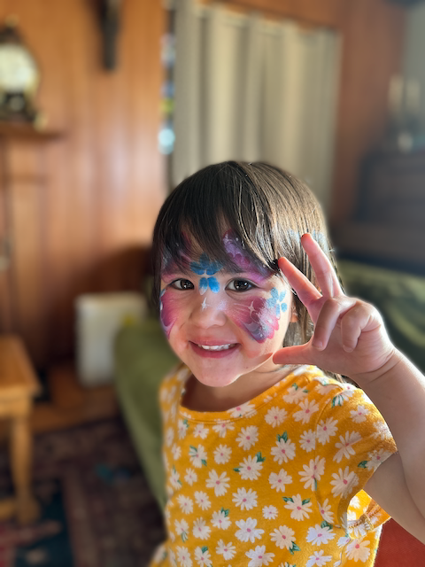

The day before school orientation, Freya and Luke had some pretty impressive face painting!

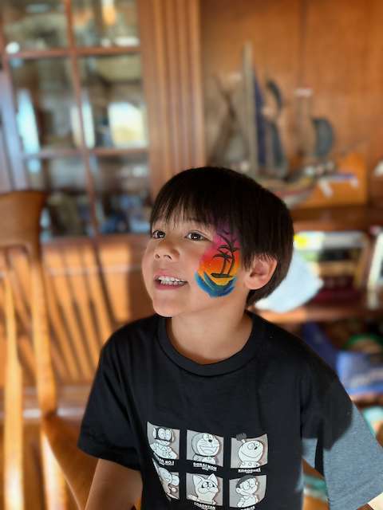

Luke was rocking the Jimmy Buffet vibe.

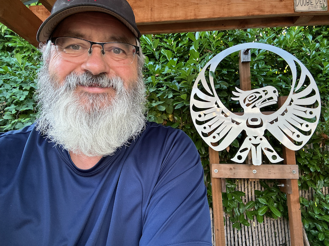

Thursday was Happy hour at the Thunderbird Tavern - My friend Sam, whom I worked with at Tableau, also showed up.  

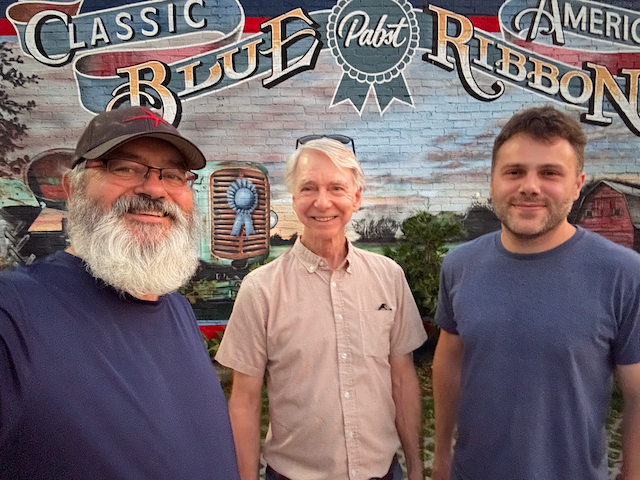

Me, Scott, and Andrew are leaving Happy Hour.

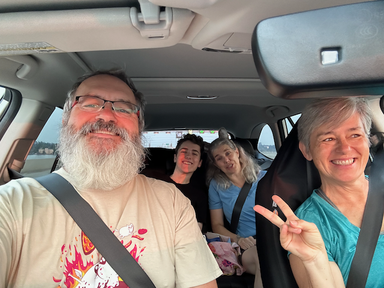

Me, Ben, Dana and Sue on our way to Carnation for the run.

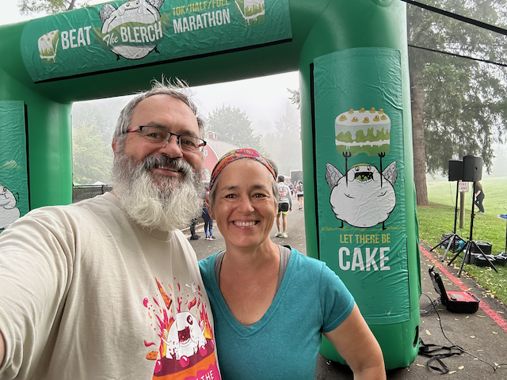

Me and Sue before the start of the Run.

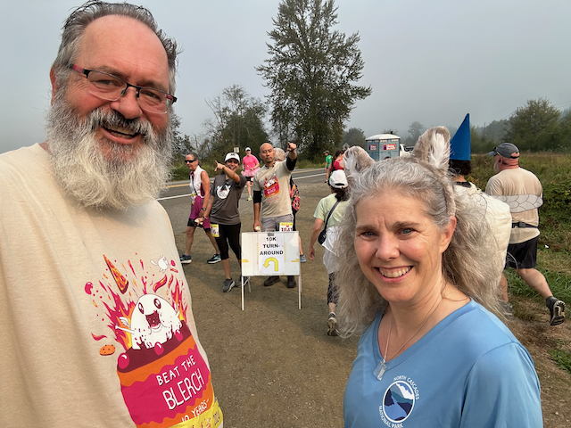

Me and Dana at the 10k turnaround spot.

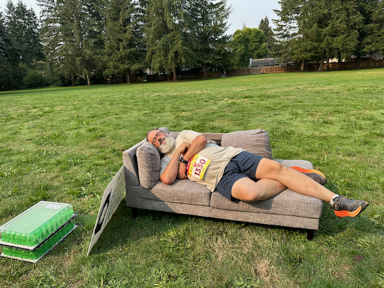

I suppose I could have finished quicker if I wasn't stopping to take naps.

My friend Sara got this picture of me crossing the finish line.

Me, Sue, Dana, Paula, and Ben.  We met Paula in the parking lot. She is from Kansas, and she and her husband's hobby is to do runs.   This run was special, as she was there to support a riend of hers running in her 500th half marathon.  Paula showed us a picture of her medal room at home.  quite impressive, as she had three walls completely adorne3d with hundreds of medals from the runs that she has completed.  She started running in her 50's and is now 70 years old.

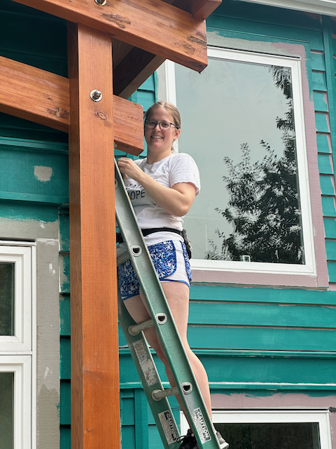

Katarina Painting her house

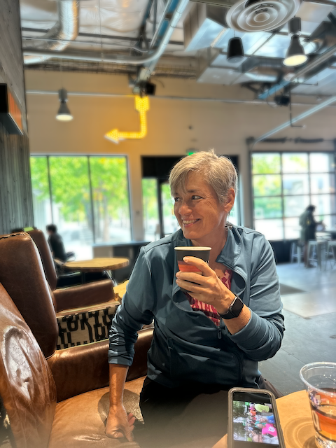

I took Sue to the kexp lounge.  in this picture she is watching the DJ make his announcements between songs.

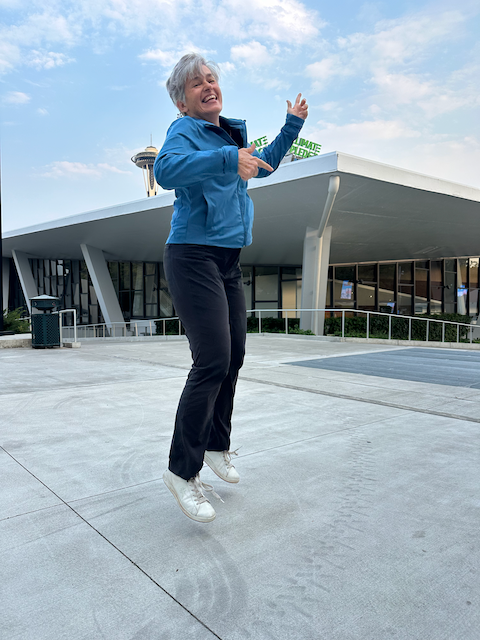

Sue was super excited to go to the Storm Game!

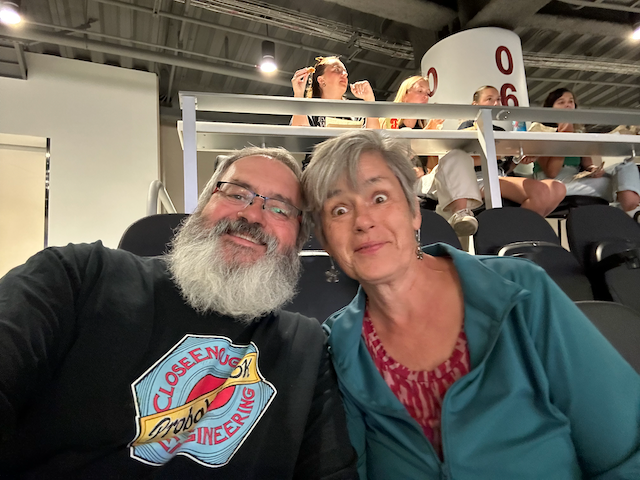

Me and Sue enjoying the game!

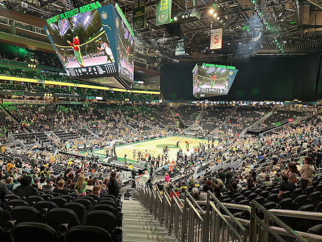

We had pretty good seats!

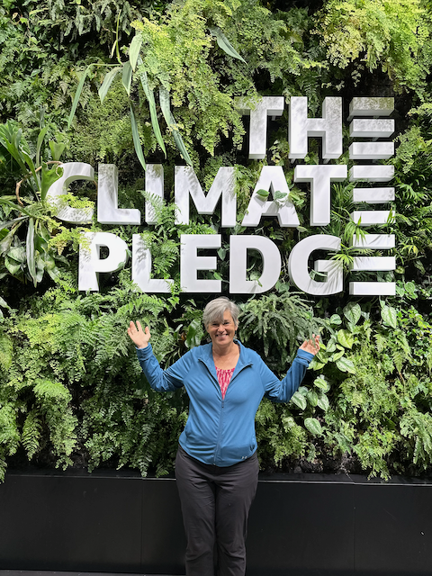

Sue at the climate pledge plant wall.

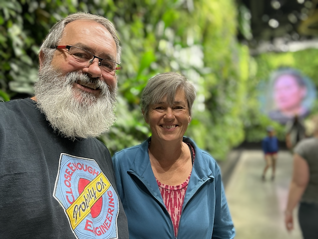

Me and Sue at the Wall. 