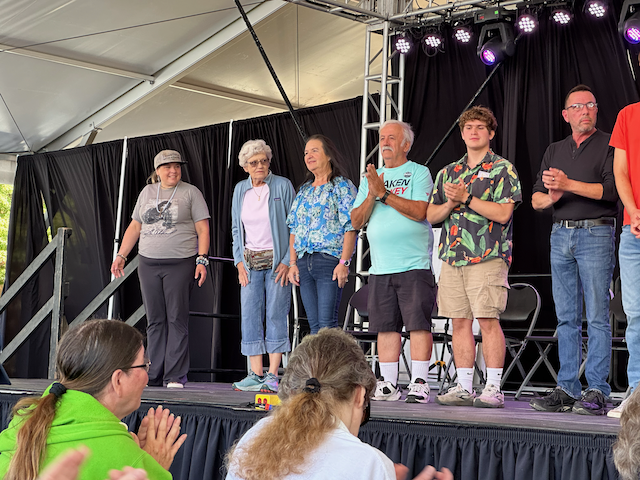

Happy Sunday and welcome to Fall!

I love this time of year as the days are getting shorter, and the air smells wonderful, and you don't know when you will be dodging raindrops from day to day (at least up here in Seattle).  

Things are good around here. This past week, I had the chance to join Mom and Sue at the Puyallup fair—that I do about every three years, and that is often enough :). We had a great time—Mom didn't know that I would pick her up from the airport, so that was fun. I took the van so that I had somewhere to sleep on Sunday night. Sue had gotten a hotel for her and Mom, and I slept in the van that night.

The fair was a ton of fun. We were there when it opened at 10:30 in the morning and didn't leave until 7:30 at night. We checked all of the boxes—elephant ears, roasted corn, scone, onion burger, and kettle korn. Now, it is time to lose the weight I put on.

Things are going okay - I'm starting to feel a tinge of senioritis and am working on tamping that down, as there is still significant work for me.   We have yet to declare who our new Chief Technology Officer (CTO) or Chief Product Officer (CPO) will be, and it has been almost five full months, and we are deep into the planning cycle for 2025 at this point.    We hired the guy who has been running Ticketmaster as the new General Manager of Vrbo. Considering the reputation that Ticketmaster has earned these past couple of years (which is not good), I have some questions about that decision.   I am hoping that there will be an introduction meeting with him, where he will take some questions ;)

After Soup night on Tuesday, I met many folks from the Architecture team for dinner at Mint Progressive Indian Food down on 1st Ave.    This is the last big travel hurrah of the year, as everyone has been asked to slash their travel and entertainment budgets.    (and the way that these guys spend money, I can see why :) )

On Wednesday, the weather was clear, and the wind was perfect, so I left the office early and took the guys from San Fransisco out sailing—and it was beautiful.

This week, we are having the Judging round for our Global Hackathon. I will be the EmCee for one of the Seattle Panels, so that is what I am doing tomorrow.   

Love ya all - have a great week!

Dan W

Catherine, Katarina, Sue, Alex and I went for a walk to see the Troll at the Nordic Heritage Museum

I was there as well :) 

Barry Diller, the chairman of Expedia Group, was in town for the board meeting , and he held a fireside chat - He didn't really say anything interesting other then there is something wrong with a company that can not hire from within (which is kind of rich, since all of the people that report to the CEO are new to the company and the industry, and the senior leaders in the tech org - same thing)

I put up some new lighted house numbers on the house.

On Sunday I surprised mom and picked her up from the airport - she flew in to go to the Puyallup fair with Sue, and I decided to tag along.

Me, Sue and Mom heading into the fair.

Sue has milking a cow on her bucket list - this is about as close as she was able to get at the fair.

This was a pretty cool little farm set that they had.  Kids showed up and walked through on a scavenger hunt for different items to better learn where their food comes from.

We went to the Hypnotists show.

Aaaand mom got hypnotized and caught a wiggler on her tongue 

And then the whole set of volunteers from the audince Danced the ballet

And then Mom sang happy birthday as part of an audition.

I have been skeptical in the past about hypnosis - but I saw it with my own eyes!  :) 

Waiting for mom and sue to finish a tram ride.

We were there pretty much all day - and didn't leave until the sun was filtering through the stalls.

On Tuesday night, I headed out to dinner with the architecture team after soup night, and these were the smoked manhattan's that were served.

And then, on Wednesday, the weather was nice, so I took Arun, Remus, and Nagarjun out sailing - it was a perfect evening for sailing.  

Here they are as the sun is going down.

and that's a wrap for the sailing.   Likely for the year - This Friday I am going to haul the boat out of the water for maintenance - this will be the first time in four years that it has been hauled out.   It's a good time to do it, as the J24 world championships are happening next week, and they want to borrow my slip for mooring the competitors boats.

Friday night I went down to Queen Anne Beer Hall to hang out with some of the crew that I worked with from 2017 to 2020.   Dineth, who works for GoDaddy now, was in town from Austrailia.

Saturday night Catherine and I joined Curt and Amy for the Seattle Area Feline Rescur gala fundrasier event.  We didn't win the dessert dash litter box.   I did get to try some, and it was a pretty good cake :) 

Amy, Curt, Catherine and I after the auction last night.