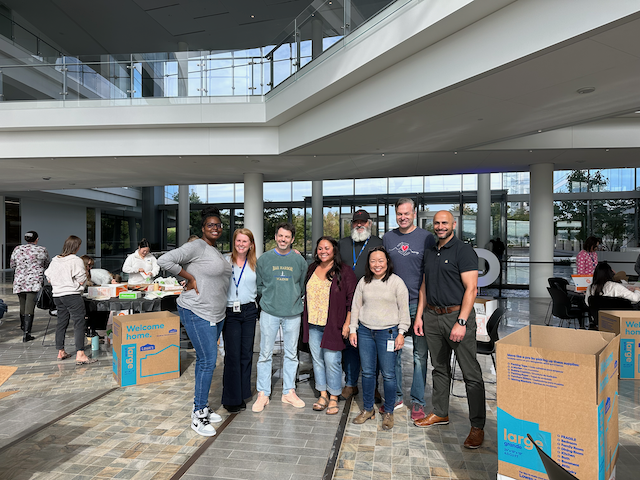
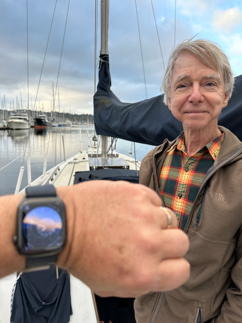
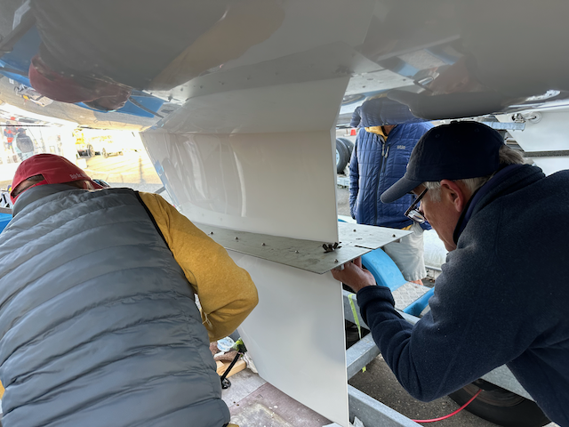
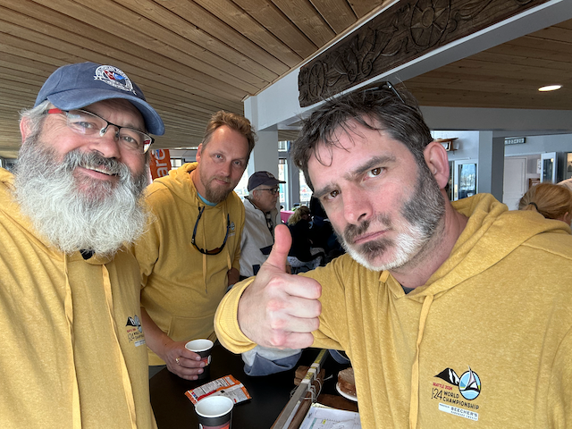
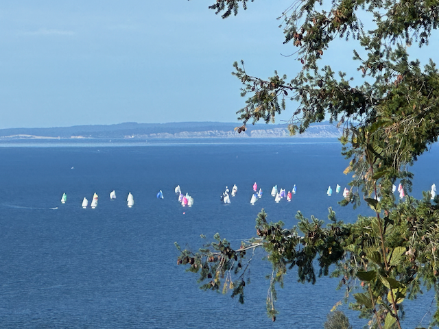
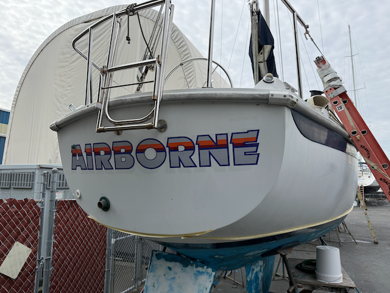
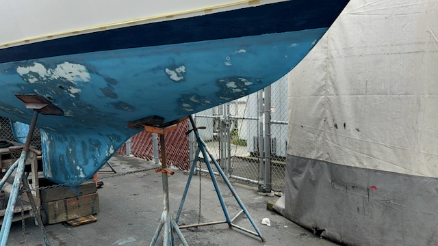
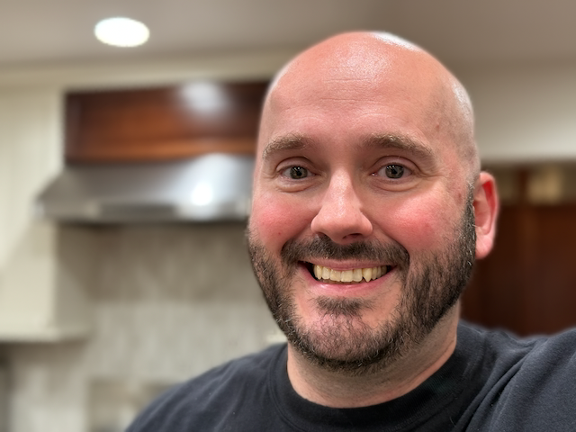
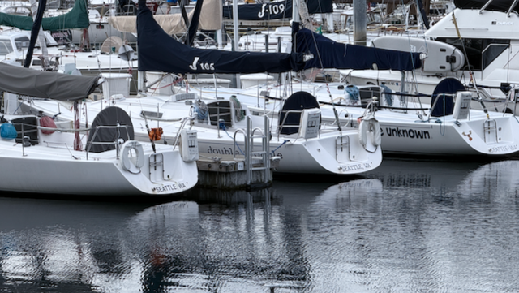

Hello - and Happy Sunday!

I hope this letter finds you well. I’ve had many experiences lately. The other day, I had a bit of a mishap while grilling chicken on the Weber. The heat got away from me, and I ended up burning the skin pretty badly - it was still something that we could eayt, but not as good as I was hoping for.  I think I know what went wrong, and I am going to try my hand at it again.

On the brighter side, I finally got our home automation system running smoothly, just in time for the darker mornings and evenings. It’s nice to have everything working as it should, and it’s a small win that feels good.

Work has been busy as I’m organizing the upcoming SteerCo meeting and a virtual roundtable. I’m still deciding whether to handle everything myself or delegate some task,   Fingers crossed, but I think we are going to have all of the hurdles out of the way for my replacement to join the effort this week. My retirement plans are also becoming more concrete, with my last working day set for January 10th. It’s exciting and a bit surreal to think about.

Last Friday, Scott and I moved Airborne to the boat yard for its first Haul out in over four years.  It came out of the water looking good.  These days, the boat yards will only let their employees work on their bottoms to control the runoff from the yard.  So, it's been over a week, and it still needs to be done.  I did ask them to put a little bit of extra effort into preparing the bottom for paint, as it required some smoothing ;)    

I did the haulout now because the J24 world Championships were sailed out of the Corinthian yacht club this past week, and they wanted to borrow my slip for mooring one of the 54 participating boats. I spent last weekend volunteering to measure boats. The volunteer orientation was a great experience, and I learned a lot about the logistics and technology associated with participating in and hosting an event like this.

There is a new system out for managing races called  [Vacaros](https://vakaros.com/) . Learning about the Vakaros system and its impact on race dynamics is fascinating.  This system uses GPS and a device on every boat to help control the starts.  I talked to some of the racers, and they say that it takes a tool away from them at the start, because without it, it is possible to force another boat over early and be over early yourself since you know that your boat's bow is hidden by the boat you pushed over early, so the Race committee can't see you.  But with the Vakaros system, whether the race committee can see you or not doesn't matter.   However, it also comes in handy in the protest room, as the protest committee can see exactly what course everyone was sailing as they went into a situation resulting in a protest.  I'm of mixed mind; while I love my technology, it does take some of the gamesmanship out of things.  

Wednesday was the OMCC social hour at Stoup Brewing, where we discussed local community issues like potential school closures and housing challenges. Staying connected with what’s happening locally is always rewarding. My big job as the president of the OMCC is to recruit the next cohort of leaders who will run this place for the next 10-20 years.

On the home front, I’m continuing to work on improvements for the van, including considering a suspension upgrade. 

Looking ahead, I’m considering a trip to New Orleans for Mardi Gras and maybe even an adventure along the Powder Highway. It would be nice to have some travel plans to look forward to.

Love ya!

Me, and some of my team mates, after packing care packages for the Month Of Cating event.

Scott and I Moving the boat to the yard.

Airborne, being well, Airborne :) 

A shot of her hanging in the slings.

Here are some volunteers measuring the keel of a J24 to make sure that it is in spec per the class rules.

Me, Sam and Ed were the helpers for the mast up crew.  We would help the measurer weasure the forestay length, the J measurement (the distance from the front of the mast, to the front of the boat) and the heigh of the mast.    It was interesting work

On Monday I went to Sunset park, and watched the practice session.  They did about five practice starts, and then they did a practice race.

Some of our OMCC Neighbors at the end of the Happy hour at Stoup brewing.

Airborne's stern

Airborne's bottom is looking _much_ smoother then it has in _years_

A flower garden at Shilshole with an Orbitz gnome hiding out in it.

J24's sailing in the last race of the regatta.

The duck pond at Golden gardens

This is one of my long time former co-workers Jay.  He was at the friends gathering that we went to Saturday night.

Three J105's floating quietly in the marina

