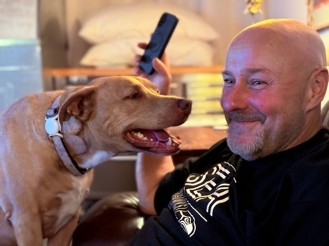
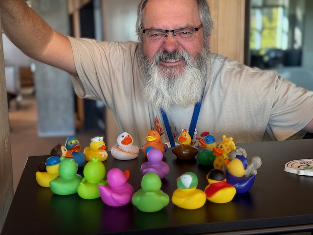
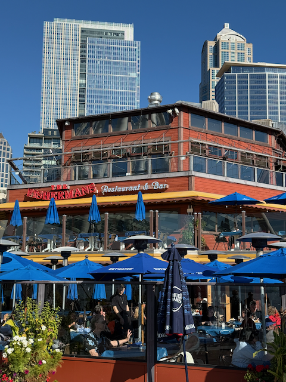
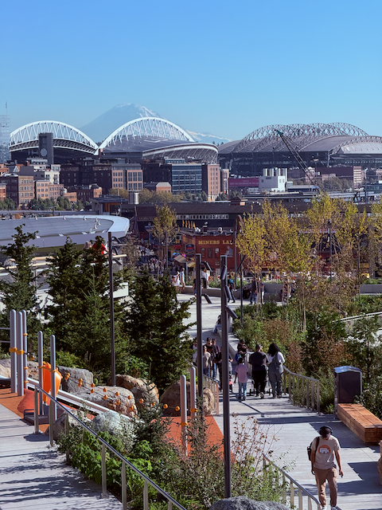

Good Morning, and Happy Sunday!

I hope everyone is having a good day and that y'all have had a good week.  Things are well here; the weather the week has just been spectacular. There are some real bonus days for the summer, even if it is getting dark earlier and earlier, and the sun is rising later and later.

This morning, I'm writing this message at the end of "A" dock at Shilshole, overlooking the south end of the breakwater, and Magnolia. The weather is beautiful, and it is the second day of a regatta here, so I am having the chance to watch the sailboats head out to the course.   

This week started with heading over to our Friend TJ's on Sunday to pick up our air compressor, check out his progress on rebuilding his garage, and watch the Seahawks lose the football game.  All of it was good, except that last part ;) 

On Monday, I went into work, and things were kind of slow there, so after lunch, my friend Sundeep and I went for a walk and talked. We walked six miles from our offices down to the Collman dock along the waterfront and then back through the Pike Place market. 

On Tuesday during the day, I ran to Tukwilla to pick up a new bike rack for the van that we had been looking for, and we are super pleased with the way it works.  That night was soup night, and I made mushroom soup this week. It came out well, and everyone enjoyed it.    
On Wednesday, we had the appliance repairman come out to troubleshoot why the oven on our range doesn't get very warm. He figured out that the bottom heating element was broken, ordered a new part, and will come back this coming week to install it. This explains why our pizzas and bread have just not been baking like we have come to expect.

The Corvo crew came over Thursday night, and we had our kickoff for the 2026 North Americans.   We have set out our goals (have fun and put the most competitive boat on the water).   We discussed some details of putting this campaign together (weight, budget, and time commitment being the big three).  So that is coming together, and everyone is on board.

Thursday, I rolled into the office and worked from there.   My boss asked me if I could step into another project to assist with a big launch. I suggested keeping the learnings in the house, which would be better, but I would step up if they couldn't find anyone.  So he reached out to me on Friday, and I will be leaning into that.  

Friday night, Catherine and I headed to Seattle Public Theatre to see the world premiere of [The Park](https://www.seattlepublictheater.org/thepark), a new play written by two local women. It was really good. The theatre was the Bathhouse at Greenlake, and we rode our bikes there and back, which was quicker and easier than driving.  

Yesterday, Catherine headed over to Omak in the van, where she and Kat are volunteering in an extensive spay and neuter clinic all week.   Catherine took her bike on the new bike rack, and we will see how that works out for us.

I spent the day down at the boatyard.  The boat has been out of the water for just over two weeks now, getting the bottom painted, through hulls checked, and the packing around the prop shaft replaced.   They have been taking longer than I expected, but they were finally done with the bottom pain yesterday, so I washed and waxed the topside and then painted the boot and sheer stripes.  That was 8 hours of work I got done, but I feel really good about it, and the boat looks a lot better and is ready to go back in the water.

Love ya all
Dan W

Pumpkin and TJ watching the game.

All of these rubber duckies, and the devil ducky is missing!   

Me and Sundeep heading out for a walk

We are looking into the city from a pier on the waterfront.

I love walking through the Pike Place Market.   

It's a thrilling experience to overlook the waterfront from the newly opened [pedestrian overlook](https://waterfrontseattle.org/waterfront-projects/overlook-walk). This innovative addition, which just opened last week, seamlessly connects the Pike Place Market to the aquarium, enhancing the overall experience of the Market and the Waterfront.

Walking along the pedestrian overlook

A lovely sunset from the front porch.

This is the new bike rack that we picked up for the van.

And both bikes fit on it just fine.

This is what the bottom looked like after prep, but before paint.

I took a long walk Wednesday night while I finished listening to our latest book club book [Amazon.com: A Soldier of the Great War ): Mark Helprin,](https://www.amazon.com/A-Soldier-of-Great-War-audiobook/dp/B000Z7FGWK) I managed to finish it yesterday while I was working on the boat.

A slipway at Shilshole at night.

Ah-HA!  we found the broken heater elemenet.

[The Seattle Public Theatre](https://www.seattlepublictheater.org) is a very intimate theatre.  

On the way home from the show, Catherine and I stopped at a local bottle shop called [Draft Punk](https://daftpunk.com).

Catherine out, with her Bike, for Omak.

It wasn't very windy yesterday for the regatta.

Airborne is looking pretty good!
