Good Day, and Happy sunday!

I Hope that everyone is well!  Things are good here.  Catherine and Kat spent this alst week over in Omak voluntereing for a huge spay and neuter event, where well over 1,000 dogs and cats were spayed and neutered.    Catherine took the van on the trip, and had the chance to see our Friends Phil and McKenzie, as well as their dog Hercules.   She quite enjoyed the trip and the opportunity to help out in a good cause.

I spent the week working, and being kind of low key.  The boat went back in the water on Tuesday, and it is looking good now.   Tuesday was also soup night, and as both Catherine and Katarina were not in the house, I had the chance to make the bread for the week :) 

At work things are winding up, more or less.  We had our first steerco meeting for the effort I was associated with, and the guy that is taking over that effort from me is doing a great job of picking up the baton from me, so that feels good.  I got sucked into another project that will keep me busy through the early part of December.  (I'm just in a support role to help out a bit).  I'm not _as_ invested in that project (adding branded AI features to the Expedia product)  But it will keep me busy, and hopefuly out of trouble.   

We did announce who our new Chief Technology Officer (CTO) is going to be, and that he will start on December 4th.  (we haven't had a CTO since May, and the new proejct I'm working on was her pet project). so it is good to see some progress on that front.   We are still waiting to see who the Chief Product Officer (CPO) will be, as that is the other _key_ leader that we are missing at the moment.

That's really about all that seems to strike me for the Narrative today.   :)

Love ya all
Dan W

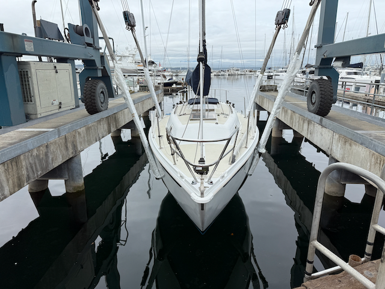

The boat is heading back into the water

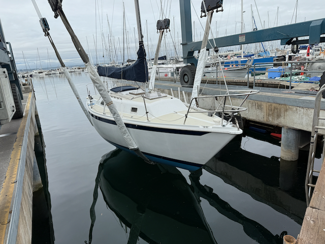

Another shot of the boat getting splashed.   I have some work to do on the deck to get it all cleaned up from all of the dirt that it accumulated in the yard, but the topsides look great :). 

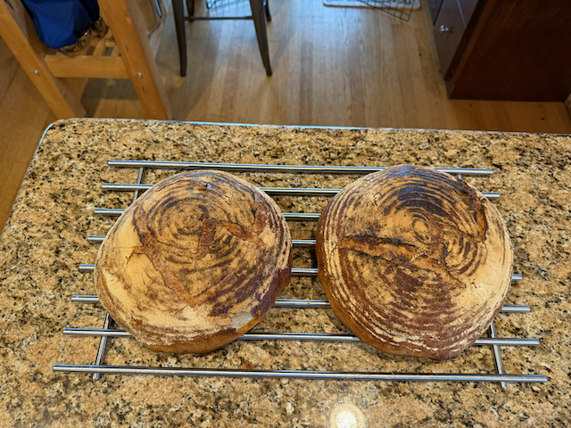

Oven still isn't working quite right, so I did a "Hack" and cooked these loaves of bread in dutch ovens that I heated as much as I could, and then turned the broiler on to heat those ovens up while the bread was baking.

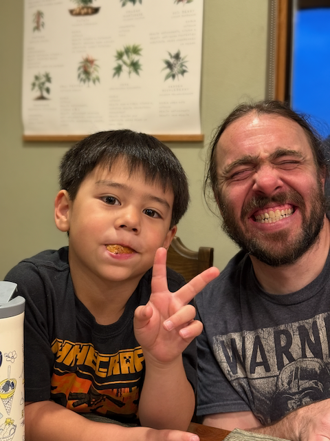

Luke and Chris at soup night.

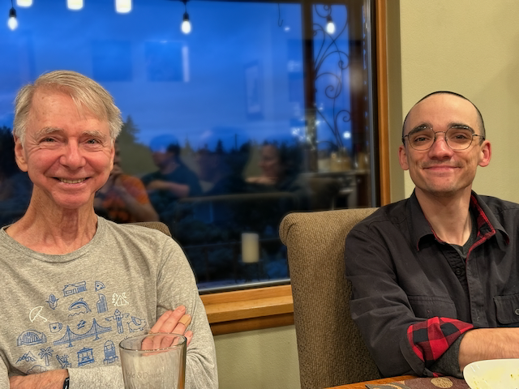

Scott and Matt

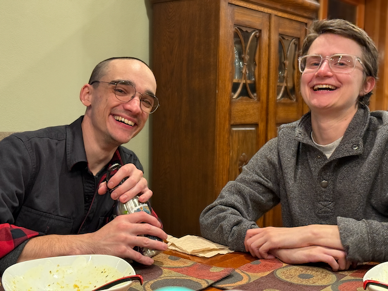

Matt and Justine. (Those glasses that Justin is wearing are her brothers)

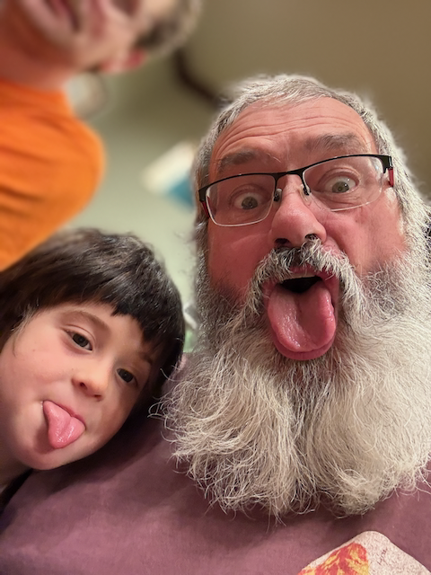

Remy and me making funny faces.

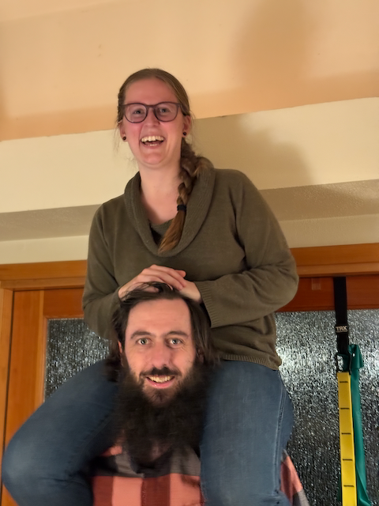

Alex gave Luke and Freya a peek at what is "above the ceiling" in the entry way, and then Katarina wanted a peek.

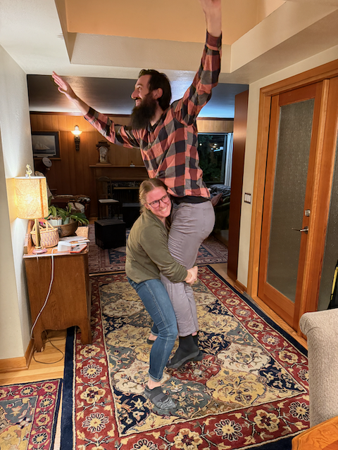

Catarina was able to lift Alex a little bit, but not high enough for him to get a peek of what is up there.

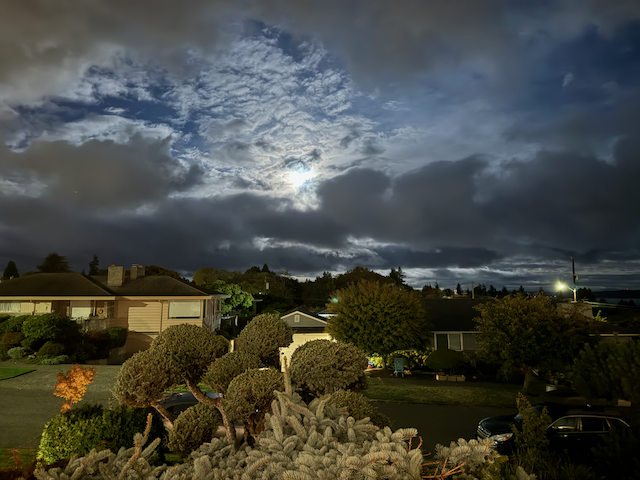

The full moon setting in the morning.

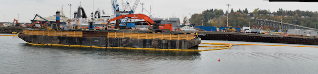

This Big project down at the cruise ship terminal has been going on for a while

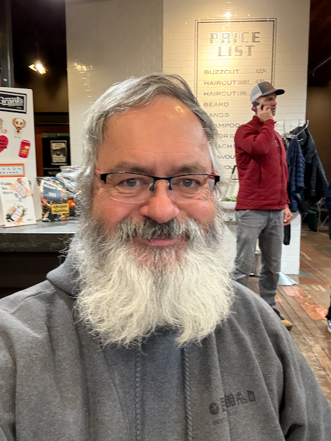

I did get a haircut this week.  this is the before picture ;) 

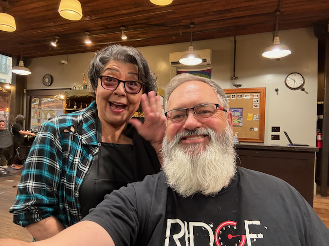

and the after 

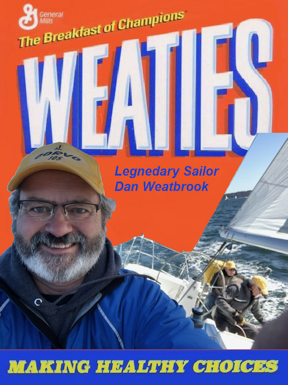

A buddy at work made this wheaties box cover for me :) 

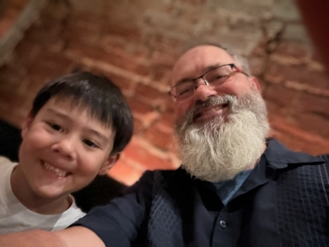

Saturday night Luke and Emi took Catherine and I out for dinner with the kids as a thank you for watching Jazz while they are on there upcoming trip to LA to see Chris's folks.

Alex, and some friends, Hiked the enchantments on Saturday.