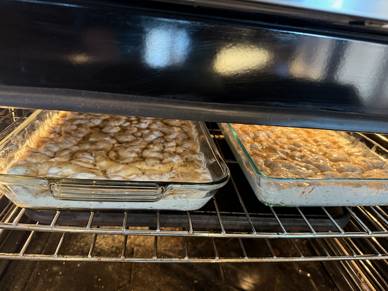
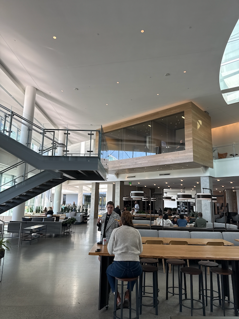
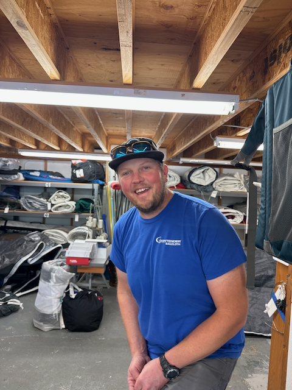
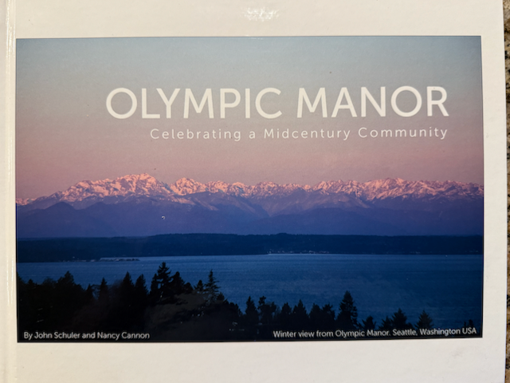

Good Morning!  

I hope everyone is doing well!  Things are good here.  We have had some just glorious days of weather up here in the northwest, and we have had some kind of dreary days as well, but for the most part the days are good.

The big news at work is that we have announced who the new CTO is going to be for Expedia.   I am cautiously optimistic that he is going to be a good leader for the teams.  There are two things that give me hope on this front.  1) he has spent the last 20 years at two jobs (meaning that he hasn’t been jumping from job to job to escalate his title, and not living with the results of the decisions he makes). 2) Ariane, our CEO, referee to him as an empathetic leader.    Which seems like a good sign, since Ariane is one herself.   Now, does that matter to me that much?  No, not really, since I won’t be working there long enough to be impacted by how he does things.  I will have a chance to hear about how things go, since I have lots of friends that will still be working there, and I’m sure that I will get some insight into things.    

On the sailing front, Butch, Kat and I had our first meeting with the Sailmaker, and we have put together  strategy for the sails that we want to buy leading up to the 2026 North Americans.  We have documented that, and presented that to the rest of the crew.  Now we need to incorporate any thoughts or concerns that the rest of the crew has on that before pulling the trigger and ordering the first batch of sails.  

In other news, I picked up a new Camera that should come in quite useful for preparing for the races coming up.  It is an insta360 x4, which is a 360 degree action camera, and I have to say, I have been quite impressed with the quality of the video and pictures I am able to get out of it, and the functionality of it.  Here is an [example video](TK instead link to YouTube video - } of me using it to get a sense of the clearance that the van has when it goes under the bridge on the way to Shilshole.   

Catherine, Katarina and Alex have been putting in a ton of work on the 538 house, getting the floors in the basement ready to finish.  So they have been over there with power sanders on the floor.  So things are getting closer and closer there, and it is really fun to see things start to come together there.

Hope all is well with everyone. 

Love ya all!

Dan W

Making focaccia bread for soup night - without the bottom element, the oven really struggles - the new part has finally been ordered (thank you Catherine for chasing that down!) so soon we will be back to good bread and pizza ;)   

Peace Freya!

My new cookbook.   The first recipe I cooked out of this book was grilled cauliflower and it was excellent.

Lunch on Campus.

This is Alex S - The sailmaker that we are planning on working with.

Scott and I went out on Thursday night for dinner and a drink.

This is the cover of the OMCC history book - I am putting together a reprint order for 2025.