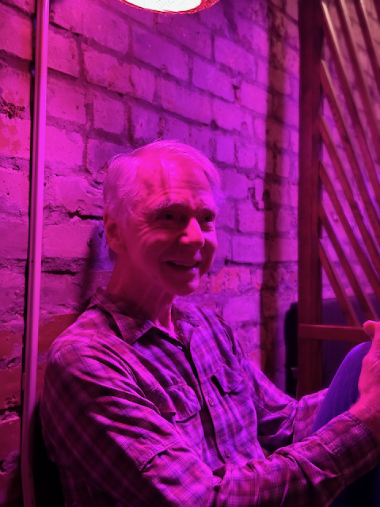

Good Morning!  

I hope everyone is doing well!  Things are good here. We've been enjoying some beautiful weather up here in the northwest, and I hope you're all experiencing the same wherever you are.

The big news is that we have announced the new CTO for Expedia.   I am cautiously optimistic that he will be a good team leader.  Two things give me hope on this front.  1) he has spent the last 20 years at two jobs (meaning that he hasn’t been jumping from job to job to escalate his title and not living with the results of the decisions he makes). 2) Ariane, our CEO, referred to him as an empathetic leader, which seems like a good sign since Ariane is one herself.   Now, does that matter to me that much?  No, not really, since I won’t be working there long enough to be impacted by how he does things.  I will have a chance to hear about how things go, since I have many friends that will still be working there, and I’m sure I will get some insight into things.    

On the sailing front, Butch, Kat, and I had our first meeting with the Sailmaker, and we have put together a strategy for the sails that we want to buy leading up to the 2026 North Americans.  We have documented that and presented it to the rest of the crew.  Now, we must incorporate any thoughts or concerns that the rest of the crew has before pulling the trigger and ordering the first batch of sails.  

In other news, I picked up a new camera that should be quite useful for preparing for the races that are coming up. It is an Insta360 x4, a 360-degree action camera, and I have been quite impressed with the quality of the video and pictures I can get out of it and its functionality. Here is an [example video](https://youtu.be/vw-0jeXlX8I) of me using it to get a sense of the van's clearance when it goes under the bridge on the way to Shilshole.   

Catherine, Katarina, and Alex have been doing a lot of work on the 538 house, getting the floors in the basement ready to finish. So they have been over there with power sanders on the floor. Things are getting closer and closer there, and it is really fun to see things start to come together there.

I hope all is well with everyone. 

Love ya all!

Dan W

Making focaccia bread for soup night - without the bottom element, the oven really struggles - the new part has finally been ordered (thank you Catherine for chasing that down!) so soon we will be back to good bread and pizza ;)   

Peace Freya!

My new cookbook.   The first recipe I cooked out of this book was grilled cauliflower and it was excellent.

Lunch on Campus.

This is Alex S - The sailmaker that we are planning on working with.

Scott and I went out on Thursday night for dinner and a drink.

This is the cover of the OMCC history book - I am putting together a reprint order for 2025.