Good Evening!  I hope everyone is doing well and enjoying the fall and impending weather!  Things are well here.   Tuesday's soup night saw new faces as Alex invited some coworkers to join us.  So that helped fill in for the fact that Chris and Emi were in LA with their kids, Scott was back East, and Elizabeth was in Alaska working.   Justine made a lovely soup.    Yves came over on Wednesday evening and brought some fresh mushrooms he had foraged, and Catherine worked them into a sweet risotto.   

Thursday was Halloween, and we were prepared for 600 kids to come buy, but with it being on a Thursday and there being quite a bit of rain, we probably only had about 300 kids come to the door.   Catherine upped the allocation for each kid, so we did a good job of ensuring we didn't have any leftover candy (well, there are some mint patties, but Catherine is wisely not letting me know where she stashed them). 

Friday afternoon, Kat and I headed to Corvo to swap headsails and examine the North Sail that we picked up in 2020 but haven't used since.  

Saturday was the Sloop Tavern Yacht Clubs Fall Regatta, and Corvo managed to get second out of seven boats racing.   I did bow, Kat did Main, George was up from San Fran and did a guest appearance as the trimmer, and Stefan and Butch shared driving, tactics, and pit responsibilities.   

The weather was perfect. The southerly breeze was nice and easy and fairly steady, and the rain stayed away until we were back at the dock.  

After the race, Catherine and Alex met George and me down at the Sloop Tavern for the awards ceremony.   We sent George home with the coffee mug that we got for second place in our class.

Sunday Catherine and I went over to help George replace the Microwave, fix some light fixtures, and repair a door at his house that he owns and rents out by Seattle U.   

OK - time to get this out to you all :) 

Love ya!
Dan W

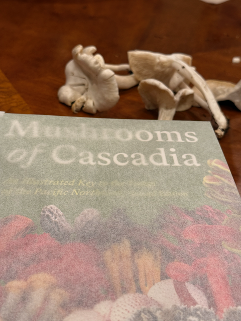
Yves new mushroom foraging book that he picked up.   and some of the (non edible) mushrooms that he brought over on Wed.

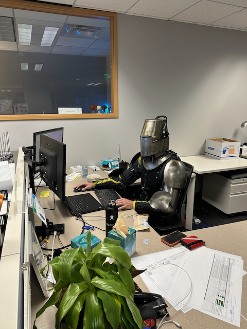

Alex wore his best suit to work on Thrusday

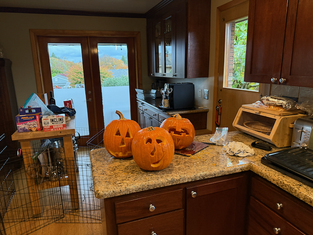

I carved some pumpkins on Thursday when i arrived home from work.

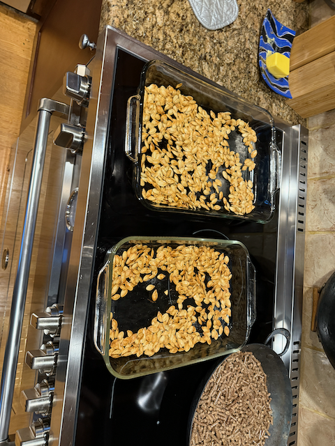

And I roasted up the pumpkin seeds.  This years batch turned out great, and were gone before the evening was over.

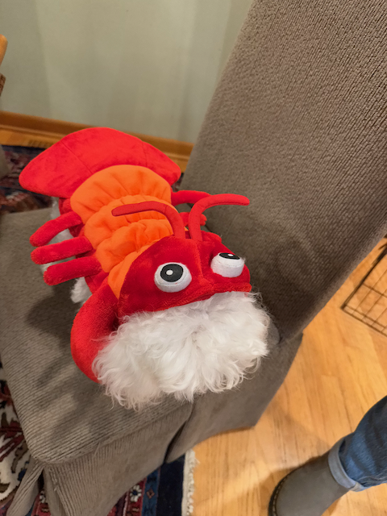

Kat came over with Blanka dressed as a lobster.

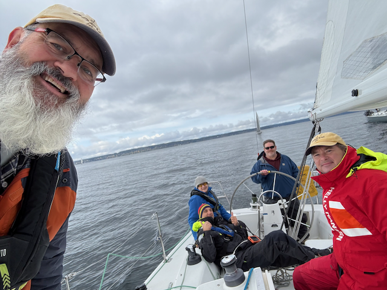

Me, George, Kat, Butch and Stefan getting ready for the race.

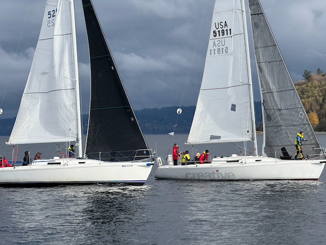

Two of our competitors heading towards the finish line.

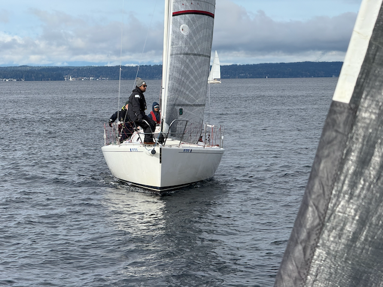

getting in front of Muzu.

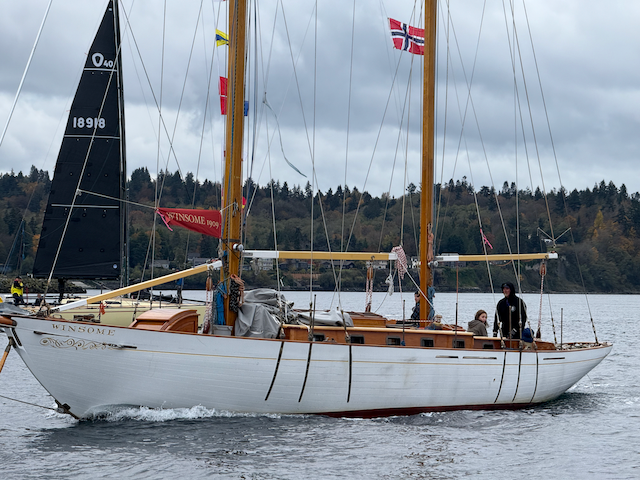

This was a very pretty boat that went past us.  It has a sign on it saying that it was built in 1902.

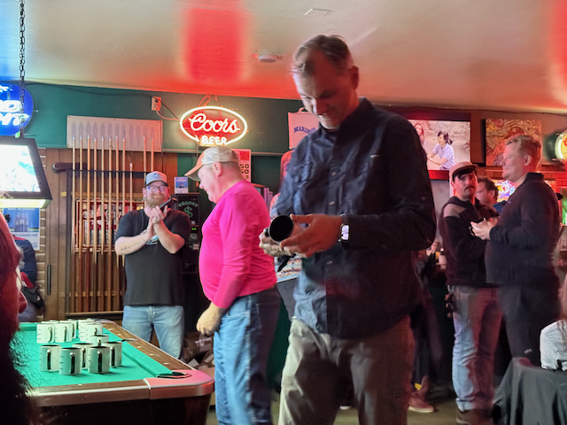

George went up and got the award for second place.

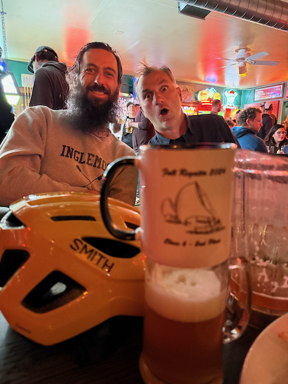

George and Alex. 

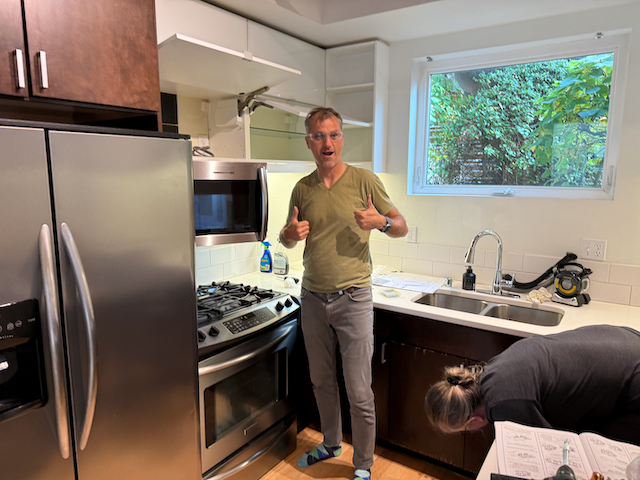

New microwave is in!