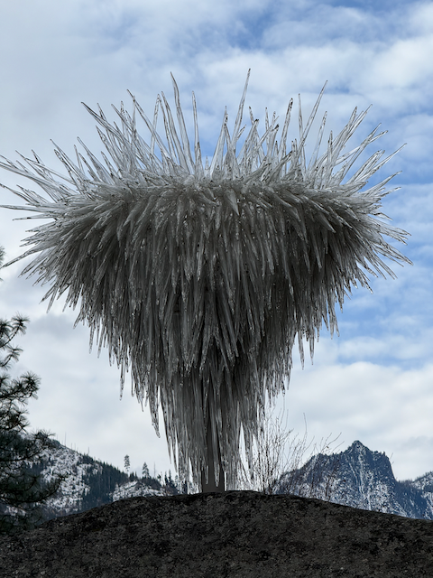
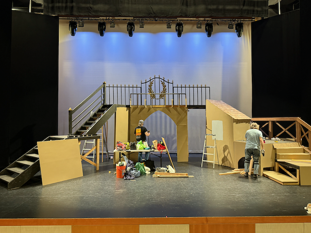

Good day!  I hope that everyhone is doing well!

I am sitting down here on Corvo this morning waiting for Stefan to arrive so that we can go and do some experimentation with the intruments and logging the data from the instruments.

This has been a crazy week.  On Monday Catherine and Katarina went to Katarina's house to do some sanding on the floor to prepare it for the "densifier" application.  Turns out that the sander takes a bit more wrestling then they thought, so Alex and I went over there to help Spell Catherine and Katarina.   We made  great progress, and there was more great progress made this week as well, and now things are ready for the densifier application.  Once the densifier is in place, things will go a bit more quickly.  I don't have the full list, but I do know that painting, cabinets, doors, trim, finish eletrical on still on there.

Tuesday was the election.  We had folks over for soup night, and Catherine made Tim Walz's chili recipe, and it was super super good.    Wedensday was a day of disappointment for me from the percpective that over half of the country could vote for a man of that character, with his racism and mysgony.  (I'm not a fan of his poiicies either).  A bright spot in the whole thing is that the results were definitive, avoiding the potential of violence and turmoil that was being fomented.   

Wednesday the Strategic initiatives team had a happy hour at Log Cabin Distilary across the train tracks from campus, and it was good to hangout with all of my team.  Thursday saw me meet up with my friends Kevin and Robert that both used to work at Expedia (and Robert and I were actually office mates at Tableau as well). Before meeting up with Catherine, Scott and Tory up on Phinney Ridge.   

Thursday also saw Cathering get the van loaded up with the set for the Three Musketeers show that is being put on at Icicle Creek Center for the Arts in Leavenworth.   She managed to get more stuff into the van then I think anyone thought could be possible.

Friday Catherine and I headed over to Bellevue to meet up Scott Horn (my boss from Expedia 2017-2020) and a bunch of folks that worked for and with him back in that time.  He is currently working for Maersk in Denmark, and was over chatting with one of the companies that they do logistics for.

From there we headed over to Levenworth for the evening, and in the morning we unloaded the set, helped assemble structure of the set before heading into town for a wonderful lunch, and then heading back to the threatre to watch the 75th Warren Miller movie.   It was good, but it almost felt like a bunch of commercials strung together for various outdoor and liquor brands.

Work has been OK this week.   I'm helping coordinate a design sprint that starts this week.

Love ya
Dan W

Alex sanding the floor at Katarina's place.

Katarina was driving the Vacuum cleaner

Me and Brent rocking the old school hotels hoodies from the 2017 era

Soup night - getting ready to play a game of cartagrapher.

Tom Shivitz and myself.   Tom has been at Expedia since before I joined, and we worked together at Disney before that.  Tom is good people.

Me and my current boss Joe Lizee - he's cool, and I have very much enjoyed working for and with him.

When I journal in the mornings, I have the heater going, and a candle.  

Hal, Daman, Bharti, Me, Scott Horn (my old boss), Brianna and Robin at Bakes on Friday night.

Art out at sleeping lady.

Some more art (this one, I used the apple intelligence to remove the pole that holds it up )

This artist forsaw the rise of AI generateed images that were weird - notice the two tails on the salmon.

Putting the set together.

Later in the day.

75 years of Warren Miller films.  that is something.