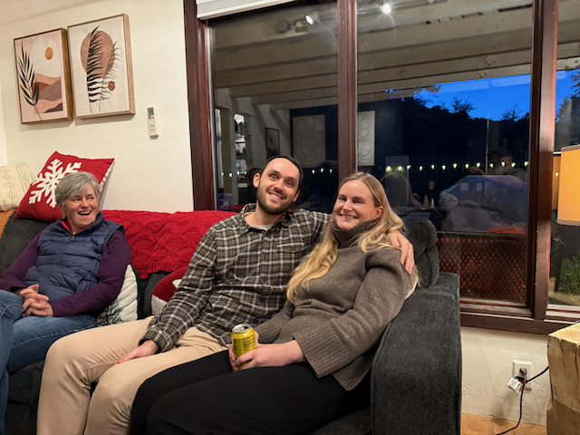
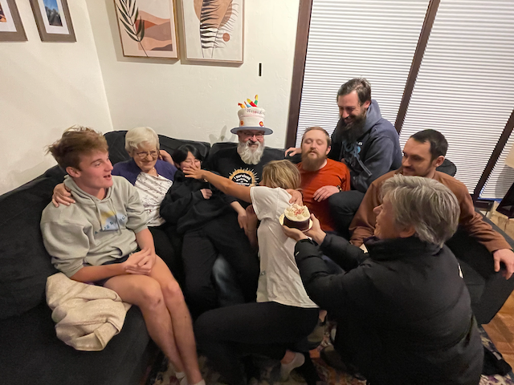

Happy Thanksgiving!   

I hope that everyone has had a wonderful Thanksgiving with Family and friends!   We were fortunate to have everyone in Mom's family together for the event.  Sister Sue organized an AirBnB in Prescott for everyone, and all of mom's children, their children, and everyone's partners could gather.

I spent a week before getting down there in the Van.   Stopping in at friends' places in Oregon and California,  then [racing with Kyle and the rest of the Close enough engineering team in sonoma](../trip-reports/2024-11-Sonoma-thanksgiving/day-6-7-and-8---lemons-racing-in-sonoma.md).   Once the race was over, I rolled on towards Flagstaff, arriving on Monday afternoon.

Catherine, Alex, and Katarina left Seattle late Friday night, drove down to Flagstaff in Alex's Honda, and managed to get there in just over 24 hours of constant driving.    Catherine, Alex, and Katarina worked mon-wed in Flagstaff, and I had the chance to explore the Flagstaff area.  On Wed afternoon, we headed down to Prescott, where the AirBnB is located.   Catherine and I were the first to arrive, and Catherine got to work on the batches of chili for Wednesday night dinner.  Those turned out super, super good.

We had a lovely time catching up with everyone as everyone started to filter in on Wed night.  

Mom was in charge of the Turkey, and she brought just about her whole kitchen with her. On Thursday, Mom started cooking dinner, and Catherine helped. In the morning, a bunch of folks went for a hike. Dinner turned out spectacular! Jay and Jack's sweet potatoes were delicious.

The day was spent hanging out, hiking, catching up, and playing games.  

Friday saw some folks head out for a hike (Sue, Catherine, and I did a 7-mile loop hike.  Balin, Perrin, and Katarina did a thorough hike from where we started back to the house).  And then we hung around the house catching up, playing games, doing puzzles, and just generally enjoying the time together.    We also celebrated Mom's birthday and recreated a long ago photo.

Saturday was departure day.   Breakfast was wrapped up by 9:15 - cleaning and packing was wrapped up by 9:45, at which point we had a closing circle before everyone broke for home at 10:00 am.

Catherine and I were in the Van, and Alex and Katarina were in Alex's car. We started the 19-hour drive back home as a caravan. We made really good time, with a six-hour stop from 2 a.m. to 8 a.m. in northern Nevada for some sleep. We arrived home at 5 p.m.

Thank you, Mom, Sue, and Catherine, for all of the work that you put into making this such a wonderful and memorable Thanksgiving.

Love you all
Dan W

Catherine Preparing the Chili's for Wednesdays Dinner.

Peter and Mari made it in from Norway for the event.  It was wonderful to have them in the house!

Peter and Alex reuniting. 

Me and Jack hanging out and catching up.

Mom stuffing the Turkey.

Katarina, Alex, Jack, Ailin (Jack and Jay's friend) and Sue having some breakfast.

Judy and Penny.  Judy is working on a watercolor for a friends wedding.

Preparing to go on a Hike on Thanksgiving day.  Me, Katarina, Alex, Sue, Catherine, Jack and Ailin.

Alex, Peter and Jack.   The sweater that Jack is wearing was knitted by Mari's mom for him.

That's a lot of butt's in a one butt kitchen helping with Thanksgiving Dinner

Mari and Jay

Perrin enjoying the message chair.  (that chair got quite the workout!)

Everyone in the family.   Plus Jay's mom Jana, and Jack and Jay's friends Ailen and Sharron.

Part of the crowd sitting down for dinner.

Augie (Jay's mom Jana's dog) and Jay's two dogs Mogli and Miko.  

Sam and Perrin's Prescott friend Nick stopped in for a short visit as well.

Sam and Mom, with Mom wearing her Birthday hat.

Athena had a good time as well.

This picture was taken at Mom and My birthday celebration 20 years ago.

Here is our attempt to reproduce that picture :) 

Jay, Sue and Mari.

Athena taking over the bigger dogs bed.

We wore the dogs out hiking :) 

All of the family, including the dogs.
Dan, Judy, Penny, Balin, Mom, Perrin, Sue, Catherine, Katarina, Athena, Peter, Alex, Mari, Sam, Jay, Jack, Jana, Sophie.

Jay holding court with the dog's. They were all so well behaved.

Sam.

Mari.

Jack and Sophie with the a majority (3 of 5) of the dogs that were there.  

Perrin working on the puzzle in the game house.

Sam, Jack and Alex played a good portion of High Frontier for all over the course of a couple of days.

Stopped at Tonopah brewing, where we stopped for dinner on the way home.

The cars at Antelope resevoir, where we spent the night.  Katarina and Alex slept on the floor of the van.  

.png)

Sunrise over Antelope resevoir

Some foggy roads on the way home.

Almost home!
