Good morning!  

I hope that everyone has had a wonderful week!    Things are good here at the Weatbrook house.   I slipped quickly into work after having been gone for two weeks, and it was almost like I never left :)   There were a couple of things that I helped out with on the project that I'm on.  There are two significant milestones - we release our Beta version of our AI features on Wednesday (the Alpha has been out since this past May), and then come April, we will be launching a redesign of one of our key brands, and the AI stuff that we are working on will be key to that.  So, the design, feasibility, and presentation of that new design have all come to a head these past couple of weeks, with the presentation to our "L3 leaders" on Monday and the CEO on Thursday.   So the design team has been pushing hard to get that all in place for that, and I have been helping with some coordination and communications while trying not to let folks get addicted to me being there, as come Jan, I'm out of there.

In other work-related news, our new CTO started on Wednesday, and we had a fireside chat with him. I think he is going to be pretty good, and I feel good about what will happen at Expedia over the next few years.

Tuesday was my birthday, and we had the soup night crowd over. Mom even joined over Zoom.   Catherine made my favorite cake - German chocolate with coconut \ pecan frosting.  It was just lovely.

Wednesday night was theatre with Curt and Amy, and we saw [A Very Die Hard Christmas](https://www.seattlepublictheater.org/a-very-die-hard-christmas) at Seattle Public Theater.   It's an interpretation of the Bruce Willis Diehard movie from 1988.  It was hilarious :) 

On Thursday, Catherine smoked some ribs, and Francis came over for dinner and brought some mead from the meadery she works at, and man, that was good.   They have one that they call "No" that is loaded with Habanero peppers, and it is well named, as it is _HOT

We joined Scott and Martha at the Triple Door on Friday night to see [Branford Marsalis](https://en.wikipedia.org/wiki/Branford_Marsalis). The show was fantastic, even though the Bassist suffered from severe cramping in both hands about two-thirds of the way through.

Catherine rented a truck on Saturday, and we moved the cabinets for Katarina's house out of our garage and into her house. That went quickly (it helped that we had a lot of help), and now we have our garage back. In the evening, I went to my coworker's 35th birthday party. The party started at her house, and then we got on a party bus and took a tour of Christmas lights in Seattle.  

Today I'll try to get some lights up and catch the football game.

Tomorrow, I am taking the day off of work and heading to Port Orchard to work with Kyle on installing the van's suspension.

I hope everyone has a nice and quiet Sunday and an enjoyable week!

Love ya all

Dan W

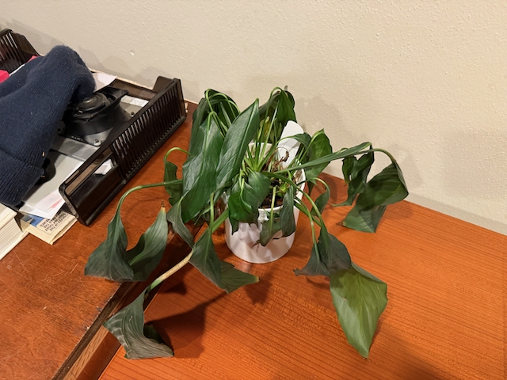

My peace, Lilly, was being a little dramatic when I got home from the road trip.   I gave it a little bit of water, and it has recovered nicely.

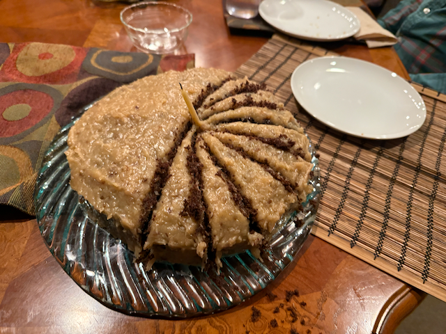

My Birthday Cake!

Brian and I had lunch on Wednesday.

Dinner before the show at Nells, on Greenlake, was wonderful

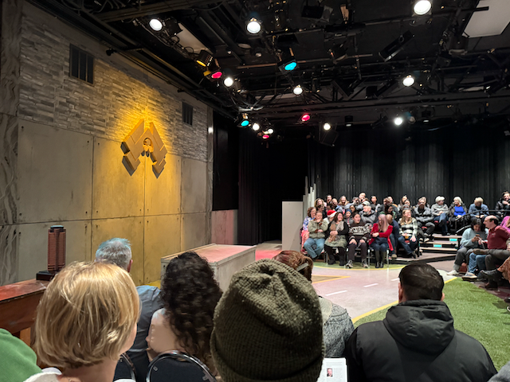

The set for Diehard

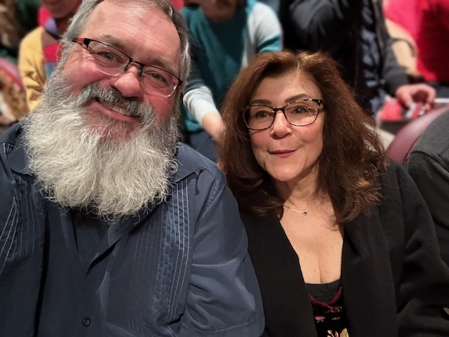

Me and Amy

Branford Marsalis and his quartet, on stage

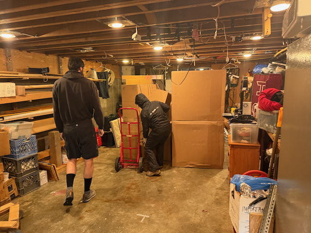

Moving the box's out of the garage.

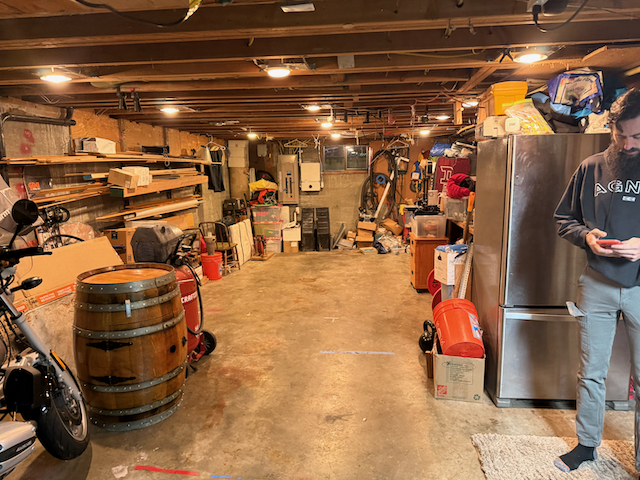

Garage is empty and now ready to be cleaned back up.

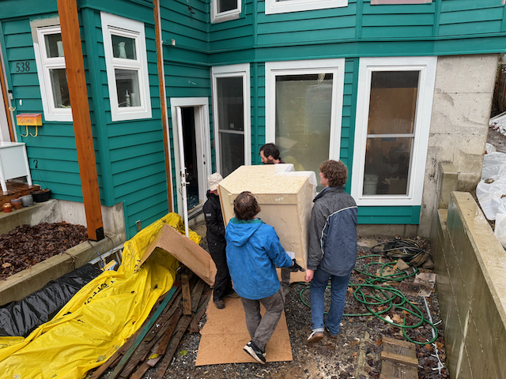

Moving cabinets into the 538 house.

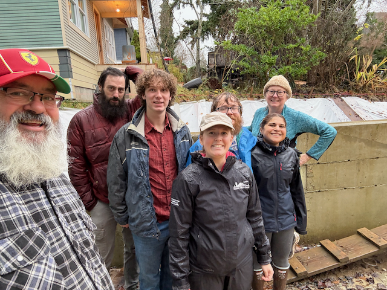

The move in crew.  Me, Alex, Oscar, Katarina, Alex (Katarina's brother), Gretchen and Catherine

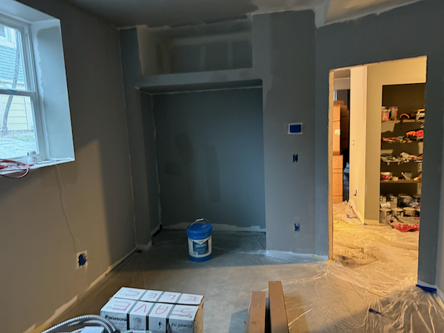

Looking out of a bedroom towards the front of the house.

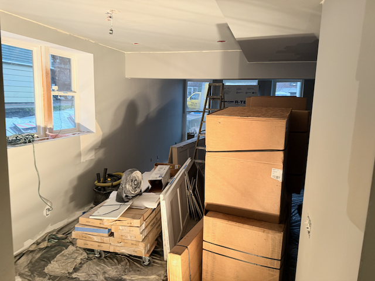

Cabinets are all in moved in - Priming is almost done.

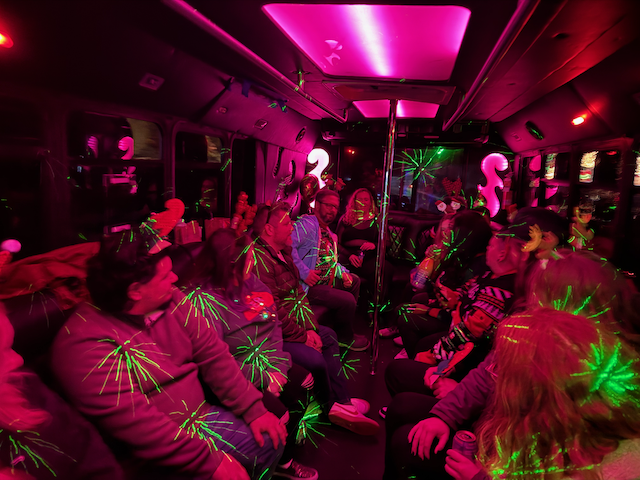

In the party bus heading out to look at lights.

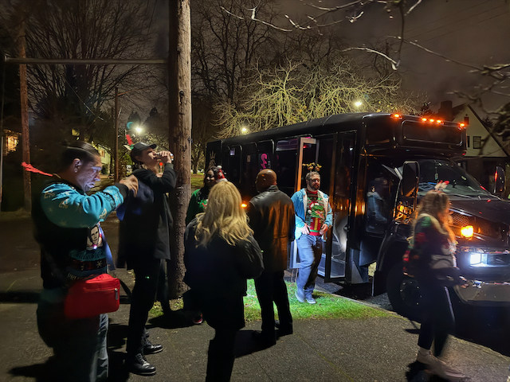

Taking a walk in Candy Cane Lane.
