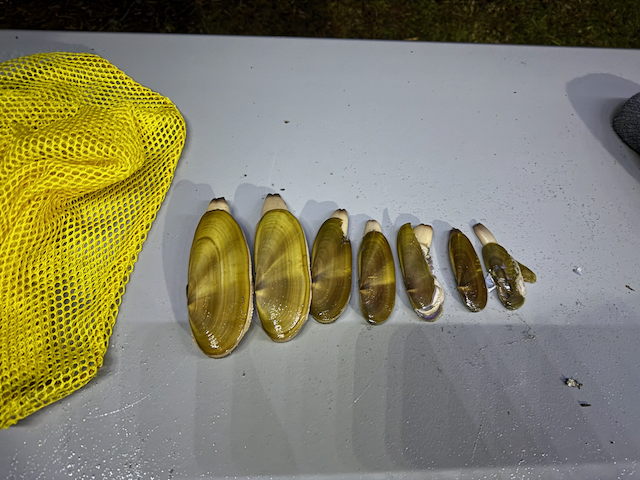

Howdy! I hope everyone is having a nice, quiet weekend and that the pressures of the holiday season are resting easily on your shoulders.  

This week started with me heading over to Kyle's house to begin the installation of the new suspension parts on the van.    That was ten and a half hours of labor, and we only got the front components installed.   There will be another long day to do the rear, as we will also be replacing the rear springs, which will be a challenge.   I'm very grateful that Kyle has the skills, tools, space, and patience to help with this project, as the local sprinter shop was quoting me north of $1500 for the work.  

The rest of the week was calm.  The next version of "Romie". (Expedia's AI trip planning assistant) launched, and it went smoothly.   There are a couple of follow-up items for the team to work through, but nothing earth-shattering.   The design team also presented the vision for the _next_ version to the CEO, and while I wasn't there, the reports are that it went pretty smoothly as well.  There is some feedback and a lot of work to do to get the execution plan put together.  There is a big deadline on the 1st of April, and then they will also need to have a plan for how to introduce the rest of the features that are targeted for this.  I would say that I am going to miss all of the fun, but I don't think I will miss it ;)

On Friday afternoon, Catherine and I loaded up the van and headed down to Grayland, Washington, for the weekend to meet up with our friends Harry and Leigh Anne to do some clamming and Crabbing.    We arrived just as the tide started to come in, and it was rainy and cold, so we took a quick half-hearted look to see if we could see any clams. We didn't see any, so we went to the park to set up camp for the weekend.  It's a good thing that we had a camp site with power, as the batter in the van has decided to turn itself off, and the support case I have with the company I bought it from didn't conclude before we had to leave.  But the shore power is working, so we had heat and light.

Harry had caught some crabs in Tokeland, so we had a crab boil for dinner, which was incredible. We hung out, caught up with Harry and Leigh Anne, and met her daughters Sydney and Leta.  Those two were just a joy to spend time with.

On Saturday morning, we got up, and Harry and I drove into Tokeland to put down the crab traps, and man, the tide was HIGH, and the waves were breaking over the roadway in spots.  it was just crazy.    In the early afternoon, we returned to pick up the traps and got two keepers.     in the mid-afternoon, the girl's dad came by and picked them up, and then Hary, Leigh Anne, Catherine, and I headed down to the beach to do some clamming.   The weather had improved, but it was tough clamming; between the four of us, we only got 6 clams (the limit is 15 each).   But that was enough to have a nice little add-on to the crab cakes that Leigh Anne made for dinner.    

We stayed up too late, playing games and having a wonderful time.

Today, we managed to catch three keepers, and we are sitting here on the beach waiting for the tide to go out before we go and try and see some more clams ;) 

Love you all
Dan W

Rolling into Kyle's garage for the first phase of the suspension upgrade.

We just about maxed out Kyles floor jack

Kyle and one of the old struts

Ready to install the new strut and shock.

The new bump stop is on the right, and is _much_ beefier then the original.

New Strut and shock installed.

A well lit house _not_ in our neighbourhood

Me and Harry

Leigh Anne, dinner, and Harry

A lovely lovely crab boil.

Sydney and Harry after setting the crab traps.

Some great waves out there at high tide.

Harry running away from a wave.

Sydney, Harry, Leta and Leigh Anne outside of the community center, where there was a christmas bizaar

And the opportunity to get your picture taken with Santa!

GEttign read to go clamming!

That's a lot of beach!

Between the four of us, that is all we were able to collect.

There were only two keepers in all of that.