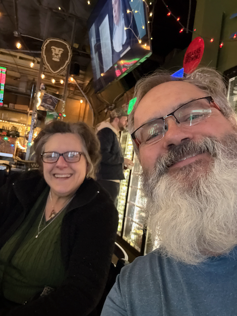

Merry Christmas!  

I hope everything is coming together and you find this time of year relaxing and can enjoy the season!

Things are going well here. It was a slow week. Things are slow at work (or they seem to be to me, but that could be because I'm cut out of most things now, and I have left a bunch of Slack channels). I have a few things that I want to wrap up before my last day of work on January 10th, but nothing that I won't be able to do the first week of 2025.

I used my Birthday money to pick up a new 3d printer, which arrived while we were gone last weekend, so I set that up this week. Things have come a long way since I got my first 3d printer in 2018.  This printer is much faster, and the ergonomics and workflow are much nicer than my old Ender 3.     So far, I've printed up a game organizer for Katarina and a few things to help better organize my desk.   Thank you, Mom.   In addition, I picked up the new sails for Corvo this week.  This will be our tune-up sails for the North Americans.  We will use these sails for the regattas where we want to have our top performance.     For the regatta itself, we will get at least a new Jib.  We will evaluate the condition of these sails as we get closer to the regatta. We are in the best position to maximize our sail options in Sept of 2026.

On Wednesday night, I wore the manor's Santa costume and stood in front of the neighbor's house, waving and taking pictures with all sorts of people. It was pretty fun. We do This tradition every year: Different folks dress up as Santa and hand out Candy Canes to the kids who come through and take pictures.

Things are moving along at Katarina's house.  The kitchen cabinets have been installed, and the painting is close to being done.   It's starting to feel real!

Tomorrow, I am heading to Kyle's to finish installing the new van suspension. The house battery is still kaput, and I am waiting for the warranty repair to come through.  

Merry Christmas!
Love you
Dan W

Unboxing the new printer.

the first benchmark print - man this thing is fast!

I've been printing all sorts of little things to help organize my desk.

Our new sails for Corvo

Remy, Luke and Freya came over for Soup night on Tuesday

This is the best pic I have of me being santa this year.  Handing the suit off to the next santa :(. you would think that, that of all people, I would have gotten at least one picture of myself in the suit... :) 

Friday night Catherine and I walked over to Chucks to grab a beer, and low and behold, they were having a barrel aged festival, so I got some suggestions from Kyle on what I should drink.

This is Andrea - we met her, her husband Charles, and their boston terriers at Chucks, and had just a delightful conversation with them about beer and road trips (they are from LA)

On Saturday Scott and I went to the Pike street Market to do a little Christmas shopping.

Rainbow on Phinney ridge on the way home from the Market.

Kitchen Cabinets!

Doors!

Paint!

More Paint!

Lights in our neighborhood.