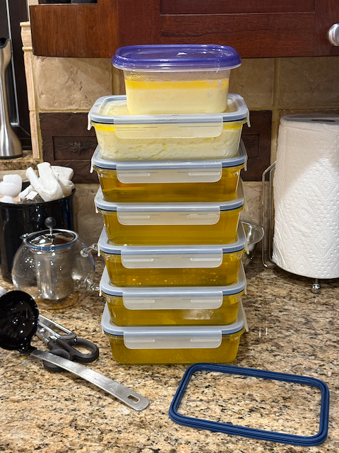

Good Morning.

The following is a Note from Catherine, providing an update on the health of her Dad.


```
  
Dan asked me to write an update on my dad for you all. 

  

It’s been a whirlwind of a week. Last Sunday, Katarina and I went to my dad’s apartment to load up things for his upcoming move from Bayview to Landmark. When we arrived, we found him stuck on the floor in his bedroom. Katarina helped me get him up and seated on the edge of the bed. He said he was fine—just a little sore and embarrassed—we let him rest for a bit while we loaded up her car and I sent her on the way to work on her house.

After getting him some food and observing him for a while, I decided to take him to the ER. His elbow hurt, he had tremors (which he normally doesn’t have), and something just felt "off." While nothing obviously matched the BEFAST stroke protocol, it felt beyond my ability to assess.

At the Ballard ER, they ran some stroke evaluations and, initially, they thought I was overreacting. They did a CT and MRI to confirm there were no signs of a stroke and then scanned his elbow, which turned out to be broken. We also had a consult with a neurologist who, frankly, wasn’t the most compassionate, dismissively declared there were “no neuro issues,” and started discharge paperwork.

Then, during the discharge process—just 37 minutes later—Dad suddenly lost control of his entire right side: his speech, facial movements, arm, and leg. It was like watching a wave crash over him. Within moments, a team of fast-moving medical professionals surrounded him, shifting into stroke and anti-seizure protocols. Any plans for discharge were thrown out the window. This happened on the night of December 29th.

We spent 30 hours in the ER before they moved him to a general ward at Ballard. Because TIAs aren’t considered critical to the neuro team (and there were no available neuro beds), that’s where we stayed.

Dad made some progress in the general ward—he ate well using his left hand and walked well on Wednesday. By Thursday, though, progress seemed to stall. They switched him from a cane to a walker, and on Friday morning at 9:30 AM, his nurse found him with his right side unresponsive again. An MRI confirmed two occlusion strokes. They called me after the MRI and moved him back to the Ballard ER, where I met him. We waited there until a transfer to Cherry Hill could be arranged. During this time, Dad was in and out of it—unable to walk, with speech, strength, and vision fluctuating wildly.

Late Friday night, they finally transferred him to Cherry Hill. I arrived there on Saturday morning after some much-needed sleep.

Dad’s current situation is complex. He’s dealing with the effects of two left frontal lobe strokes on top of this week’s TIAs and his hemorrhagic stroke from 2018. His symptoms are a mix of expected and unexpected: physical weakness, speech difficulties, vision issues, and more. Despite all this, there have been bright moments. For example, today, even after a failed swallow test, we watched _Iolanthe_ on my laptop. He remembered many of the lyrics and melodies, which was heartwarming.

He’s also kept his sense of humor. When asked by the hospitalist why he was in the hospital, he quipped that he’d been “swept up in a homeless encampment.” Later, when the neurologist introduced herself and mentioned that her brother is a civil engineer, Dad told her his favorite (and maybe only) joke: “There’s no such thing as a civil engineer.” When she asked why, he replied, “Because they’re all a little rude.” She laughed for the rest of the visit.

We know this is the beginning of a long road, but we’re holding onto the moments of clarity, humor, and hope along the way.
```

Catherine is holding up well; she has a good support network, as well as Katarina, Alex, and me.   We will keep you all updated on Will's condition, and we appreciate your thoughts and prayers.

Below are the pictures that I had gathered for last week's post, which is now this week's post.   I'll go ahead and give them some captions to let you know what else has been going on.


The monday before Christmas, I went down to Kyl's and we installed the new rear suspension on the van.


Christmas Eve we hosted Scott, Martha, Alex, Amber (ben's Wife), Alex's work buddy Ben, and Connor for Ham dinner.   Katarina was down with her Family in Vancouver.


Connor was looking sharp in his Christmas Blazer.


For Christmas dinner, we invited Mark, Kat, Tom, Helen, Alex, Will, Martha, Connor and Scott over for a prime rib dinner.


Catherine, Athena, Kat and Blanca


This picture of Shilshole was taken on my morning walk (I've started a new habit of going for a walk when I get up in the mornings before I do anything else)



Clarified Butter for the Baklava baking event on New Years Days.


Katarina and Alex heading our for new years eve


Lunch for Baklava day.


Here is some of the folks that were at the house on Wednesday to make Baklava.  12 batches of Bakalava were baked on Wednesday!


Assemling Bakalava


Playing cartographer late in the day.


Katarina's uncle Bob (on the right), and his father in Law Ralph, showed up to make some baklava as well.


As well as Katarina's cousin's Oscar and Sophie hanging out at the end of the day.


Some of the final product.