Good evening!  I hope that everyone is doing well.   

Thank you, everyone who reads this, for your love and support as Will navigates his recovery journey. Will is stable and has been moved to the Rehab unit at Cherry Hill. He continues to improve, just not as quickly as we would like. Catherine is exploring long-term options for his continued rehabilitation, and we should have more clarity by the end of this week. It's tough to see Will go through this, but he is blessed to have Catherine.  She is strong, capable, and giving.   I love her.  

In other news, Friday was my last day of working for a paycheck, as I [officially retired from Expedia](https://www.linkedin.com/feed/update/urn:li:activity:7283548170872147969/) after 36 years of working.    It's been a great run, and I have had a wonderful time at all my jobs over the years (Seafirst \ Bank of America, Starwave \ Disney, Expedia, Tableau, Expedia, Amazon, Expedia).  

My team did an excellent job seeing me out in style.  Thursday was the last team meeting I attended, where I was toasted, roasted, and presented with a thoughtful gift of an engraved compass.   (pics below).  Thursday afternoon, we celebrated at Queen Anne Beer Hall, where _lots_ of people showed up to wish me well. And see me off.    There is a pool amongst many at Expedia if I return, but I have practiced this a couple of times and figured it out.  This time, it is going to stick :). 

Friday morning, I continued my new habit of walking every morning.  When I got back from my walk I wrapped things up by sending farewell messages to my coworkers, updating my LinkedIn profile, publishing this [collection of photos](https://photos.app.goo.gl/ZxBsvmxWXfy5j2e88) of my years at Expedia, and just responding to all of the well wishes from everyone.   

My friend Ana came over and took me to lunch, and Sundeep took me to dinner. 

It was surreal to log out of email and Slack for the last time, knowing I wouldn't be logging back in again. At Expedia, I have created many excellent relationships. You can see some of my impact on folks by peeking at [this card](https://ellacard.com/open/3d2c0482-4095-4c35-a874-4def2036e78a) that everyone signed for me.   

So, while I am closing one massive chapter of my life, I have planned how to fill the gaps in retirement. I plan to focus on five "projects." Although this seems daunting, it provides a framework for the next three years while Catherine works for Snohomish County.

1. My health, fitness, and weight
2. Catherine - don't drive Catherine crazy by getting in her way while she is still working.
3. J105 North American Championships in the fall of 2026 - Tom has graciously offered us the use of Corvo 105, and I have assembled a crew of six with me, Butch, Steve, Kat, Stefan and Alex.
4. Work on the house \ yard and there are some projects on my car I want to do
5. Prepare for our road trip in 2027. We will travel across North America, aiming for an average temperature of 70 degrees.

In the meantime, it's time to go snowboarding! So, on Saturday morning, I loaded up the Van with Alex's ski gear (he was out coaching a pair of women heading to a rowing camp) and headed up to the pass to spend the weekend snowboarding.  Alex, Justine, and Natalie (Alex's coworker) came up in the afternoon, and we got some runs in.  Today (Sunday), we got a _lot_ of runs in, as the snow was good (especially since it's been a while since we have had any fresh snow).  Today, we skied for almost six hours and hit west, central, and east.   

After chilling at the Condo, Alex, Justine, and Natalie headed down the mountain. And I am staying up here and will get a few turns in first thing before heading down the hill for lunch with a friend.

But before I can properly start enjoying my retirement, I have been called for my civic duty, and on Tuesday - I start Jury Duty :) 

Love ya all!
Dan W

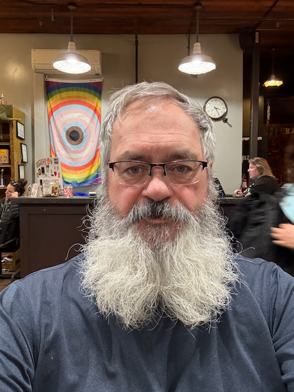

Tuesday was haircut day - Before

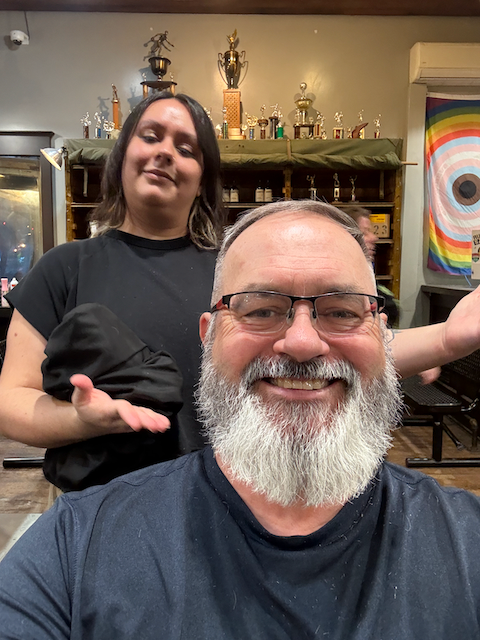

After :)

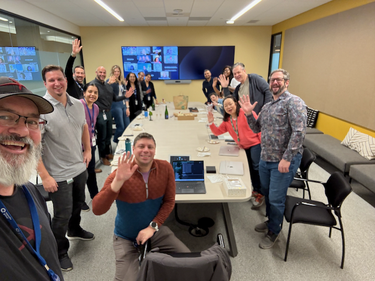

Some of the folks on the Strategic Initiatives team at my last team meeting.

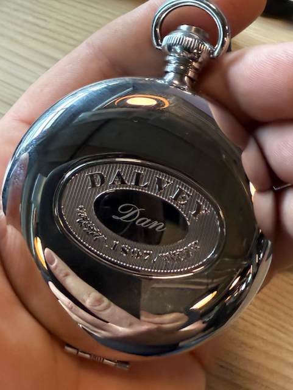

The compass that I was gifted.

.png)

"With Gratitude, Your Expedia Group Family"

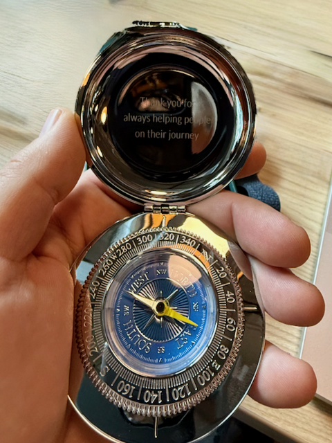

"Thank you for always helping people on their journey."

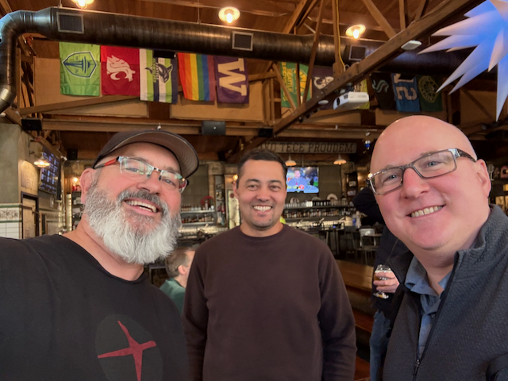

Me, Aaron, and Karl

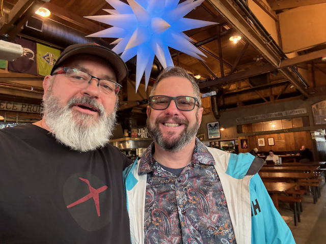

Me and Joe - my last boss.  He has been an awesome boss.

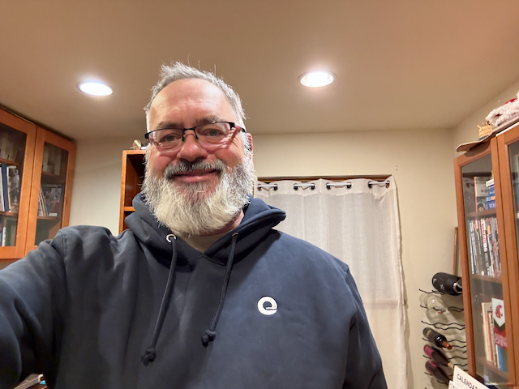

They also gave me this cozy sweatshirt.

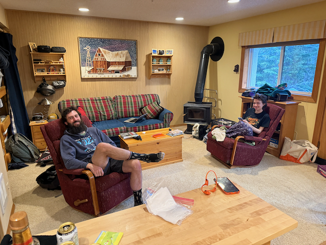

Alex and Justine chilling at the Condo

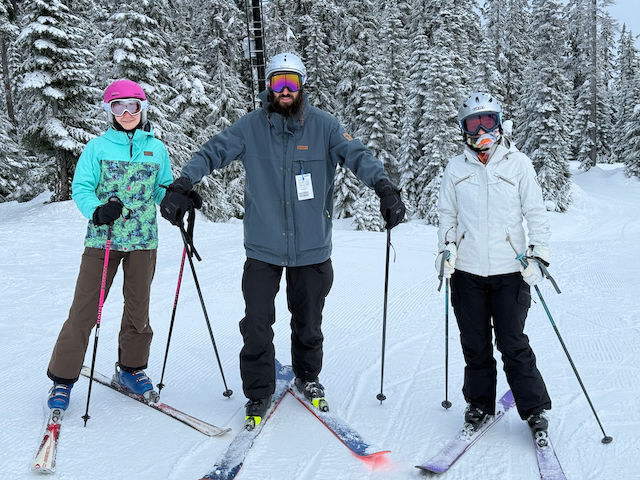

Justine, Alex and Natalie ready for a run.

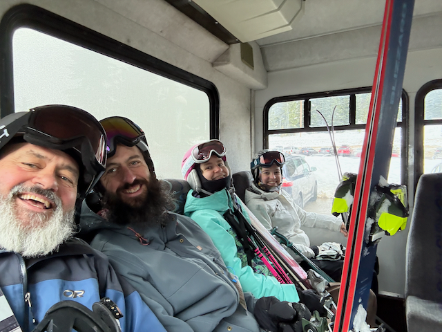

The four of us on the shuttle from summit west, to summit east.

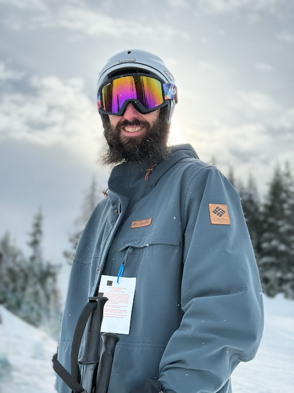

Alex

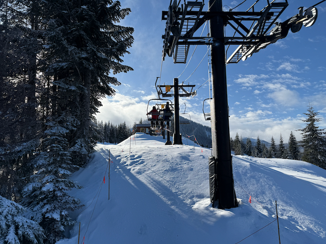

The skiing was awesome today!