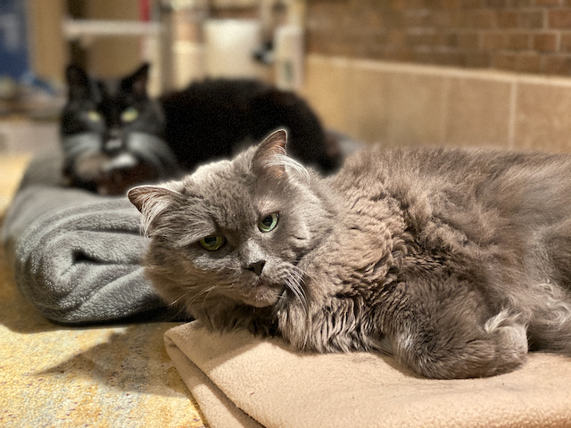
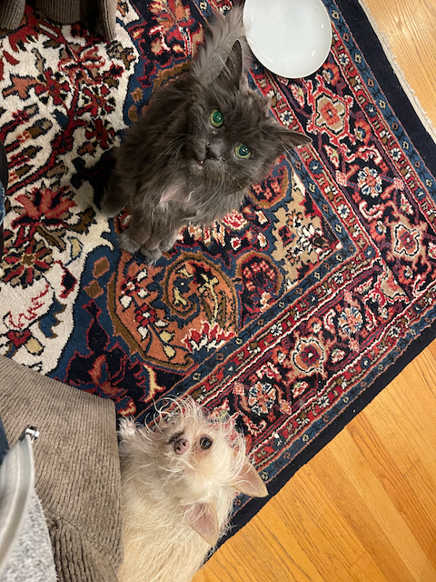
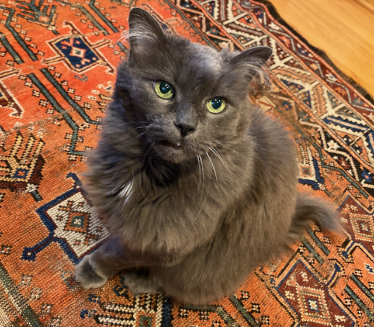
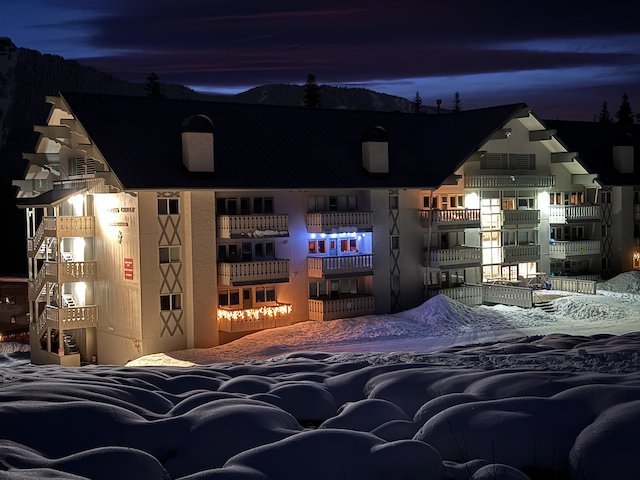
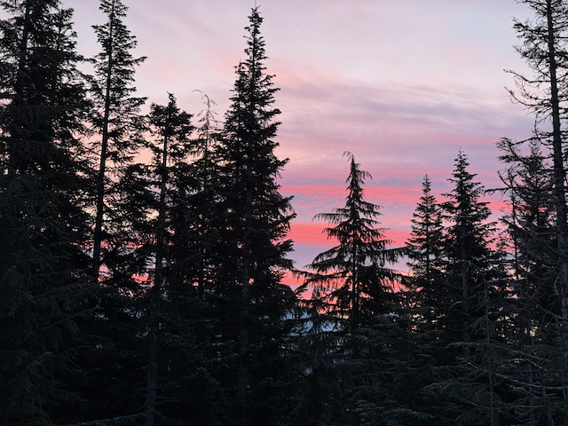
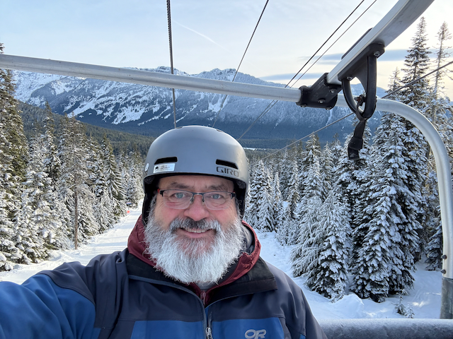
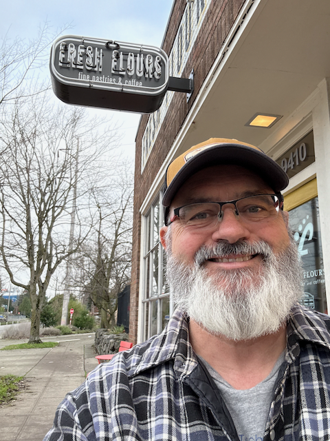
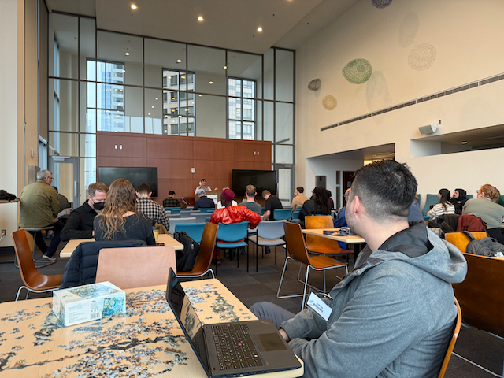
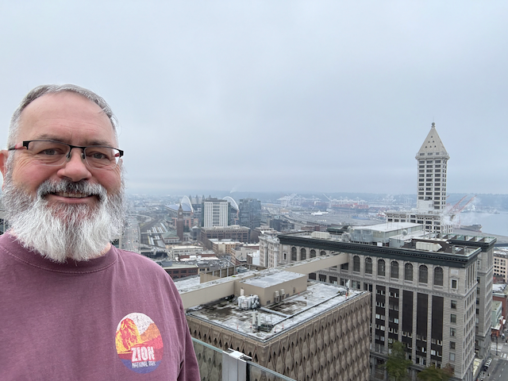
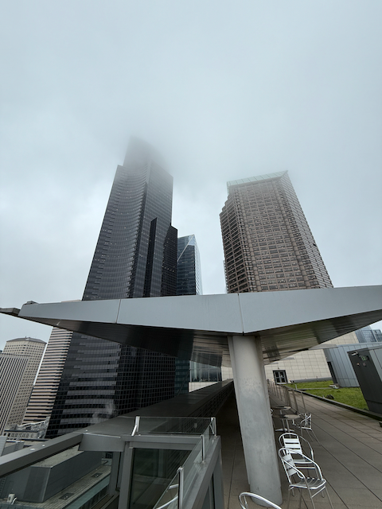

Hey All,

I hope that this week has treated you well! :) It brought challenges and changes, including updates on Will's recovery, saying goodbye to Grayman, and my first week of retirement.

## Will's Update:

First a quick update on Will.   Friday wasn't one of his best days; he's been quite tired and has trouble focusing. They're running some tests to make sure it's just part of his stroke recovery. He's a bit confused, but his sense of humor is still solid—if you ask him about being a civil engineer, he will make you laugh! 

Physically, he's having trouble with coordination and can't stand or walk independently. Talking about memories from Ballard Health Club or his dogs, Rowdy and Rex, seems to engage him. 

His laptop is there to watch videos if he seems interested, and Catherine is available for tech support if needed. He usually eats at noon and 5 PM, with medical activities around those times. There's still a lot of room for progress, and the team is hopeful.

## Farewell to Grayman:

Grayman, the cat, left us on Friday. He had been in rapidly declining health these past couple of weeks. While he didn't seem to be suffering, he was definitely shutting down and losing control of his bodily functions. The vet came to our house, and we could all be with him as he passed.   

Grayman is technically Pat Linton's (Kat's Dad) cat.  But when Pat moved to Montana, there was no way Grayman would make the trip (He HATES car rides), so he came to us.  One of his first tricks was wiggling out of his harness during Christmas and going missing for five days.   He was _hungry_ when he finally managed to find his way home and never strayed too far after that.   He was also _quite_ fond of sleeping on my pillow and grooming my eyebrows and beard.   He had a good life and will live on in our hearts.

## Retirement adventures:

My first week of retirement started with Snowboarding on Sunday. No new snow had fallen recently, so it was pretty icy and hard. This was OK, as I had a coffee scheduled with a friend in West Seattle, so I needed to bomb out of the pass early anyway.  

## Jury Duty:

I did my civil duty and went to jury duty on Tuesday and Wednesday at the Seattle municipal court.   I never got called up, so they let me go in the afternoon on Wednesday. I then headed up to the hospital and spent some time hanging out with Will, which was good for both of us.

## Moving day:

While jury duty wrapped up midweek, the week's activities weren't over. Thursday was the big move-out day from Bayview. Catherine arranged for a moving company to come and get the last of the stuff out of his apartment there. The furniture that we weren't keeping went to Habitat for Humanity, and the "things" that he won't be keeping went to [Bella's Voice](https://bellasvoice.org/). The rest of the stuff came to our house to hang out in the garage until we determine whether Will will be able to move into Landmark.

## Weekend at the pass:

Saturday I headed up to the pass in the afternoon and got there just in time for the owners meeting up there.  Since there hasn't been any snow this past week, the conditions were pretty crappy, so I didn't go out last night, and today I only put in two runs before I decided to call it quits before i hurt myself.

Here is a quick video of what the skiing was like (good) last weekend 
[Last Weekend's Good Snow Conditions at the Pass - YouTube](https://www.youtube.com/watch?v=a9aKHcPu8BA)

## Coming up next week

This coming week, I will meet friends for breakfast at several different locations, meet with my book club, and attend a show at the Triple Door.

I love you all, and I'm looking forward to hearing about your plans for February!

Dan W

Those pillows of snow in front of the condo only _look_ soft :) 

Sunrise on my first day of retirement.

Heading up for a couple of runs

Meeting a friend for coffee in West Seattle

The jury assembly room for the City of Seattle Municipal court

At least we had a great terrace with a nice view.

It was foggy!

