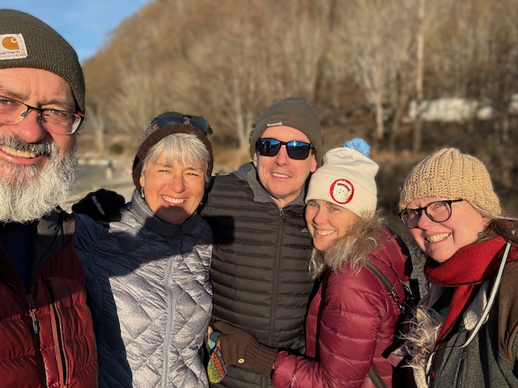
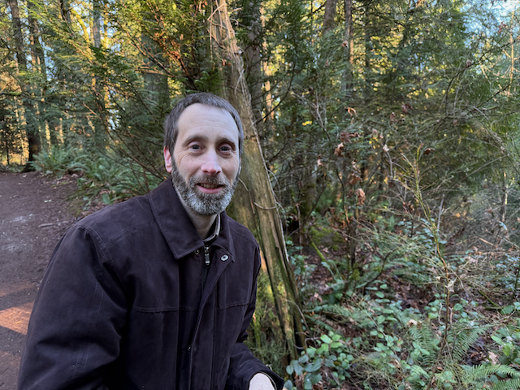
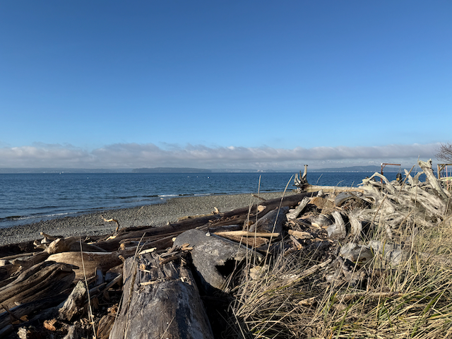
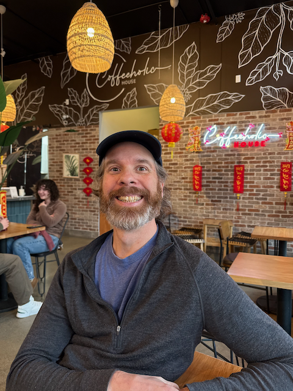
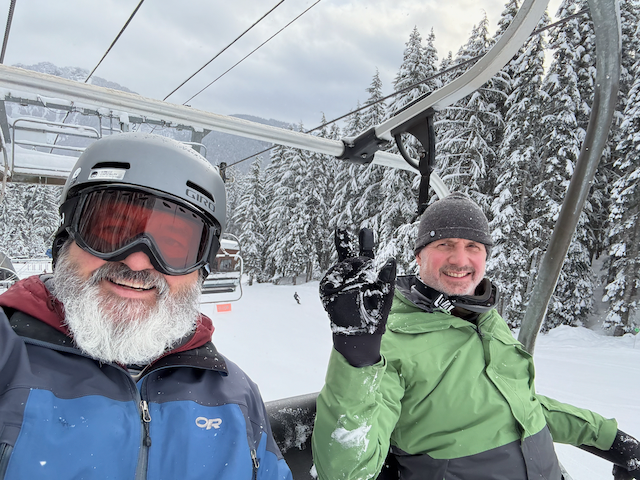
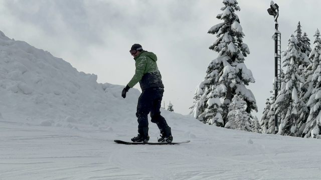
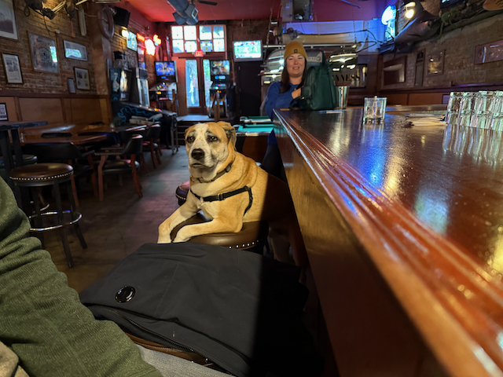
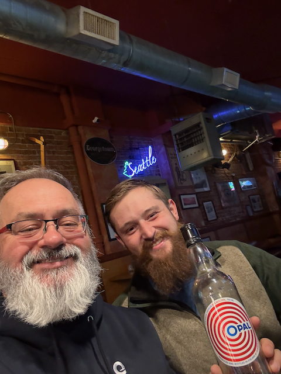
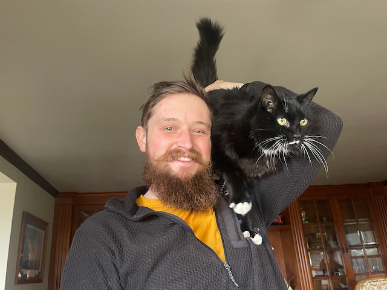

Hello, Family and friends from snowy Seattle!

I hope this week finds you happy and healthy! I'm sorry for sending this missive late, but I prioritized hanging out with Jack and went snowboarding this weekend since we had fresh snow.

I drove Sue to Redmond on Monday to drop her off with Amy.  Sue is in town for Amy's mom's memorial service and was getting a ride to Ellensburg with her.  I had a pleasant visit with Amy, and she is doing well.    Jack came into town on Thursday for the service, and Alex gave him a ride to and from Ellensburg on Saturday.

After I dropped Sue off with Amy, I grabbed lunch with my buddy Brian O'Neil.  After lunch, we finished booking our flights and accommodations in Washington DC.  We are flying out this Saturday morning and returning the following Friday.   We are going there to visit museums, the Library of Congress, national archives, the National Portrait Gallery, and whatever else comes across our path :)    One of the projects for the rest of this week is to figure out a couple of places that we would like to make sure that we eat at and if there are any performances that we would like to attend.  I'm looking forward to this trip. It will be my first time traveling to Washington DC and the first time that Brian and I have traveled together, so it will be a couple of firsts. 

If you have any suggestions for things to see while I'm in DC, let me know :)   I will post a couple of trip reports to my website, and you can find them [here](../trip-reports/2025-02-Washington-DC/index.md) when I do.

And while I am gone, I am sure that it is going to snow here :) 

On Tuesday, I went to West Seattle for a walk with Tory.   After the walk, I went and got some lunch and then hung out with TJ for most of the afternoon before heading home for soup night (Emi made Mochi soup, which was fantastic)

The weather was fantastic on Wednesday, so I went for a bike ride and checked on the boats.

On Thursday, the weather was cold and cloudy, which is what we expect in the Northwest in February.   :)

With Catherine's assistance, Will moved into the Blue Ridge family home on Thursday and is now on day 5.  He is doing okay, but some adjustments are taking place.  Catherine is with Will every day, usually in the evenings.

Will has many rehab and MD appointments in the next several weeks, hopefully bringing some direction to the next several months.

It's been challenging and heartwarming to see Will adjusting to his new home. Catherine has been amazing with her daily support.

While Will was moving, I met Jason and Afton, some old Tableau friends, on Thursday afternoon. It was great to catch up with them.

Thursday night, Jack came into town, and we hung out and played some games.  

I headed to the condo Friday night as the first fresh snow in three weeks started to fall. The conditions were much better on Saturday, but by Sunday, they were just fantastic! Curt came up Sunday, and we rode together all day—it was good to ride with him and hang out.

Monday, Jack and I spent the day walking into Ballard to grab lunch and then just hanging out until Matthew and Dana came to pick him up for dinner.

Tuesday Jack and I went shopping, and are made beef stew for soup night (stew is soup adjacent after all ;) ).  This morning, I am taking Jack and Alex to breakfast, and then dropping jack of at train station for his return to Flagstaff.

Love ya all!

Dan W

On Sunday before last, Matthew and Dana came over, and we visited with them on their boat (which is beautiful!) and then went for a wonderful walk through golden gardens.

My friend Brian on our six mile post lunch walk.

Tuesday was a beautiful day to visit Tory over in West Seattle and go for a nice walk.

This is what it looks like when I turn 180 degrees from where I took the picture above.  Tory has a nice location :) 

Afton at Coffee Holic - we used to work together at Tableau.

A trophy that I printed for a local soccer team.

Me and Curt heading up the hill for the first run of the day!

Curt managed to find his groove pretty quickly.

Jack and I hanging out with Ripley at the Lock and Keel tavern.

So....  the bartender got us to try this Icelandic drink.   And even though this stuff tastes like cough syrup, it was better then the Malort (and I can't believe it but they go through a bottle of Malort a week!)

Jack and Belle Hanging out