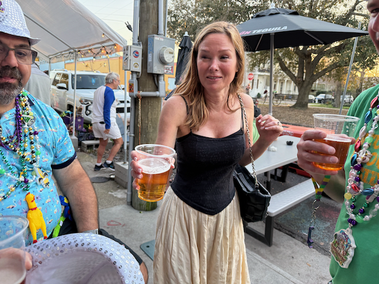

Hello!  

I hope all is well and Calm for everyone.   

Catgherine's Dad - had a solid walk yeseterdat. Alex helped her take him to Kracken Ice Plex. Getting into/out of the car was better. They walked 3 laps inside, and some outside too. Today - we start interval training because Coach Alex is a big believer in intervals :-)

I spent a couple of days this past week feeling a bit under the weather, but I was able to boince back in time to feel great for a couple of day trip to New Orleans for Mardi Gras.  I traveled down with Katarina, and we are having a great time so far.  I am hanging out with Bob and Kristi, and their posse that all went to Tulane together.

The rest of the story is in the captions in the pictures. 

First things I did when I got back from Washington DC was to go to an all day sailiing seminar - it was pretty good - the presenter is a very succesful and well known Sailor by the name of Mark Laura

This is my friend Doug - our sons were in Boy Scouts together.   I went over to his house on Monday to help him make bread.  He is part of communityloaves.org.  This organizations coordinates home bakers making bread for local food banks.  Doug has donated over 800 loaves of home made bread.

The finished loaves

Scott and I having lunch after going to the home show - 

I went for a nice walk, and came across this cool gage.

Friday night I hung out with my buddy Alan, and we went to the Latona pub to watch these guys play some Jazz.

The guy on the double bass has been playing this happy hour gig every Friday night for the last 25 years.

We had some spectacular days for walks!

We Barely made our connection in Salt Lake city - doesn't matter that you were the last ones on the plane, as much as it matters that you were on the plane.

This is an original Banksy piece of art from the time of huricane Katrina - this i protected with a piece of acrylic.

Me and Mike Volner at one of the parades on Friday night.

Kristi was having a good time Friday night - we saw two parades go buy.

One of the Parades Friday night.

The neighborhood that I am staying in is very quite - across the street is a pretty big cemetary :) 

Saturday morning - heading out to watch a couple of parades.

Me and Shane heading towards the parade route.

Kristi Blade

Bob Blade

Shane

This is the Dolly Float in the Tux Parade

Dance groups - these groups are hired by the krewe's that are putting on the parade to fill in the spaces between the different floats.

More marching Bands

It's been too long since I've seen my friend Kelly!

Kristi had quite the collection of stuff that she gathered from the floats.

So there is a big story with this - apparently there was a dog that was on the loose in New Orleans for over a year named Scrim, and he became quite the local celebrity - And there were some earings that were made in honor of that - Kelly wanted to make sure that she got some of those, so she made this sign.

Me and Bob with our Sun glasses.   The tux parade is well known for being a toilet themed parade, and for their throws being somewhat useful (they were actuallhy pretty good sunglasses)

Leland was in town.

Me and Kelly

Taking a break on the way back to Pierre's place.

Kelly and Bob - as we stopped for some refreshment.

Tom and Holly.

Me, Kristi, Jenn and Holly - having one last refreshment before we hit the sack.

Tomorrow is another day of parades and hanging out!

love ya all
Dan W