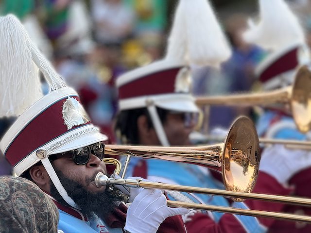
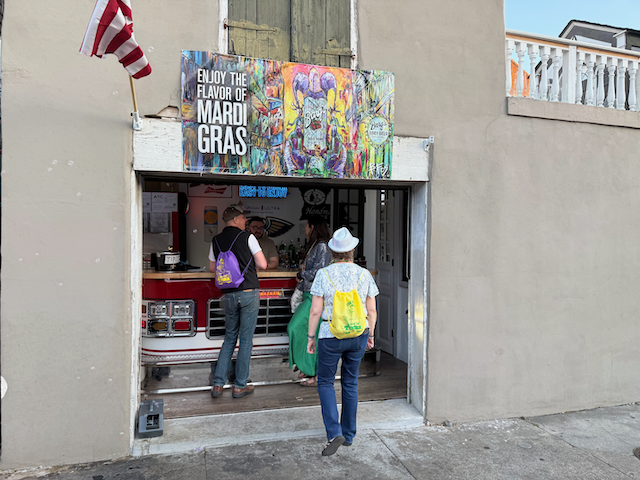

Happy Monday!

I hope that everyone is well! This past week, I wrapped up my New Orleans experience for Mardi Gras. I had a wonderful time down there. I was able to hang out with old friends and make some new friends at the same time. The flight home was uneventful, and it was good to sleep in my bed.

Catherine continues to spend time with her Dad and has been able to take him to the Kraken ice complex for walks and to watch Hockey games. He is often confused still, so Catherine continues to advocate for him in the system and get him the support he needs.

On Saturday night, Catherine and I headed to Phinney Books for our friend [Boyd Morrison](https://boydmorrison.com)'s book signing for his latest book. We had dinner afterwards at the pub next door.

Sunday morning, I got up bright and early and drove down to the Portland Yacht Club for the first of many pre-race meetings as we prepare to Do the [Oregon Offshore race](https://www.cycportland.org/pnwo-home). This race is in May and will be 191 miles long from Illwaco to Victoria, BC. After the kickoff meeting with the five of us who will be on the boat during the race, we went out for the weekly race on the Columbia River and did quite well.   

After the race, I sat around and BS'd with Dan Tedrow, the boat's owner, before heading toward the coast.  I plan to go clamming in Long Beach today, as the low tide is a little after 5 pm today - which will be nice since it will still be light out ;)   

Love ya!

Dan W

Me and Jenn are enjoying a parade.  

Marching bands GALORE!

Made some new friends through Kelly.

I had the chance to see the [band preservation hall](https://www.preservationhall.com/) at Tipitinas with Kelly.  [Charlie Gabriel](https://en.wikipedia.org/wiki/Charlie_Gabriel)   is their music director and Sax player, and is 92 years old!

Me, Kristie, Bob and Jenn.

This was a cool little bar on a side street.  Open up the garage door and there is the front of a fire truck behind it as the bar ;) 

The nighttime parades have some stunningly lit floats

Me, Lisa and Jenn at just before 5am in the morning on Tuesday morning to catch [North Side Skull and Bone Gang: “You Next!” ](https://hnoc.org/publishing/first-draft/north-side-skull-and-bone-gangs-mardi-gras-morning-reminder-you-next) Parade

That's a lot of people that got up to see a 5am parade.

Kelly brought a bunch of hand made masks for us to wear.

On Tuesday we wondered the corner dressed as peanuts in rememberance of Jimmy Carter.  There were a _lot_ of people that stopped us and expressed there appreciation for Jimmy.

This is the Disco Amigo's after party.

The weather was predicted to turn, so we headed back in the middle afternoon to Heather and Pierre's house for some dinner.

And Yes, it did start raining something fierce.

Vince had some wonderful wines for us to try.

Here is our going away lunch before we headed for our flights.

at the 74th street ale house after the book signing.

This is Dan Tedrow, owner of the [Cal 34](https://sailboatdata.com/sailboat/cal-34/) Resolute that we will be sailing the oregon offshore in. 

Dan, Doug, and Max.

And a shot of the boat itself.