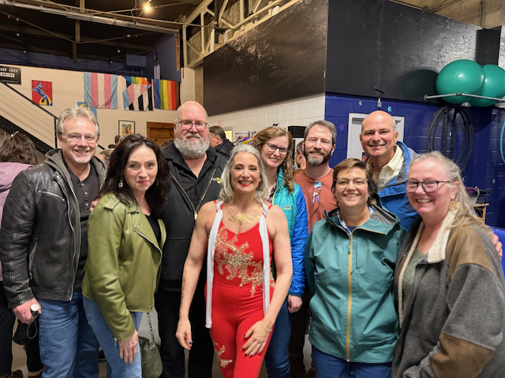

Good Morning!  and Happy Monday!

I hope that this note finds everyone comfortable and at Peace.  I know that these are testing times for many of us for many different reasons, and I truly hope that we can all find a solace of peace in a corner of our lives.

After sailing last week in Portland, I extended my trip by a day, and headed towards the coast of Oregon, and then heading to Long Beach washington to do some clamming.   I had a wonderful evening on the coast.  In the morning, I stopped at Canon Beach, and went for a wonderful walk on the beach for a couple of miles before heading back to the Van, stopping at the grocery store along the way, to get some supplies so I wouldn't have to be eating out all of the time.  

From there I headed up towards Long Beach, having a wonderful little drive.  I arrived at the beach well before it was time to go clamming, so I took that opportunity to take a nap, before heading out for the clamming.  CLamming this time of year is special, since it is not dark, so you can see what is going on.  Also, it wasn't raining, which helped.   It was a succesful outing, with me harvesting 9 large clams, and only breaking the shell on one of them.  From there, I packed up, and headed towards home.   I made a ways before pulling over and taking a nap...  It's nice carrying a bed ready to crawl into with me.   I slept until about three in the morning, before continuing my journey home.

Tuesday was the OMCC Board meeting, and then Wednesday was the OMCC General meeting.   Thursday saw great snow, so I headed up to the condo to get some snowboarding in.  I started the day out at Alpental and rode in the morning with Yves.  We had a morning of untracked 9" of snow, that was just fabulous.  Yves left around noon for a class, and I took a nap.  In the evening, one of my former Expedia co-workers came up with his kids, and we skied in the evening with his kids.  It was good to catch up with them.

On Saturday I went down to Bonnie Lake to watch a first robotics competition, and then in the evening, Catherine and I saw our friend Randi perform her Arial Act at the annual Silver Fox's show not to far from our house.  She had a wonderful performance.  And afterwards a bunch of us went to the 74th street Alehouse to hangout and catchup.

Sunday morning, I got up bright and Early and came up to the condo to do some snowboarding, which was quite nice, and then I am up here this morning as well, and will go out for a couple of hours before heading down the hill.

Love you All
Dan W

The Oregon coast.

Waves crashing at Haystack Rock

A selfie at Haystack Rock

Driving onto what is claimed to be the worlds longest beach.

Me and the Van on the beach.

The first clam of the day.

That was my haul for the day.

The battery on my bike had been stolen before I left for Mardi Gras, so the new one showed up, and I got it installed on Monday.

Me and Remy at Stoup Brewing for the community happy hour.

My Neighbors at Stoup Brewing.

Yves and Me at the top of Alpental

Aaron and his kids.

Aaron and I decided to take the Disco light to get back to the lodge where his kids were.

This is the first Robotics competition.  This is a nation wide series of competitions where high school kids build robots, create coalitions, and compete.  These are the first rounds.  The winners here go up the bracket towards the championships.  Aaron (the guy I was skiing with) has a kid on a team here, and he helps them.

The crew that went and Saw Randi perform on Saturday night

Fresh snow on a Sunday means silly lines.  I was out for two hours, and managed to get five runs in (two of those runs were the cross over trails)

More Silly lines.  We will see what today is like.