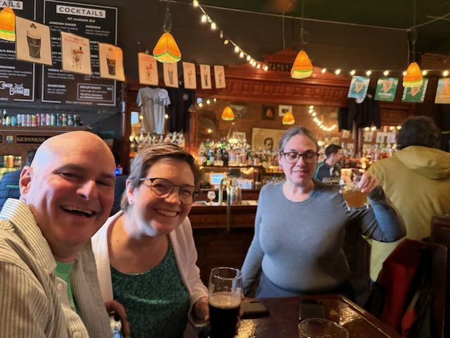
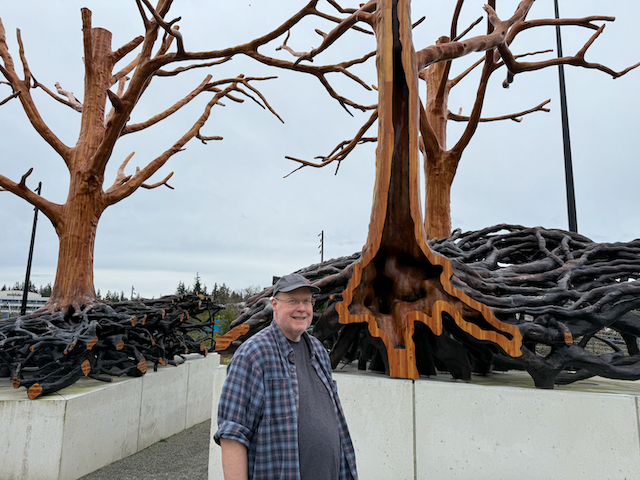
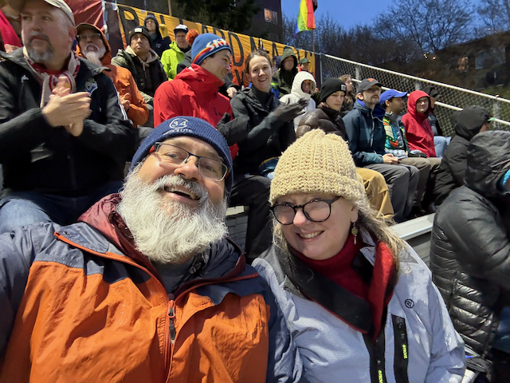
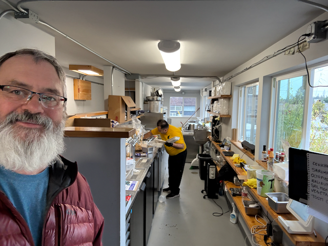
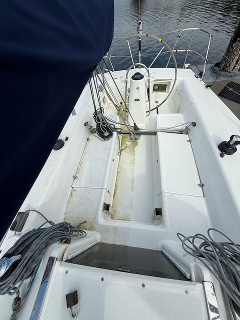
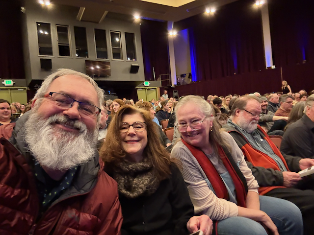
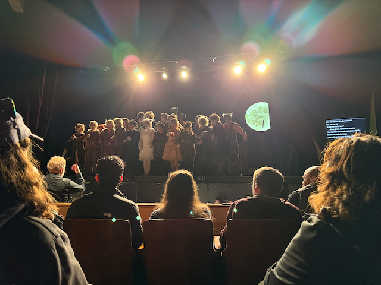
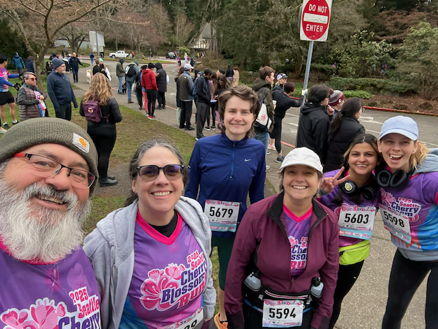
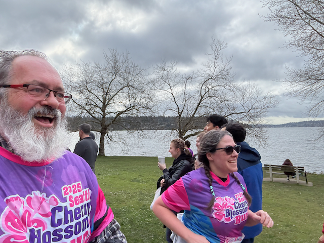
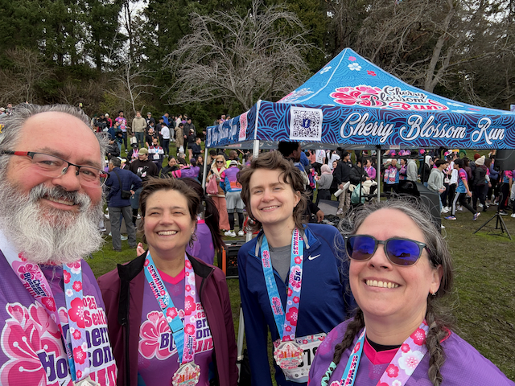

Hello, and Happy Sunday!

I hope this letter finds you well, and in good spirits.  Things are going well here.  I am glad that the first day of spring has finally arrived :)   But of course, here in Seattle, that just means that the weather has gotten committed to being gloomy :)   

This was a nice quite week mostly spent near the house.  I went out for St Paddy's day on Monday with some folks, and then I had the chance to get and visit with my High School friend Steve Gott.  Now that I am retired, I am finding that I am reconnecting with quite a few folks, and he is one of them.

On Wednesday, Catherine and I went to the Ballard Football cup game in the first round of the US soccer League Open Cup Tournament.  They lost in a heartbreaker with Spokane scoring in the closing sends of overtime.  And Ballard looking like they tied it up in the closing seconds of stopage time for the game, only to have them called offsides.    You can see a full write up of the game here [Ballard FC Suffers Heartbreaking Open Cup Defeat to Spokane Velocity in Extra Time - Ballard FC](https://www.goballardfc.com/news/2025/03/20/ballard-fc-suffers-heartbreaking-open-cup-defeat-to-spokane-velocity-in-extra-time/)

Thursday afternoon, Scott and I got together for Happy Hour, and tried out a new Ceviche place called Shark Bite in the area.  They have only four seats, so we took our food to Chucks Hop shop, and it was very very good.  

Friday, I spent much of the day pressure-washing Corvo and preparing it for the upcoming season.  She is looking a LOT better now than she was before.   In the evening, we met up with Curt and Amy for dinner and to see the woodland park players' production of [Cats](https://www.woodlandparkplayers.org/currentshow) It was fun, but I wasn't really able to discern if there was a plot or not ;)

On Saturday I got up early, and headed over to Bob and Kristi's, with Justine, for a ride over to seward park, where we all ran in the Seattle Cherry Blossom 5k.   My goal in this run, was to, you know, actually run the whole thing.  And I was able to do that in a time of [48:15](https://runsignup.com/Race/Results/71768/IndividualResult/zsgN#U87587377) - which put me at 42 of 82 men between 50 and 59 that ran the race.  So not to shabby, for this being the first time I have run since the Beat The Blerch 10k back in Sept. :). 

Later that evening, Catherine and I headed back to Bob and Kristies to hang out with them, and our friends Carrie and Dustin. They were up from Oregon to checkout a sprinter van up in Edmonds, so we took our van over, and geeked out over vans, and watched Gonzaga loose in the March Madness Tourney.

This week coming up, I am heading to Portland for Lunch with Brian O'Neil, and we have the first race of the season on Saturday.

Love you all

Dan 

Bob, Kristie and Sara and [Connor Bryne bar in seattle](https://www.conorbyrnepub.com/) for St Paddy's Day.

Scott was there as well.

Steve Gott at some interesting art on the Microsoft Campus.

Cheering on the Ballard FC

The [new Ceviche shop shark Bite](https://www.myballard.com/2025/03/20/shark-bite-ceviches-now-open-in-ballard/) 

A before and after comparison of the results of the pressure washing of Corvo ;) 

Me, Amy and Catherine at the shoreline theatre for the production of Cats.

The full cast of Cats

Me, Sarah, Justin, Kristi, Swati, and Mary before the run.

Run Dan Run!

Me and Sara finished the race at the same time!  :)

Look at them medals!