Good Day!  
I hope that you are happy and comfortable today, and that you can appreciate and enjoy this spring day!

It’s been a while since I’ve written—three weeks, actually. Sorry for the delay!

Two weeks ago, Brian and I took a quick trip to Portland for lunch. I had seen a video about some of the best street food in the country, and Portland was on the list, so we decided to check it out.

The following week, I spent time in Spokane at Aunt Do and Uncle Tom’s while Debby and her family were in Pittsburgh for their grandson Dylan’s USA Hockey tournament. Dylan goes to high school in Minnesota to play hockey, and this was his third year in a row playing on the championship U18 team. Next year, he’ll play in the Tri-Cities in the Junior Hockey League. So while I was at Aunt Do and Uncle Tom’s, we watched all of the tournament games together.

The sailing season has started! The first event of the year for us was the Puget Sound One Design Regatta (POD), where we competed against 10 other J/105s. On the first day, we sailed with our old sails; on the second, with our brand-new sails. We actually did better with the old ones, so we called up the sailmaker to help us tune the new set last week—and that helped a ton.

This weekend, we’re racing in the Puget Sound Spring Regatta. Yesterday, there was only enough wind for a single race, and we finished 6th out of 12 boats. [You can watch that on YouTube](https://youtu.be/z-VHpb8f7AU?si=HfyC74fqlNuphosB), if you're interested. Today, we’ll head back out—hopefully there’s a bit more wind :)

This coming week, I’m hoping to get some yard work in and get *Airborne* all put together for the season. :)

**Love ya all,**  
**Dan W**

---

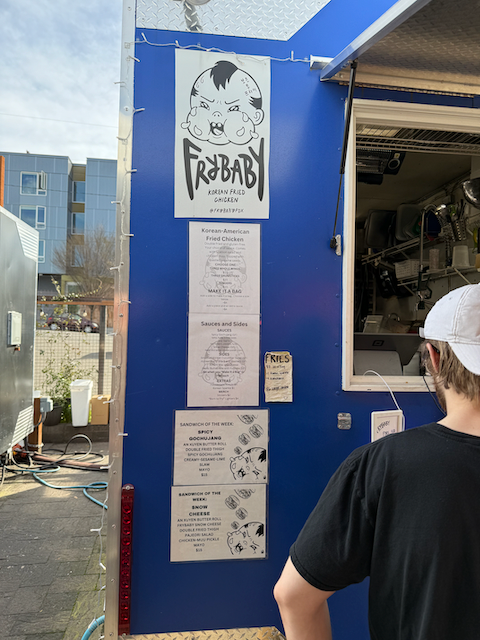  

Our first stop in Portland was Frybaby for some Korean-style fried chicken.

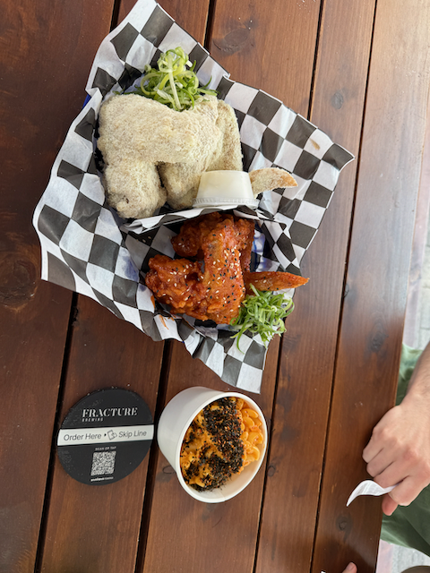  

The fried chicken (two styles) and their Kimchi Mac and Cheese — it was quite good.

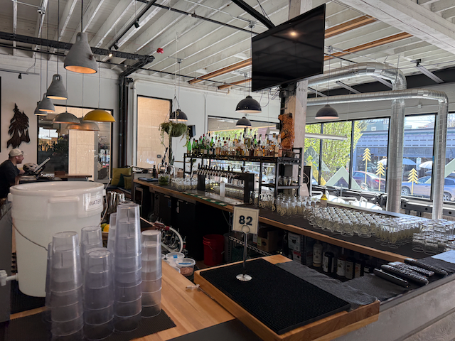  

Stopping for a beer at a nearby brewery that was really cool.

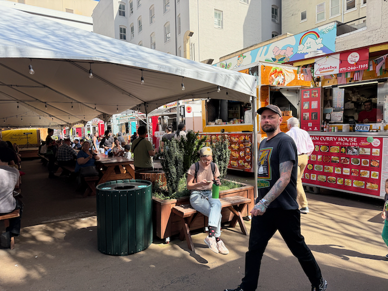  

Next stop was another pod for some Bing Mi.

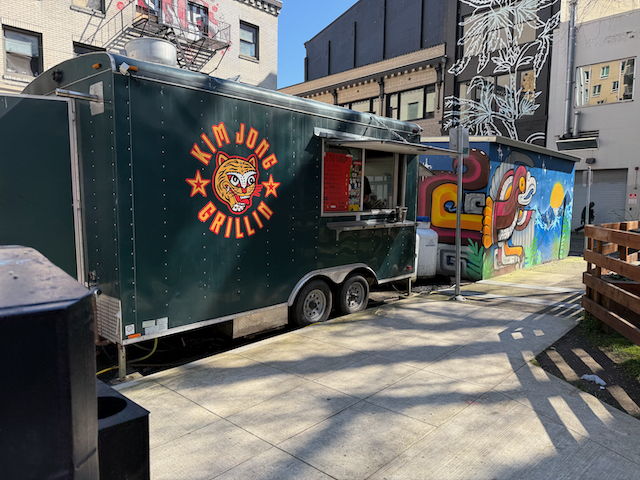  

And the final stop was for a Kim Jong Korean hot dog.

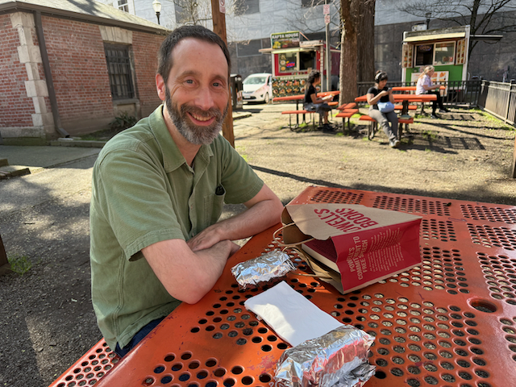  

Brian with his hot dog.

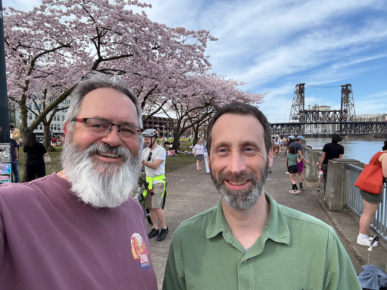  

Great walk along the riverfront.

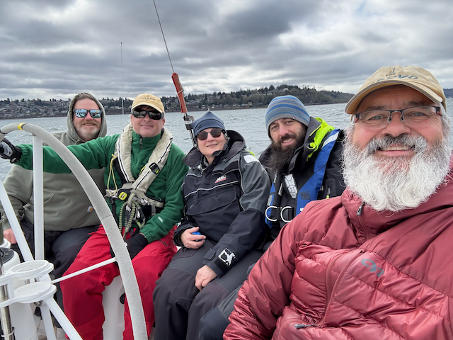  

The crew getting together for the POD Regatta — Butch, Stefan, Kat, Alex, and me (missing is Steve).

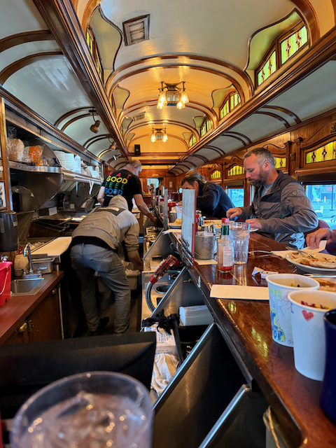  

As I drove into Spokane, I stopped for breakfast at a cool restaurant made out of an old passenger rail car.

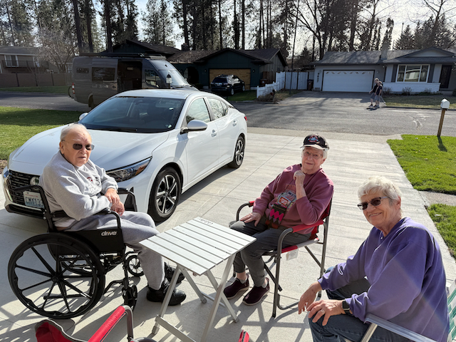  

Uncle Tom, Aunt Do, and Mom sitting in the driveway enjoying the sun.

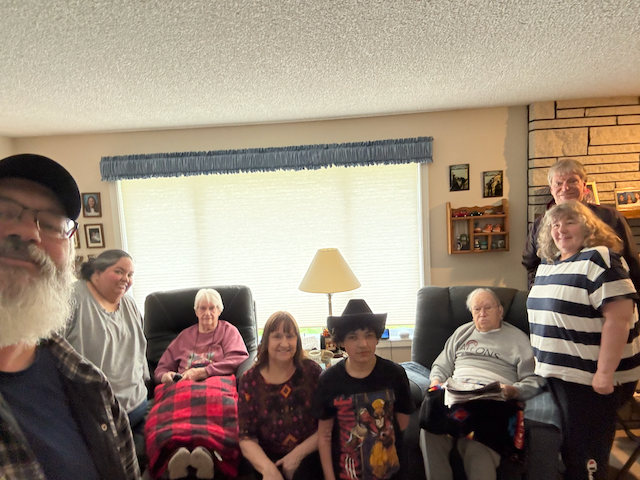  

Getting ready to head home — Me, Gina, Do, Sandy, Trevor, Tom, Deedee, and Doug.

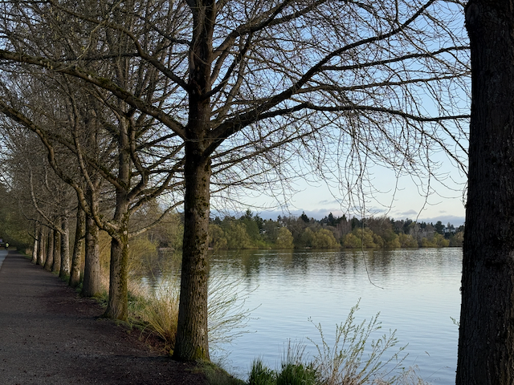  

I went for a beautiful walk around Greenlake.

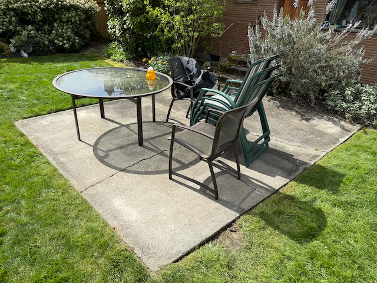  

While I was in Spokane, Groundworks came over and leveled our back patio (which used to be all heaved up and uneven).

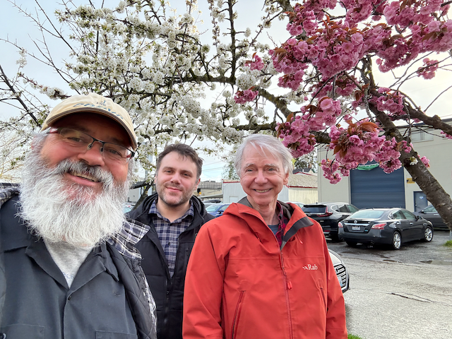  

Me, Andrew, and Scott out on a Thursday night.

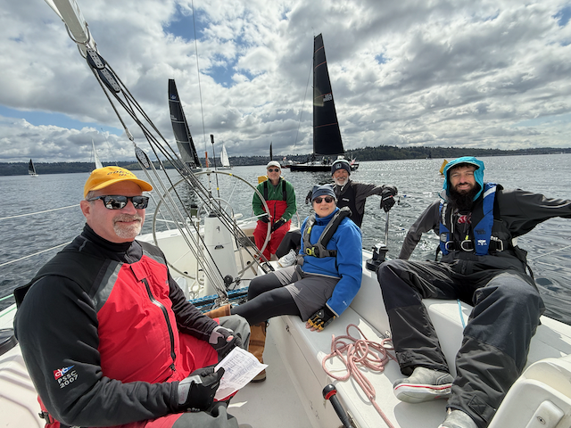  

Getting ready to start the first race of the PSSR.  
Left to right: Bill, Stefan, Kat, Mike, Alex.