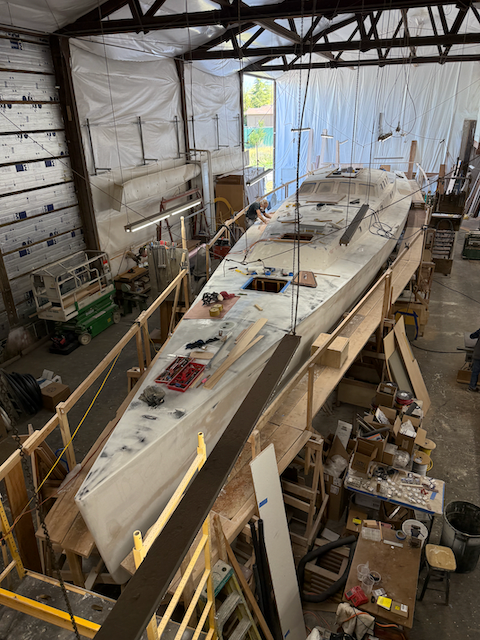
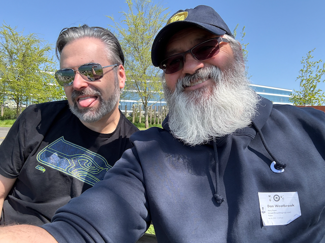

Good Morning!

I hope this finds everyone at peace. :)

I’m sitting in a little bakery in Bothell right now, having a cup of coffee and (formerly) an apple fritter — the fritter disappeared quickly! I’m on a bike ride, starting to get in shape for next month's Bike and Barge trip, and for the STP in July. I hadn’t planned to go this far today, but Amy Maher recommended [Devolution](https://en.wikipedia.org/wiki/Devolution_(Brooks_novel)) to me, and I’ve been listening to it on Libby. I’m enjoying it, so I just kept riding and riding. I’m even thinking about heading down through Kirkland and across 520 to get home.

Things have been humming along here in Seattle. Sailing season is in full swing, so Alex and I have been racing together on Monday and Wednesday nights. The boat’s doing pretty well, and we’re enjoying the process of learning how to sail better. We record all of our races so we can replay them afterward and spot ways to improve. (If you’re curious what a sailboat race looks like, the videos are up on [YouTube](https://www.youtube.com/@Corvo105/playlists).)

Alex has also been rowing most mornings, heading out the door by 4:30 AM (!), and Catherine continues to work and visit her dad daily.

Last weekend, Catherine and I spent some time in Leavenworth for an event at the Icicle Creek Center for the Arts and stayed the night at Bob and Amy’s house — it was enjoyable.

Soup Nights are still going strong on Tuesdays, with great turnouts lately.

I also drove to Portland last weekend to work on Resolute, the Cal 34 I’ll be racing in the Northwest Offshore. We’ve been fairing the bottom, replacing halyards, and installing a new wind instrument — filthy work. :) On Friday night, I even went to a high school lacrosse game with Dan Tedrow, the boat owner, which was a lot of fun.

This week looks pretty light schedule-wise, so I think I’ll focus on getting some yard maintenance done.

Love you all,
Dan W

Went to lunch with my Friend JZ, and her son Elton.

This is what it looks like when we are at the front of the fleet.

I was amazed at what a good job the "bunny" suit did at keeping all of the dust off of me from sanding on the bottom of the boat.

I spent Thursday night at Dan Tedrows house, and on Friday walked with him and his kids to the bus stop.  What a cool little community of kids, parents and dogs meet up there. :) 

This is a boat that is being built at the boat yard that Dan has Resolute pulled out at.

Dan's Daughter Kira is cheerleading at the high school lacrosse game.

The West Linn Highschool crushed Lake Oswego.

Here is the boat that I helped with.

Fairing the Keel is a LOT of sanding.

A friend of mine wanted to get his weight set out of his shed, so we are going to store it in our garage and hopefuly get some use out of it.

Alex after a race.

Me after the same Race.

I went down and saw my buddy Tom Shivitz at Expedia.  Tom and I first started working together at Disney in the 90's

My friend Matt at the Queen Anne Beer hall

On the way back from Leavenworth, Catherine and I stopped to swap drivers, and came across this car that nature is taking back ;) 

The hanging baskets are here for the year :). 