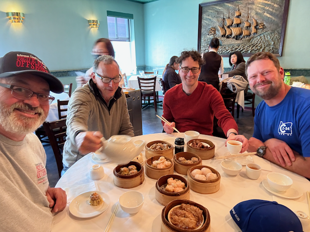

# The 2025 PNW Offshore Race  

Hey folks, I hope that this letter finds you happy and Healthy

I just got back from the 2025 Pacific Northwest Offshore Race, and it was way more than just a sailing competition. It was a wild ride full of teamwork, chaos, and a lot of laughter (and maybe a bruise or two). I wanted to share what it was really like out there—behind the sails, so to speak!

---

## The Long Road to the Start Line

  
This all started in January, on my first day of retirement, when Dan Tedrow called me during Jury Duty and asked me if I wanted to do this race.  And I said YES!   Leading up the race, we had weekly Tuesday night Zoom calls with the crew. Dan Tedrow (Resolutes owner) kept us organized with a detailed agenda that made my old work meetings look like a breeze. We had a couple of practice sessions scheduled where i drove down to go sailing.  The first one we went sailing, the second on turned into a post Haul out work party. Turns out, a 1976 Cal 34 needs a lot of love—grinding, sanding, rewiring, and even a new battery box (thanks Doug!).

The weekend before the race, Tedrow and Max delivered the boat 100 miles from Portland to Ilwaco.

  

On Tuesday, before the race I took the train down to Portland, where Doug picked me up.   Wednesday morning Ian, Dan's father in law, picked up Doug, James, Dan and I and gave us a ride to Illwaco.  Max got a ride from his wife Pattie

  

`Dan Tedrow and his father in law ian`

  

---

## Race Day: Ready, Set… Wait?

  

We raced in the “ORC C” class—basically, a group of boats that are about as old and quirky as ours. The race is 191 miles with a 72-hour time limit; the start was delayed by two hours, until 12 noon, to avoid the rough bar conditions that max ebb creates, which shortened the time limit by two hours, since we all had to be done by 10 am on Sunday still. 

  

  

Dan, Dan , James Max and Doug are ready to go!

Look at the slow cold and awesome yacht!  

---

  

## The Wind, The Waves, and… the Knockdown

  

The race started with a gentle breeze, and for a while, it was smooth sailing. We put up our fancy new sail (thanks, Max!) and were making good speed. But sailing is never that easy. Around 4:30 in the morning, the wind and waves picked up, and we had our first real “oh no” moment: we lost control of the spinnaker (the big colorful sail), the boat tipped way over, and I got tossed right out of my bunk! (Don’t worry, I landed on the cabinets and I’m fine.)

  

`We are glad to have survived the nght and the knockdowns.`

  

It took all hands on deck to get things back under control. Tedrow burned his hand on the spin halyard, while he and Doug wrestled the sail down, and James managed to steer us out of trouble. We almost lost the sail in the ocean, but I hauled it back in just before it became a sea anchor!

  

---

  

## Life Below Decks: Organized Chaos

  

Below decks was, well, a mess. We kept each other going with hot food and coffee, but let’s just say there were a few spills (I may have invented a new coffee stain pattern). We forgot to close the sink drain valve, so we got water inside the boat during the knockdown. The settee turned into a storage locker for a wet sail, which made sleeping… interesting.

  

  

`I had thge forsight to take a picture of the watch schedule - it didn't survice the big wet.`

  

---

  

## The Final Stretch: Confusion and (Almost) Triumph

  

As we neared the finish, the wind picked up and we were flying—literally hanging on as the boat heeled over and we rocketed toward the finish line. Unfortunately, our navigation gear disagreed about where the finish line was. My phone died, so we trusted the boat’s plotter… and, well, we missed the official finish line by just a bit. We were scored “Did Not Finish,” but honestly, we felt like winners.

  

---

  

## The Best Part: Crew Camaraderie and Post-Race Shenanigans

  

Despite the chaos, our crew really came together. We laughed, we yelled, and we all agreed we’d do it again (maybe with a few tweaks to the watch schedule and storage plan). After the race, we were greeted with hot towels, a bottle of bubbly, and a hero’s welcome at the dock.

  

  

`Doug orders a round of the soup of the day (whiskey)`

  

We celebrated with a legendary pub crawl, dim sum, and even some impromptu dancing (ask Doug about the male stripper story—trust me, it’s worth it). We made friends with a bachelorette party, traded shots, and laughed until our sides hurt.

  

---

  

## Home Again, Wiser and Wetter

  

Sunday was for goodbyes and reflection. We sorted our gear, swapped stories, and headed home—tired, happy, and already planning for next year. There are things I’d do differently (like double-check the finish line coordinates!), but what matters most is the adventure we shared and the memories we made.

  

  

`Welcome home to Seattle`

  Love ya!
  Dan W

  PS - here is a [youtube video](https://youtu.be/sSkw_93ICvc) of the event as well.  

---

Okay - here is a full write-up, along with way more pictures than anyone will really want to see, except for folks who were along for the ride.   I took the lengthy writeup below and fed it into ChatGPT to create a shorter, more digestible version, which is what i posted above.   And yes, the stuff I wrote below was also created by chatGPT based on an outline that I created this morning, which explains some of the jilted language.

Enjoy.

The 2025 PNW Offshore Race was more than just a sailing competition for our crew—it was a true test of preparation, teamwork, and adaptability, punctuated by memorable moments both on and off the water.

**Preparation began months ahead**, with Tuesday night Zoom meetings where Dan Tedrow, the boat’s owner and our de facto project manager, kept us on track with a detailed agenda and project plan. Our practice sails were revealing: the first gave us a feel for the boat and each other, while the second morphed into a work party, highlighting just how much maintenance a 1976 Cal 34 can demand. Haul out became a bigger project than anticipated, involving endless cycles of grinding, filling, and sanding, but we emerged with a smooth and clean bottom, a rewired mast, a new tricolor light and anemometer, and a rebuilt battery box courtesy of Doug.

The weekend before the race, Tedrow and Max did the 100-mile delivery from the Portland Yacht Club to Ilwaco in preparation for the race. On Tuesday before the race, Weaties took the train from Seattle to Portland, where Doug picked him up and dropped him off at Tedrow’s house, where he hung out with the family. On Wednesday, Tedrow's father-in-law, Ian, gave Doug, James, Tedrow, and Weaties a ride from the Portland Yacht Club to Ilwaco. We spent the rest of Wednesday doing final boat prep projects for the race before attending the skippers’ meeting at Salt and then heading out for dinner. Our hotel Wednesday night was awesome—we each had our own room.

**The Race: ORC C Class and On-the-Water Action**

We were racing in the ORC C class against a competitive field, with a course of 191 miles and a nominal 72-hour time limit. However, the start was delayed by two hours due to concerns about crossing the Columbia River bar from Ilwaco to the start area during the ebb tide. In the end, the crossing was straightforward, but the official start time was noon, reducing our time limit to 70 hours, with the finish cutoff still set for noon on Sunday.

The race began in a gentle breeze. We hoisted the Sobstad #1, which Max had purchased for the boat, and started on a port tack that would carry us for a long stretch. Apparent wind was about 60 degrees, so we didn’t have to beat, and the apparent wind speed across the deck was 9 knots, with a speed over ground of 6 knots. By 3:30 in the afternoon, the wind had backed enough for Max and James, who were on watch, to put up the spinnaker. At 4:45 pm, we jibed from port to starboard and headed in, then jibed back to port at 6:30 pm. During that jibe, we had our first equipment failure when the bolt on the port traveler control line let go, but we quickly rigged a shackle to get the traveler working again.

For the next four hours, the wind eased and our boat speed dropped below 5 knots, with the slowest patch around 8 pm. By 4:30 in the morning, both wind and seas had built. We were making 7.1 knots but got knocked over when we lost control of the spinnaker, rounding up and down in the dark. The boat was laid over on its starboard side, and Weaties was tossed out of the port settee onto the cabinets (unhurt). It was all hands on deck to tame the spinnaker. Tedrow burned his hand as the halyard ran through it until a tangle stopped it short, leaving the spinnaker about 30 feet from the boat. James, on the helm, managed to blanket the sail behind the main, and Doug and Dan wrestled it down. We narrowly avoided “shrimping” the sail as it hit the water, but Weaties was able to haul it back before it filled. The ordeal took the wind out of our sails, literally and figuratively. We then got the #2 up on deck, wrestled the #1 down through the forward hatch, and left it on the settee for the rest of the race.

At about 5:45 am, we jibed back to starboard to head for Duntze Rock, feeling like we were gybing on the layline, though other boats sailed further. By 1 pm on Friday, we hit our peak speed of 8.1 knots approaching Neah Bay—sailing at its finest.

We reached the Strait of Juan de Fuca just as the ebb turned to flood and headed for the Canadian shore. We were beating across the strait into an easterly breeze on starboard tack, and had to tack at 3:30 pm to avoid a ship in the shipping lanes. At 5:30 pm, we tacked back to port near the Canadian shore. Around 8:30 am, the wind shut off, just as the weather models had predicted, and the calm persisted until about 5 am the next day. During the dead calm, sometime between 1 and 3 am, we hoisted the windseeker. In hindsight, we could have brought the #1 back on deck for better effect. When the westerly filled in, we switched from the windseeker back to the #2, since it was already on deck.

At 6 am, we hoisted the chicken chute with a starboard pole. The wind wasn’t strong yet, but the models predicted 20+ knots through Race Rocks, and we didn’t want to have to change spinnakers later. We held this all the way through Race Rocks, where the wind did indeed build into quite a blow. There’s usually a hole between Race Rocks and the finish, so we stayed right of the rhumb line. Doug was up at the mast with a hand on the boom vang while Tedrow drove hard toward the finish, the boat barely in control as we tight reached.

As we approached the virtual finish, confusion set in. The Navionics tablet and Raymarine disagreed on the finish position, and Weaties’ phone had run out of power. We decided to trust the Raymarine plotter and turned off the tablet, but unfortunately, the waypoints for the finish line were incorrect, and we were scored as “Did Not Finish.”

**Life below decks was a study in organized chaos.** Hot food and coffee kept morale up, though “open” cups led to a few spills. The kettle lacked a whistle, making it hard to know when water was ready. A knockdown led to water ingress after we forgot to close the sink through hull, and the settee berth became the least desirable bunk with the Sobstad #1 stuffed into it. Storage was an ongoing challenge—there was no system for personal gear, and Max even lost track of his phone for two days.

**Despite these challenges, the crew gelled.** Everyone was self-aware and trusted each other, and even when Max’s information-sharing style rubbed the wrong way, it was clear that all were good sailors who would willingly sail together again. Tedrow’s “Must Read” document set expectations, and the watch schedule, for all its flaws, fostered a sense of teamwork.

**The finish was a celebration.** Hot hand towels, a welcoming committee, and a bottle of bubbly greeted us. We rafted up to Jugo and immediately began recounting the highs and lows as we rinsed and folded sails, mucked out the inside of the boat, and scrubbed the boat inside and out. The post-race festivities became legendary in their own right: a pub crawl through Victoria, dim sum at Don Mee, whiskey flights at The Churchill, and even an impromptu introduction of James as a male stripper by Doug at Big Bad Johns, where we ended up hanging out with an engagement party. Both groups bought each other shots and shared laughter, but we all made it back to the boat for a final night aboard.

It was only after we cleared customs that Doug let us in on a secret he’d been keeping the entire race—a consequence of a lost bet from some time in the past. The details of the wager are best left for Doug to share himself, so if you ever meet him, be sure to ask about it. Suffice it to say, his commitment to seeing it through added another layer of camaraderie and humor to our adventure.

**Sunday was for goodbyes and reflection.** Over coffee, we sorted gear and packed up. Max caught the Coho to Port Angeles, and the rest of us took the bus out to the Royal Vic Yacht Club for awards and BBQ. After the BBQ, Weaties, Tedrow, Doug, and James went to the Steamship Grill to kill some time before we all headed to our respective flights.

**Looking back, there’s plenty we’d change—** a more predictable watch schedule, better stowage, a lighted compass, and a finish line programmed and double-checked in advance. But those are details. What mattered most was the camaraderie, the adventure, and the sense that, despite the chaos, we pulled together and had a hell of a ride.

On the train!

The original mainsheet setip

Dan Tedrow and his father in law ian

The new mainsheet configuration

Preparing to replace the knotlog impeller, which had gotten painted.

James rigging the topping lift

They had the cutest book store in Illwaco

The crew getting ready to go!

Look at the slow cold and awesome yacht!

Ok - I've never gotten seasick before, but these guys spooked me, so I put on a patch

Could this be the moment our future problems were hatched?

Max is ready to go!

Doug Driving us out to the start line

Tedrow is excited for the start

Dan looking very proud of all of the work that we have done to get here.

Max and James moving us along well

Cruising along nicely with the spinaker up.

Go Doug Go!

Trimming the chute

Enjoying the open ocean

Getting ready for sunset.

James... Do you think it will get cold as well?

Rolling up the coast with the spinaker up.

I had thge forsight to take a picture of the watch schedule - it didn't survice the big wet.

Ghostly spinakker at night.

We are glad to have survived the ngiht and the knockdowns.

Doug rocking along

Doug watching the water go buy

Dan and Dan love to sail!

Doug is ready to take on the night!

It's starting to get cold

James and Doug enjoying the sailing and camradre

Max loves sailing as well

James rinsing and folding the spinaker

.png)

Doug orders a round of the soup of the day (whiskey)

The crew heading for dimsum

DIMSUM!

Basking on being on dry land

Getting ready to charge into the Empress hotel like we own the place.

Doug learns some of the finer aspects of Croquett

Dougs first time at Big Bad Johns.

These women celebrated everyone that came in the bar, and Doug kept going back for more.

Congratulations to the newly engaged couple sitting on my left.

The enchildas were so so welcome late at night

James, Doug, Dan heading to the Yacht club for awards.

Enjoying a sunny day at the Club.

Getting ready to fly home

Welcome home to Seattle

