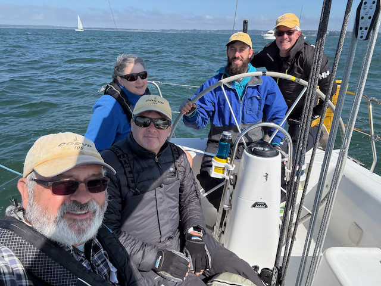
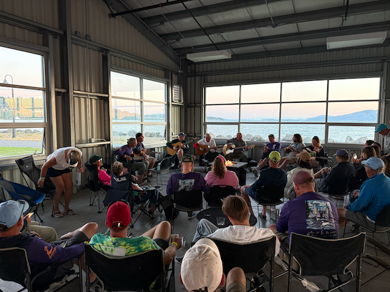

Hi all,

Just back from Bellingham Race Week, and wow—what a week! The sailing, the crew, and even the deliveries to and from the regatta made it a memorable experience.

We started slow (as in, _dead last_ slow), but with a mid-week rig tune-up and some sail shape coaching from Alex S. at Ballard Sails, we found our speed and climbed back into the mix. We ended up with a couple of 4th-place finishes and felt solid pacing with the fleet by the end of the week. There’s still work to do—especially downwind—but it was an excellent baseline for building toward next year.

Alex impressed me with his sailing _and_ his leadership. He’s also part of a budding group of next-gen J/105 sailors that I think will help keep the fleet strong.

The race venue was fantastic—great race committee, support from Bellingham Yacht Club, and even a kids' sailing camp running alongside the event. The social scene wasn’t quite the same as Oak Harbor, but it’s got potential to grow.

Our deliveries—both up and back—were _magical_. On the way up, Bec and Jenn joined Stefan and me. We cruised through Port Townsend, Spencer Spit, and Sucia Island, where we hiked, anchored, and watched the sunset from Snoring Bay. On the return trip, Alex skippered the whole 12-hour sail (yep, we _sailed_ almost the entire way back to Shilshole!). I didn’t lift a finger, and I was proud to see how confidently he handled it.

The only downside was my sleep hygiene—I got too cozy with my phone and YouTube, and I’m paying for it now—time to get back to better habits.

Today’s plan: hit the gym, then head down to the boat for a deep clean—inside and out. It deserves it after the week we just put it through.

Love you all,
Dan

The Race crew - Me, Stefan, Kat, Alex and Steve

Enjoying some Goslings rum drinks while we wait for our food.

Alex

Stefan

Steve

Kat

Wednesday was campfire night, where a bunch of us sat around and sang songs around an indoor campfire (it was propane). 

Me and Alex

Sunset at the top of the dock

Stefan me and Alex, and Stefans dog.

Sunset over the Marina

Corvo rafted uo next to Stefans boat.

I made some pretty good sandwhiches each day

Stefan and his Family

Carter (from the J105 Troublemaker) and Alex

Alex, Justus, Brooks, Jocyln and Colby ready to depart on the delivery home

And we are back at Shilshole.  That was one of the best deliveries ever - 12 hours, and the motor was on for only two of them.

Corvo all powered up and headed to windward.

[Short little youtube video of the event](https://www.youtube.com/watch?v=WCOPiLQZVZc)