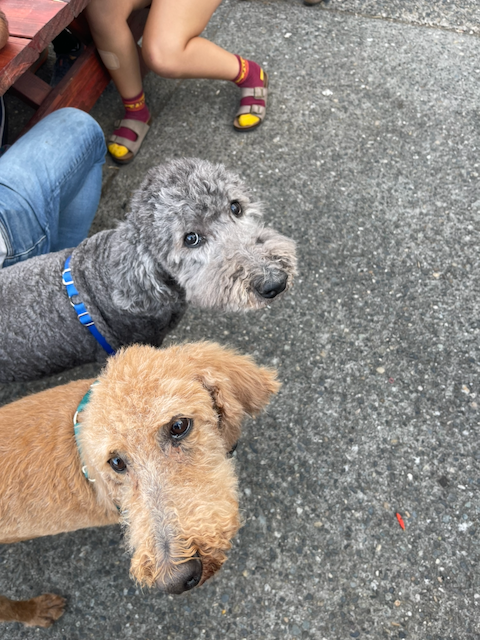
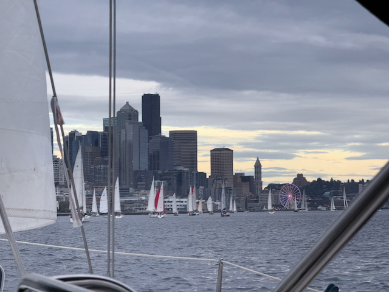
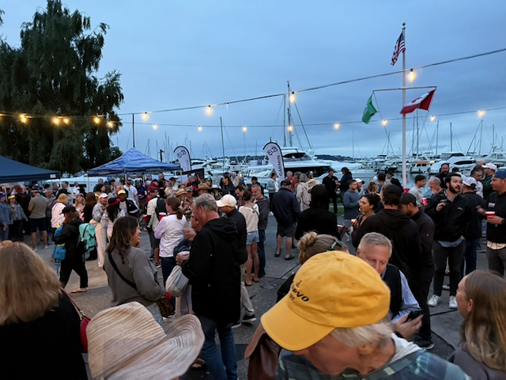
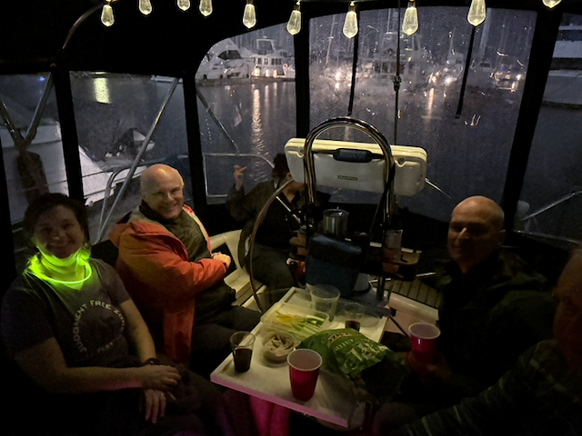
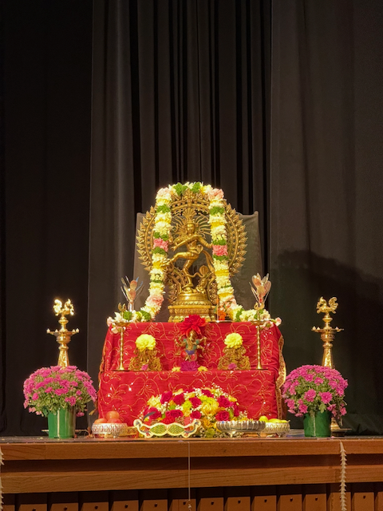
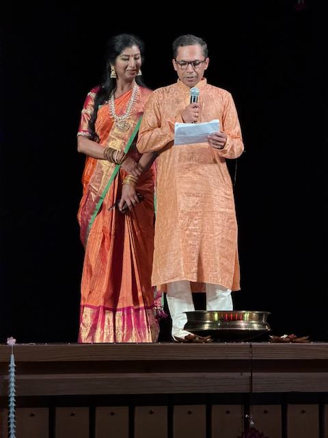
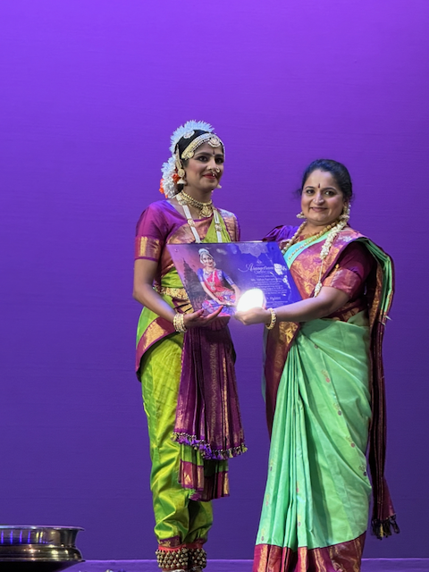

Hi Mom!

I hope things are going well for you and that the weather down there hasn’t been too terrible. Things are pretty good here—it’s been a relatively quiet week.

I missed out on sailing last Wednesday because I was on the milk run bus coming back from Spokane. They took me through Pasco, Sunnyside, Yakima, and Ellensburg before I finally rolled into Seattle. 😉

On Thursday, Bridget called to see if I had time for lunch while she was up from Tacoma checking on her house. It was great to catch up with her. That evening, I went out for the last race of the downtown sailing series on Dave Ewton’s boat. The wind died, and then the skies opened up on the way back in—but luckily Dave’s boat has a complete enclosure around the cockpit, so we stayed nice and dry.

Friday, I headed down to Renton to help my friend Arun set up a venue for a dance recital, and then I went back on Saturday to watch the show. Arun’s wife teaches traditional Indian dance, and this recital was the graduation for one of her students. The style has such a deep history going back thousands of years—I enjoyed the performance. Afterward, I met up with Catherine at our friend Mike’s 50th birthday party.

Yesterday I took a couple of buddies out sailing, then did some work on the boats. Today I’m heading down to the gym in a bit. I joined the Ballard Health Club and have been trying to get in a couple of workouts a week with Sara.

This coming weekend, I’ll be heading to Minnesota with a couple of the guys from Berkclub to visit Brandon, who moved out there with his family. I’ve been brushing up a little on Minnesota history to be ready.

And finally—starting next week, I’ll be using a new blogging platform to manage these weekly letters. So the look might change a little, but it’ll still be me writing them.

Love ya,
Dan W

Fozzie and Annie at Mikes bday party

The boats sailing along the Seattle water front on Thursday night

The party after the Thursday night race is always fun with Hotdog, beer and a band :) 

Warm, Cozy, and out of the rain on Dave's boat.

The alter to Shiva, the god of Dance.

The proud parents of Vidya thanking everyone for showing up.

The orchestra

Vidya receiving her certificate after the dance from her Guru Nityalakshmi Iyer.